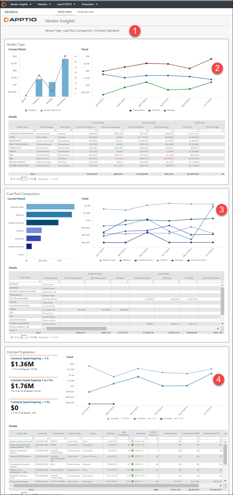

# Información sobre proveedores (panel de control)

◆ Aplicable a: Vendor Insights en TBM Studio 12.8 y versiones posteriores ( v107 )

Utilice el Vendor Insights panel de control para analizar el gasto total de la cartera de proveedores por tipo de proveedor y grupo de costes, así como para analizar el gasto de los contratos con los proveedores y los datos de vencimiento. Este informe está diseñado para:

- Director de informática y altos cargos de TI
- Propietarios de aplicaciones
- Propietarios de servicios
- Gerentes de finanzas de TI
- Gerentes de proveedores

El panel de control proporciona la siguiente información:

- Distribución de proveedores por categoría, con gasto actual y tendencias de gasto
- Gasto mensual, trimestral y anual por proveedor, y responsable de cada proveedor
- Mayor gasto de proveedores por grupo de costes y cómo ha cambiado el gasto a lo largo del tiempo
- Distribución del gasto del fondo común por proveedor
- Análisis del gasto contractual

**Mostrar el Vendor Insights informe**

En el menú Aplicaciones, seleccione Vendor Insights .

1. Vaya a Colecciones de informes > Proveedores.
2. En la barra situada en la parte superior de la página, seleccione Información sobre proveedores.
3. Para exportar o enviar por correo electrónico tus datos, selecciona Exportar (  ) en la parte superior derecha de la página y selecciona un formato de exportación.

El **Vendor Insights** informe contiene los siguientes elementos:

**(1) Recopilación de informes**

Los informes de la colección **Proveedores** proporcionan los detalles que necesita para revisar la actividad y el gasto de los proveedores, y para analizar la precisión de sus datos de cuentas por pagar, órdenes de compra y proveedores:

- Vendor Insights Informe (del panel de control) (descrito en este documento)
- [Informe resumido de proveedores](report-vendor-summary.html)

**(2) Tipo de proveedor**

Utilice los gráficos de tipos de proveedores para comprender la distribución de los proveedores por tipo, con su gasto actual y la tendencia mes a mes. El tipo de proveedor se deriva del archivo de asignación de categorías de proveedores.

**Gráfico de barras**. El gráfico de barras muestra el número de proveedores únicos y su gasto total en el mes actual. No se incluyen los costes no asignados a cuentas por pagar (AP) ni a órdenes de compra (PO).

**Gráfico de tendencias**. El gráfico de tendencias muestra el gasto mensual por proveedor según el tipo de proveedor. Utilice este gráfico para detectar anomalías que puedan requerir investigación.

**Tabla**. Utilice la tabla para ver más detalles sobre el gasto y el cambio de cada proveedor en el mes actual, el trimestre hasta la fecha y el año hasta la fecha.

Haga clic en cualquier elemento de la columna **Nombre del proveedor** para abrir un [informe detallado del proveedor](report-vendor-detail.html) que contiene información específica sobre ese proveedor.

**(3) Composición del fondo común de costes**

Utilice esta sección para ver el gasto de los proveedores desglosado por grupo de costes (por ejemplo, mano de obra externa, software, telecomunicaciones, servicios externos y más), y el importe del cambio como tendencia de gasto por grupo de costes mes a mes. El informe también le ayuda a ver la distribución del gasto de su fondo común de costes por proveedor.

Utilice la tabla para ver el gasto actual, trimestral y acumulado por proveedor, desglosado por grupos de costes. Haga clic en cualquier elemento de la columna **Nombre del proveedor** para abrir una página de detalles que contiene información específica sobre ese proveedor. Consulte el informe Detalles del proveedor.

**(4) Vencimiento del contrato**

**indicadores clave de rendimiento**

- **Gastos contractuales con vencimiento inferior a 1 año**. El total de los contratos con proveedores que expiran en menos de un año y el porcentaje de ese total en comparación con el gasto total.
- **Gastos contractuales con vencimiento de 1 a 3 años**. El total de los contratos con proveedores que expirarán en un plazo de uno a tres años, y el porcentaje de ese total en comparación con el gasto total.
- **Gastos contractuales con vencimiento superior a 3 años**. El total de los contratos con proveedores que expirarán en más de tres años y el porcentaje de ese total en comparación con el gasto total.

**Gráfico de tendencias**. Utilice el gráfico de tendencias para ver la tendencia del gasto de los contratos que vencen, desglosada por la duración del contrato mes a mes.

**Tabla**. La tabla ofrece una visión general de los detalles del contrato, incluyendo el propietario del contrato, los días restantes, el gasto actual, el gasto acumulado en lo que va de año y el gasto total. Haga clic en cualquier elemento de la columna «Nombre del contrato» para abrir una página de detalles con información adicional sobre el contrato. Para obtener más información, consulte el [informe Detalles del contrato](report-contract-detail.html).

Preguntas respondidas

Utilice este informe para responder a las siguientes preguntas:

- ¿Cuánto gastamos con los proveedores preferidos frente a los proveedores de productos básicos?
- ¿Qué grupos de costes componen los costes de mis proveedores?
- ¿Dónde tenemos variaciones en el gasto?
- ¿Qué cambios debemos realizar para reequilibrar el gasto en proveedores?
- ¿En qué medida está fragmentado/concentrado el gasto entre los distintos proveedores?
- ¿Tenemos proveedores redundantes?
