# Atualização da versão do conteúdo

## Atualize os componentes do aplicativo para a versão mais recente

Este artigo fornece instruções gerais para atualizar o Costing Standard para a versão mais recente do modelo. Conclua as etapas descritas neste artigo somente após atualizar o aplicativo para a versão mais recente do TBM Studio. As imagens neste artigo são para a versão 12.5 com uma atualização do modelo v104 para v105, mas as instruções funcionam para qualquer atualização de modelo.

Você pode atualizar seletivamente apenas os componentes cujos novos recursos são relevantes para suas necessidades. Antes de fazer isso, analise cuidadosamente as dependências dos componentes mostradas na tela de instalação dos componentes ou documentadas no guia de configuração para garantir a compatibilidade e evitar impactos indesejados.

## Melhores práticas para desenvolvimento paralelo durante o processo de atualização

Se você planeja continuar com as atividades de desenvolvimento enquanto atualiza os componentes, recomendamos as seguintes práticas recomendadas:

- Verifique todas as alterações antes de criar um ramo de atualização. Idealmente, é melhor concluir a atualização e mesclar o branch o mais rápido possível.
- Se o trabalho de desenvolvimento precisar continuar, as seguintes atividades também podem continuar enquanto um branch de atualização estiver aberto:
  - Carregue os dados e publique nos ambientes de desenvolvimento, teste e produção.
  - Crie novos relatórios personalizados.
  - Modifique relatórios personalizados existentes.
- Evite as seguintes atividades até que a ramificação tenha sido mesclada:
  - Instale novos componentes.
  - Anexar e mapear conjuntos de dados aos conjuntos de dados principais.
  - Altere as configurações ou alocações do modelo.
  - Modifique relatórios prontos para uso (OOTB).

O tempo estimado para concluir o processo de atualização depende do número de componentes que estão sendo instalados, da quantidade de personalizações feitas nos seus relatórios OOTB e do nível de validação necessário antes que você possa mesclar o branch.

## Passo 1: Crie uma ramificação

Antes de realizar esta etapa, atualize para a versão mais recente do TBM Studio.

Execute o processo de atualização em um ramo separado, em vez de em um ambiente de desenvolvimento pessoal.

1. Antes de criar a ramificação, conclua e registre todas as alterações no seu projeto principal.
2. Na guia Projeto, clique em Criar ramificação.

   A caixa de diálogo Criar ramificação é exibida.
3. Insira um novo nome para o ramo, por exemplo, Ramo de atualização de versão.

   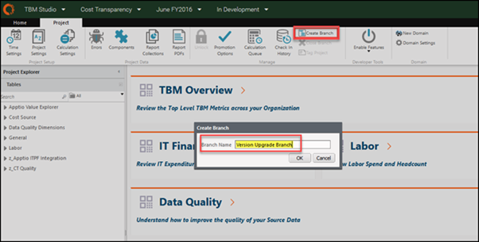
4. Clique em OK.

   A caixa de diálogo Fila de Cálculo é exibida. Aguarde até que os cálculos sejam concluídos.

   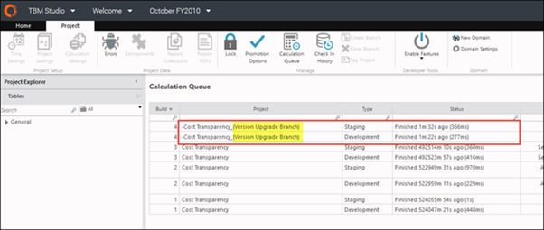

## Passo 2: Abra o novo ramo

Atualize o projeto em um ramo separado. Para obter mais informações, consulte [Melhores práticas: ramificação de projetos](https://www.ibm.com/docs/en/apptio-commercial/tbm-studio/saas?topic=administration-best-practices-branching-projects "(Abre em uma nova guia ou janela)").

1. Na guia Projeto, clique em Trunk.
2. Selecione o ramo desejado, por exemplo, Ramo de atualização de versão.

   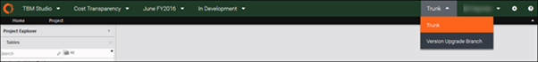

   Após selecionar um ramo, você verá o ramo ativo na barra de menu.

   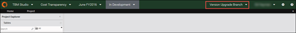
3. Sempre que você retornar ao TBM Studio, verifique se está no ramo de atualização correto antes de prosseguir. Caso contrário, e Trunk for exibido, será necessário selecionar novamente o Ramo de Atualização de Versão.

ATENÇÃO:

Não faça alterações no projeto principal (por exemplo, Trunk) durante as atividades de atualização na ramificação de atualização separada. Consulte [as práticas recomendadas para desenvolvimento paralelo durante o processo de atualização](#converup__Best_practice_for) para obter mais detalhes

## Etapa 3: Alterar a versão do componente

1. Na guia Projeto, clique em Configurações do projeto.

   A caixa de diálogo Editar configurações do projeto é exibida.
2. Para Versão do Componente, selecione a versão mais recente, por exemplo, Versão 105.

   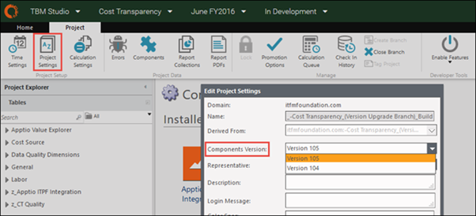
3. Clique em Save.
4. Verifique a alteração e insira uma descrição, como Configurações do projeto: alterar para [atualizar versão do modelo].

## Etapa 4: Revise os componentes a serem atualizados

Confirme se as novas versões dos componentes estão disponíveis e, em seguida, atualize-as.

1. Na guia Projeto, clique em Componentes.

   A caixa de diálogo Configuração de Componentes é aberta.
2. Veja a lista de componentes instalados.

   Uma seta no canto inferior direito de cada componente instalado indica que uma versão atualizada para esse componente está disponível.

   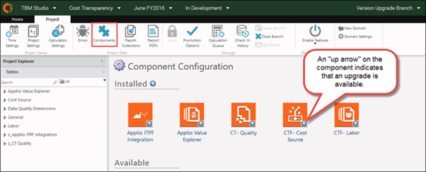
3. Instale e atualize todos os componentes para a nova versão do modelo. Execute a seguinte etapa para cada componente que precisa ser atualizado.

## Etapa 5: Atualize componentes individuais e verifique as alterações

1. Na caixa de diálogo Configuração de Componentes, clique duas vezes em um componente específico, por exemplo, CTF - Fonte de Custos.

   Uma página de componentes é aberta.

   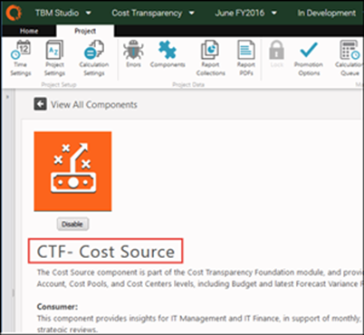
2. Role para baixo abaixo da lista de relatórios incluídos até a seção Atualização disponível.
   - Uma caixa azul indica que nenhuma personalização foi feita em nenhum item do componente.
   - Uma caixa amarela indica que foram encontradas personalizações nos dados, métricas calculadas ou relatórios.

   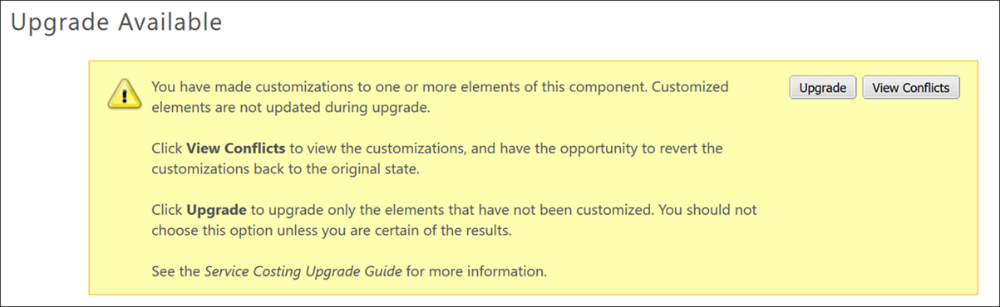

   Observação: ocasionalmente, a caixa amarela permanece após reverter todas as personalizações. Para continuar, clique no botão Atualizar na caixa amarela.
3. Se houver personalizações, clique em Exibir conflitos ou role até a parte inferior da página.
4. Reverta quaisquer relatórios personalizados e métricas calculadas.

   Observação: Não reverta os conjuntos de dados. Se alguma das colunas ou fórmulas padrão do conjunto de dados mestre tiver sido personalizada, talvez seja necessário revisar a configuração após a atualização para garantir que seus conjuntos de dados tenham as colunas e a configuração adequadas.

   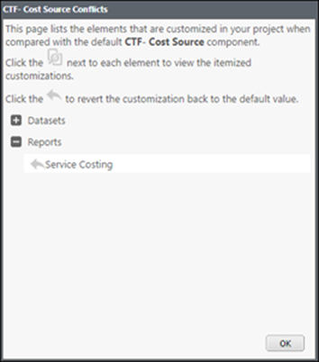
5. Clique em Atualizar e confirme que a seta de atualização não está mais sendo exibida.

   O aplicativo leva alguns minutos para processar a atualização. Após a página do componente ser atualizada e retornar à página Configuração do componente, você poderá continuar.

   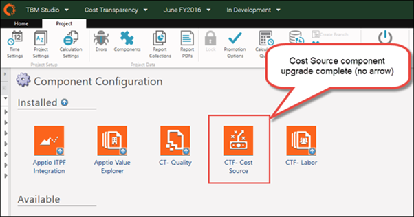
6. Após a conclusão da atualização, você deve alterar manualmente quaisquer outros conjuntos de dados personalizados que não tenham sido revertidos.

   Observação: esta atividade pode exigir tempo para compreender e implementar corretamente as alterações no conjunto de dados principal.
7. Execute os seguintes procedimentos conforme necessário para reverter seus conjuntos de dados personalizados:
   - Para adicionar novas colunas a um conjunto de dados mestre existente:
     1. Navegue até Tabelas e verifique os Dados Mestre da Origem de Custos.
     2. Adicione uma etapa Fórmula antes da etapa Anexar.
     3. Na nova etapa Fórmula, adicione as novas colunas.

     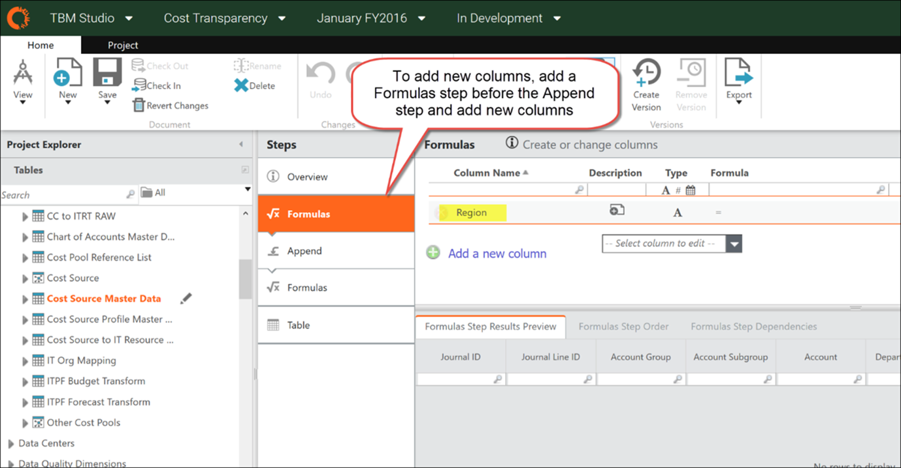
8. Quando terminar de atualizar seus conjuntos de dados personalizados, verifique as alterações relacionadas a uma única atualização de componente, uma de cada vez, da seguinte maneira:
   1. Selecione Projetos e clique em Check-in.
   2. Selecione Todos os itens no painel esquerdo (padrão).
   3. Insira uma descrição dos itens no painel Mensagem.
   4. Clique em Check-in

ATENÇÃO:

A falha em verificar os componentes um por um pode resultar em um erro que faz com que você perca seu trabalho e reinicie a atualização a partir do beginning.\\

Observação: insira uma descrição útil, como Origem do custo: reverter alterações no conjunto de dados, componente atualizado. Isso é fundamental para as atividades de mesclagem de ramificações posteriormente neste processo de atualização. Revisão [da Etapa 10: Mescle as alterações no projeto principal (Trunk)](#converup__ten) para entender por que isso é importante.

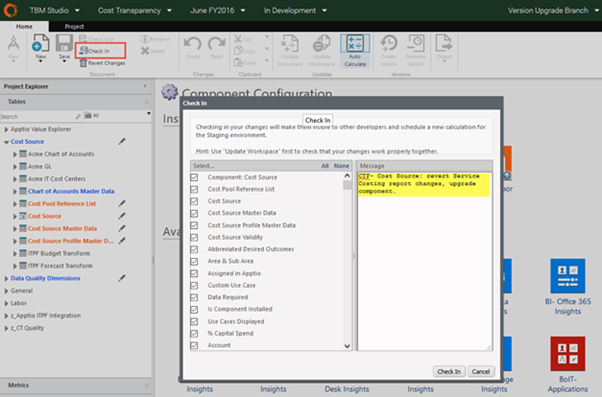

## Etapa 6: Etapas de atualização específicas dos componentes

Siga todas as etapas de atualização específicas do componente mencionadas na tela de instalação do componente ou no guia de configuração.

## Etapa 7: Atualize os componentes restantes na ramificação de atualização

Repita as etapas 4 e 5 para atualizar quantos componentes forem necessários.

Embora não exista uma ordem prescritiva para a atualização dos componentes, é recomendável atualizar os componentes na mesma ordem em que o objeto relacionado ao componente está alocado em seus modelos. Por exemplo, para o Padrão de Custos, atualize a Origem dos Custos antes das Torres de Recursos de TI e as Torres de Recursos de TI antes das Aplicações.

A recomendação é atualizar todos os componentes instalados para a versão mais recente, a fim de garantir que você tenha os recursos mais recentes e o conteúdo da mais alta qualidade. Você também pode optar por atualizar apenas um conjunto selecionado de componentes com os recursos desejados.

ATENÇÃO:

Quando terminar de atualizar os componentes, execute as seguintes etapas para evitar possíveis perdas de dados.

1. Abra o componente CT Apps-Aplicativo.
2. Na seção Elementos personalizados, procure as seguintes métricas:
   - Desenvolvimento de aplicativos (excluído)
   - Execução do aplicativo (excluído)
   - Orçamento de execução do aplicativo (excluído)
   - Orçamento para desenvolvimento de aplicativos (excluído)
3. Clique em cada métrica ausente para reverter para a versão original ou padrão.

   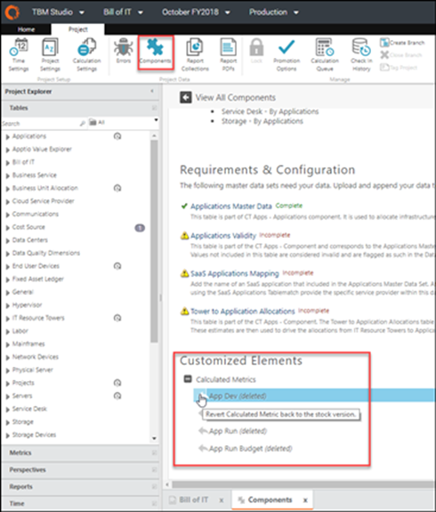
4. Verifique a troco.
5. Abra o componente Unidades de Negócio CT.
6. Na seção Elementos personalizados, procure as seguintes métricas:
   - CapEx Corrigido (excluído)
   - CapEx Variável (excluída)
   - Investimentos em projetos (excluídos)
7. Clique em cada métrica ausente para revertê-la para a versão original ou padrão.
8. Verifique a troco.

## Etapa 8: Revise o aplicativo atualizado no ramo de atualização

1. Na guia Projeto, clique em Fila de cálculos.

   A caixa de diálogo Builds é aberta.
2. Verifique se as compilações foram concluídas.

   Você verá uma lista dos check-ins individuais.

   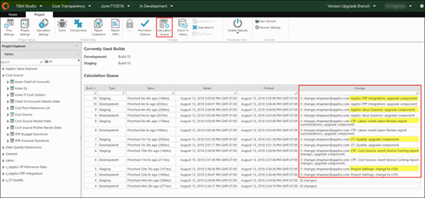
3. Na barra de navegação, selecione Padrão de cálculo de custos no menu Aplicativo.

   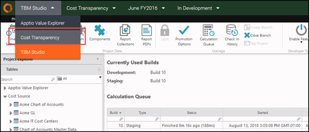
4. Selecione o ramo de atualização, por exemplo, Ramo de Atualização de Versão.

   A página inicial é aberta.

   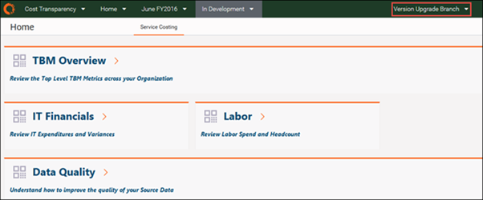

## Etapa 9: Compare os relatórios da versão anterior com os da versão mais recente

1. Abra o projeto Padrão de Custeio em um navegador.
2. Selecione Trunk para visualizar os relatórios do modelo antigo.
3. Abra o projeto Padrão de Cálculo de Custos em outro navegador.
4. Selecione a ramificação de atualização de versão para visualizar os novos relatórios do modelo atualizado.
5. Analise os relatórios lado a lado.

   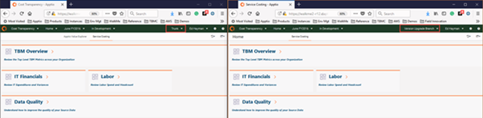
6. Se desejar, reaplique as alterações específicas do cliente aos relatórios diretamente na ramificação de atualização de versão.

   Nota:
   - Evite fazer alterações nos relatórios padrão para minimizar o esforço envolvido em futuras atualizações.
   - Se for necessário personalizar os relatórios, aplique as personalizações aos relatórios padrão após concluir a Etapa 7 para mesclar as alterações da atualização. Isso minimiza o tempo que você precisa trabalhar na ramificação de atualização de versão.
   - **Lembre-se** : não faça alterações, exceto carregamentos de dados, no projeto principal (Trunk) depois de criar sua ramificação de atualização.
7. Depois de verificar a versão mais recente dos relatórios, prossiga para a próxima etapa para mesclar as alterações em seu projeto principal.

## Etapa 10: Mesclar as alterações no projeto principal (Trunk)

Consulte [Melhores práticas: ramificação de projetos](https://www.ibm.com/docs/en/apptio-commercial/tbm-studio/saas?topic=administration-best-practices-branching-projects "(Abre em uma nova guia ou janela)") para obter mais informações.

Observação: não mescle todas as alterações em uma única etapa. Se você fizer isso, o processo de mesclagem falhará. A recomendação é mesclar pequenos lotes de registros de check-in - até 5 registros por vez. Isso requer manter notas para garantir que todos os registros de check-in sejam mesclados no trunk na ordem correta.

1. Voltar ao TBM Studio.
2. Selecione o ramo de atualização, por exemplo, Ramo de Atualização de Versão.
3. Na guia Projeto, clique em Verificar histórico.
4. Role até o final da lista, clique e comece com o primeiro item acima das entradas *do bootstrap*. Essas devem ser as configurações do projeto: alterar para [nova versão do modelo] check-in.

   Observação: você pode selecionar itens adicionais para verificar como uma única fusão, mas selecione no máximo 5 itens por vez.

   ATENÇÃO:

   A fusão de mais de 5 itens em um único check-in pode causar falha no aplicativo.
5. Clique com o botão direito do mouse no item da linha e selecione Mesclar alterações na ramificação.

   Este exemplo utiliza o item de combinação CT-F Cost Source.
6. Selecione Trunk como destinatário da fusão.

   A caixa de diálogo Mesclar conjuntos de alterações é exibida.

   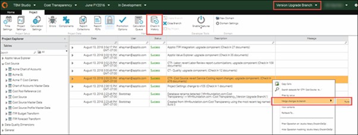
7. Selecione todos os itens para mesclar (padrão).

   Observação: Não desmarque nenhum item individualmente.
8. Clique em OK.

   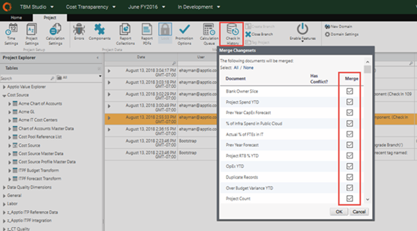

   Lembre-se: acompanhe manualmente as etapas mescladas à medida que atualiza os componentes, pois a caixa de diálogo Histórico de check-in não indica quais itens foram mesclados. Se você tentar fazer o check-in de um item duas vezes e a seguinte mensagem aparecer, clique em Cancelar e prossiga com um componente diferente.

   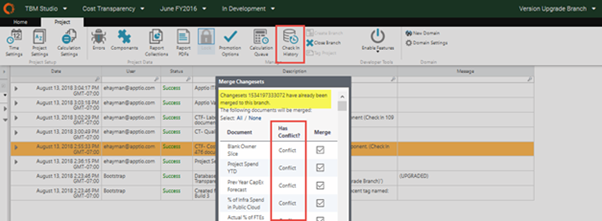
9. Após a conclusão, a janela deve mudar para Trunk. Caso contrário, mude para Trunk para fazer o check-in do item mesclado em seu projeto.
10. Para verificar se a alteração foi propagada para o ambiente de desenvolvimento:
    1. Na barra de navegação, selecione o ambiente Em desenvolvimento.
    2. Clique na guia Projeto.
    3. Clique em Componentes.
    4. Verifique se o componente não exibe mais a seta de atualização, como neste exemplo, para o componente CTF - Fonte de custo.

    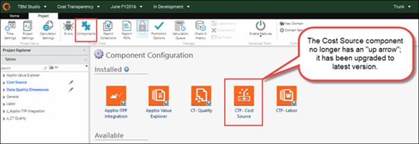
11. No menu Ambiente, na barra de navegação, selecione Preparação.
12. Na faixa de opções Projeto, certifique-se de que o ícone Bloqueado esteja desativado (não bloqueado).

    Você precisa fazer isso apenas uma vez.
13. No menu Ambiente da barra de navegação, selecione Em desenvolvimento e clique em Fazer check-in.

    A caixa de diálogo Check-in é aberta.
14. Selecione todos os itens no painel esquerdo (padrão).

    Isso deve se limitar aos itens mesclados.
15. Insira uma descrição dos itens no painel Mensagem.

    Lembre-se: use uma descrição útil, como Mesclar – CTF-Custo Fonte: reverter personalizações do relatório de custos de serviço, atualizar componente.
16. Clique em Check-in.

    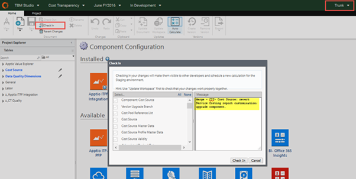

    Aguarde até que a compilação seja concluída.

    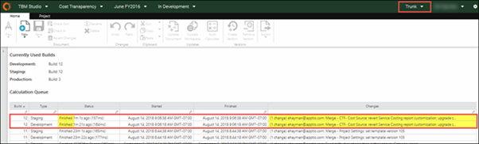
17. Verifique se a alteração esperada da etapa de mesclagem da ramificação foi aplicada ao ambiente de preparação.

    Neste exemplo, na guia Projeto, clique em Componentes para verificar se a nova versão do modelo está ativa.

    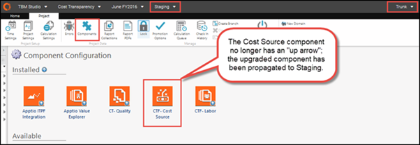
18. Retorne ao ramo de atualização, por exemplo, Ramo de Atualização de Versão, para prosseguir com o próximo item a ser mesclado.
19. Repita as etapas acima para continuar mesclando até 5 ramificações de atualização individuais (de uma vez) e check-ins subsequentes do Trunk (em desenvolvimento) até que todas tenham sido mescladas.

## Etapa 11: Valide os relatórios da versão mais recente no projeto principal (Trunk)

1. Abra o projeto Padrão de Custeio em um navegador.
2. Selecione Trunk para visualizar os relatórios atualizados.
3. Abra o projeto Padrão de Cálculo de Custos em um segundo navegador.
4. Selecione a ramificação de atualização da versão para comparar.
5. Compare e analise relatórios lado a lado.

   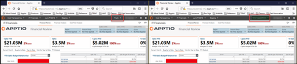
6. Se desejar, reaplique as alterações específicas do cliente aos relatórios diretamente na filial principal, por exemplo, Trunk.

Lembre-se: evite fazer alterações nos relatórios padrão para minimizar o esforço envolvido em atualizações futuras.

## Etapa 12: Atualize o ambiente de produção

Depois de concluir a verificação dos relatórios, envie o aplicativo atualizado para Produção.

1. Vá para o Estúdio toTBM.
2. Selecione o ambiente de preparação.
3. Na faixa de opções Projeto, clique em Bloquear.

   Uma breve mensagem pop-up indicará que o ambiente está bloqueado. O ambiente está agora pronto para ser promovido para Produção.

   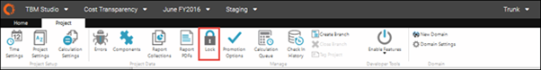
4. Na faixa de opções Projetos, clique em Opções de promoção e, em seguida, execute uma das seguintes ações:
   - Clique em Promover agora. A atualização é enviada para produção imediatamente.
   - Clique em Promover mais tarde para agendar quando a atualização será publicada na produção.

   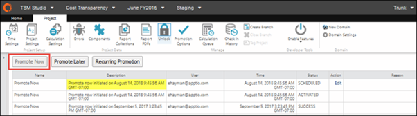
5. Na faixa de opções Projeto, clique em Fila de cálculos para verificar a compilação da produção.
6. Compare os números de compilação dos ambientes de desenvolvimento, teste e produção.

   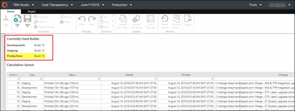

## Etapa 13: Feche o branch de atualização

1. Selecione o ramo de atualização de versão.
2. Na faixa de opções Projeto, clique em Fechar ramificação.

   A caixa de diálogo Confirmar Fechar é exibida.
3. Clique em OK para fechar a ramificação.

   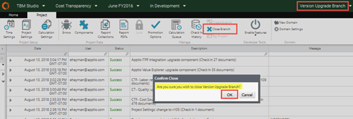
4. Confirme se Trunk não é mais exibido na barra de navegação.

   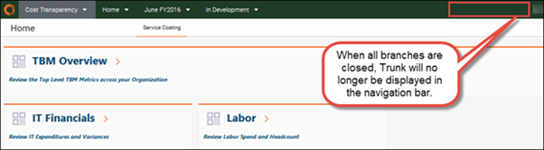

Lembre-se: feche o branch de atualização o mais rápido possível. A ramificação consome a mesma quantidade de recursos que o projeto principal. Fechar o ramo de atualização libera recursos e melhora o desempenho geral.
