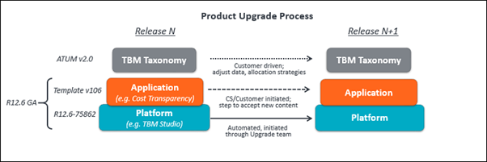
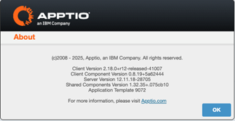
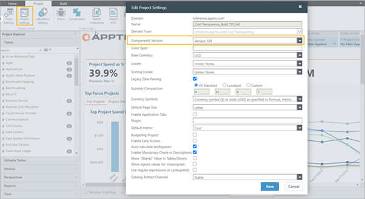
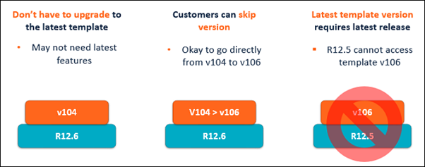

# Atualização do padrão de cálculo de custos

O processo de atualização do Padrão de Custeio envolve atualizações nas seguintes camadas.

## Camada da plataforma

A plataforma (ou base de códigos Apptio ), chamada TBM Studio, é um conjunto de recursos e funcionalidades que permitem realizar tarefas que impulsionam as aplicações Apptio, tais como criar modelos, carregar conjuntos de dados, alocar custos e criar relatórios. O TBM Studio também inclui o mecanismo de cálculo Apptio.

O objetivo é atualizar todos os clientes do Server 12.x para a versão mais recente a cada trimestre. Em um esforço para manter nossos aplicativos atualizados com os recursos mais recentes e melhorias de desempenho, programamos uma manutenção obrigatória durante um período específico. Para datas, entre em contato com seu gerente de sucesso do cliente ou consulte esta [programação.](https://community.ibm.com/community/user/viewdocument/tbm-studio-and-applications-r12-rel "(Abre em uma nova guia ou janela)")

**Controle de versões**. R12 é um atalho que se refere à versão atual do produto básico TBM Studio. As versões incrementais do TBM Studio são representadas como 12.11.x. Para atualizar para uma nova versão do TBM Studio, entre em contato com seu gerente de sucesso do cliente.

Para ver a versão do Server Version que você está executando, selecione  > Sobre.

A janela a seguir exibe a versão do servidor:

## Camada de aplicativos (Conteúdo)

As aplicações são componentes pré-definidos que utilizam os recursos da plataforma para realizar um caso de uso. Os componentes da aplicação podem conter os seguintes elementos de conteúdo:

- Conjuntos de dados mestres
- Objetos modelo
- Taxonomia
- Métricas
- Perspectivas
- Relatórios

**Controle de versões**. O controle de versão para aplicativos Apptio é refletido como versões de modelo. O modelo v120, por exemplo, é o número da versão mais recente do modelo. É possível usar versões anteriores do modelo (por exemplo, Modelo v107 ou Modelo v109 ) na versão mais recente do servidor.

Para ver a versão do modelo que você está executando, abra o TBM Studio e selecione *Projeto > Configurações do projeto*.

A caixa de diálogo Editar configurações do projeto é aberta, exibindo a versão do componente.

## Orientação para atualização

As atualizações do aplicativo ficam a seu critério:

- Mude para um novo modelo de aplicativo se desejar usar os recursos e aprimoramentos mais recentes introduzidos por esse modelo.
- Você pode optar por permanecer na versão atual do modelo do aplicativo, mesmo após atualizar para a versão mais recente do servidor. Por exemplo, você pode optar por permanecer no modelo v109, mesmo que a versão mais recente do servidor tenha o modelo v120
- Você pode ignorar as versões do modelo. Por exemplo, você pode atualizar do modelo de aplicativo v107 para v110, ignorando o modelo v109.
- Você pode optar por atualizar apenas alguns componentes cujos recursos mais recentes sejam do seu interesse. Tenha cuidado com as dependências dos componentes disponíveis na tela de instalação de componentes ou no guia de configuração.

Observação: para acessar um modelo de aplicativo atual, você deve atualizar para a versão mínima da plataforma que suporta esse modelo. Por exemplo, você não pode acessar o Template v106 a menos que esteja no TBM Studio 12.6 e versões posteriores.

Você deve atualizar o TBM Studio antes de atualizar o modelo do aplicativo.

Para obter instruções passo a passo sobre como atualizar o modelo, clique [aqui](con-ver-lay.html).

## Camada de taxonomia TBM

A Taxonomia TBM é uma estrutura para alocar custos de TI em uma abordagem padrão que permite que os líderes de tecnologia administrem e otimizem a TI como um negócio. A atualização de uma versão para outra é uma decisão tomada pelo cliente e não está diretamente relacionada às atualizações da plataforma ou do conteúdo. Os arquivos de referência para cada versão do ATUM estão disponíveis no produto. A mudança de uma versão do ATUM para outra requer alterações nos dados e nas estratégias de alocação para mapear os custos para as novas categorias.
