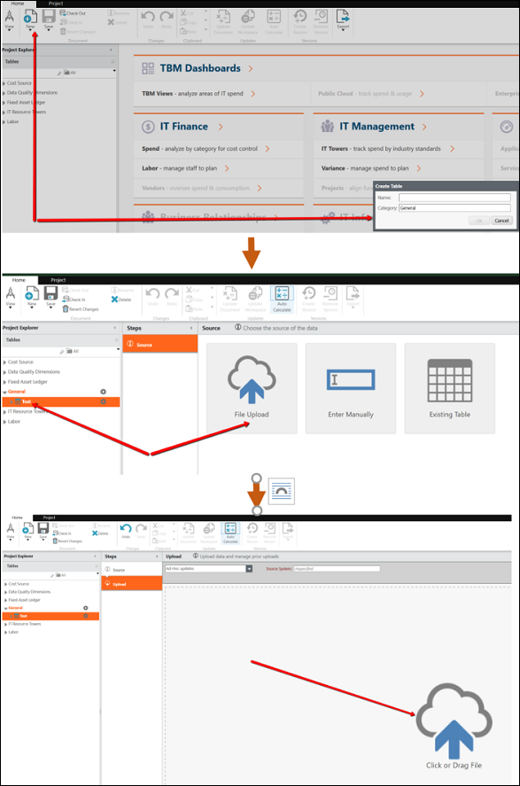

# Carregue seus dados

O processo geral de como o Apptio usa seus dados inclui:

1. Carregue seus dados em Apptio.
2. Anexe e mapeie seus dados no conjunto de dados mestre correspondente.

Os conjuntos de dados mestre são usados em todo o aplicativo Costing Standard para:

- Voltar objetos no modelo
- Apoiar estratégias de alocação
- Calcular métricas
- Exibir dados em relatórios
