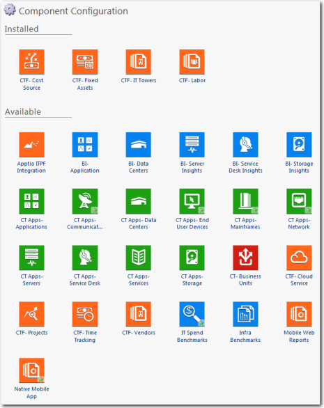
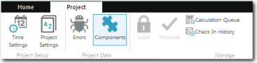

# Sobre os componentes do cálculo de custos padrão

Um componente do aplicativo Costing Standard agrupa relatórios e métricas para fornecer insights sobre seus negócios. Um componente também pode instalar uma ou mais tabelas de modelo em seu projeto. A Figura A mostra os componentes disponíveis no aplicativo Costing Standard .

## Componentes com código de cores

Os componentes são codificados por cores.

- Laranja - componentes do CTF
- Verde - Aplicativos e serviços
- Azul - Insights de negócios
- Vermelho - Unidades de negócios

## Instalar um componente

1. Verifique se você está no início do tempo em seu projeto.
2. Na guia Projeto, clique em **Componentes**.
3. Na área Disponível da tela Configuração de componentes, clique no ícone que corresponde ao componente que deseja instalar.
4. Na página de detalhes do componente, clique em **Instalar**.

AVISO

Não é possível desinstalar um componente depois de instalado. Você pode desativar um componente que remove os relatórios associados, mas mantém as tabelas e as métricas. Depois que você desinstalar todos os componentes em Costing Standard, todos os relatórios de nível superior serão adicionados. Se o cliente não quiser visualizar nenhum desses relatórios de nível superior, terá de criar um projeto personalizado.

## Informações relacionadas

- [Enviar comentários sobre a Central de Ajuda](productfeedback@apptio.com "(Abre em uma nova guia ou janela)")
