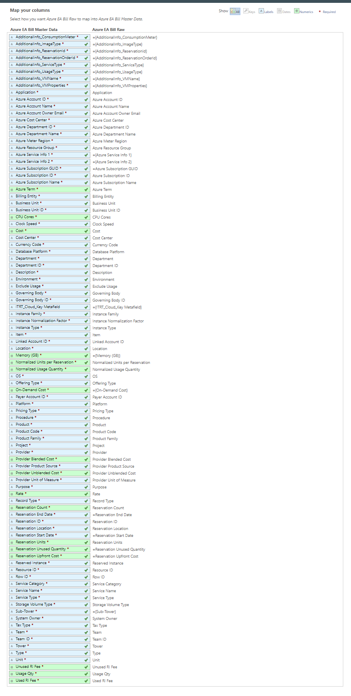
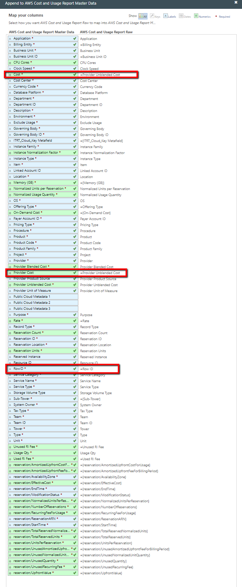

# Adição de uma etapa de fórmula às tabelas de nuvem do 12.6

Atualmente, o site Apptio não é compatível com a adição de etapas de fórmula às tabelas de nuvem AWS e Azure. No entanto, se houver necessidade (por exemplo, se você precisar modificar o Custo), use a seguinte solução alternativa.

Aplica-se a: Cloud em Costing Standard e Cloud Business Management (CBM) em TBM Studio 12.6 ou posterior

Para adicionar uma etapa de fórmula ao seu relatório mensal AWS, faça o seguinte:

## Procedimento

1. Desanexar o **AWS Cost and Usage Raw** do **AWS Cost** and **Usage Master Data**.
2. Crie uma transformação a partir da última etapa da tabela de pipeline e nomeie-a como **AWS Cost and Usage Transform**. Coloque-o na **categoria Provedor de serviços em nuvem**.
3. Anexe a **transformação de custo e uso do site AWS** aos **dados mestre de custo e uso do site AWS**.
4. Mapeie os seguintes campos:

   - Custo = Custo não combinado do provedor
   - Custo do provedor = Custo não combinado do provedor
   - RowID = ID da linha

## 

Para adicionar uma etapa de fórmula ao seu relatório mensal Azure, faça o seguinte:

### Procedimento

1. Desanexar o **Azure EA Bill Raw** do **Azure EA Bill Master Data**.
2. Crie uma transformação a partir da última etapa da tabela do pipeline e nomeie-a como Azure EA Bill Transform. Coloque-o na categoria Provedor de serviços em nuvem.
3. Anexe a transformação da fatura do EA Azure aos dados mestre da fatura do EA Azure. Todos os campos devem ser mapeados automaticamente.

### Exemplo

## Informações relacionadas

- [Enviar comentários sobre a Central de Ajuda](productfeedback@apptio.com "(Abre em uma nova guia ou janela)")
