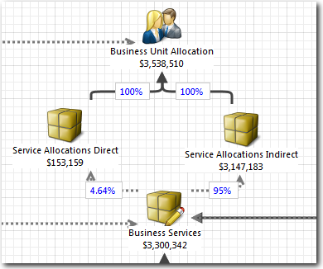

# Alocações diretas versus indiretas

As alocações diretas são baseadas no consumo. As alocações indiretas são baseadas em uma proporção selecionada, como o total de funcionários por departamento.

## Custos diretos

Os custos diretos podem ser atribuídos a um produto, departamento ou projeto específico. Mão de obra, software, equipamentos e matérias-primas são exemplos de custos diretos. Os custos diretos podem ser identificados com um objeto de custo específico. Uma grande porcentagem dos custos diretos vem da mão de obra e dos materiais.

## Custos indiretos

Os custos indiretos geralmente incluem a infraestrutura que mantém uma empresa em funcionamento. Os custos indiretos podem incluir itens como material de limpeza, serviços públicos, aluguel de equipamentos de escritório, computadores de mesa e telefones celulares.

## Como os custos diretos e indiretos são aplicados ao modelo de custos do Apptio

Os custos diretos e indiretos são calculados na parte superior do modelo de custo usando quatro objetos: Serviços empresariais, alocações de serviço diretas, alocações de serviço indiretas e alocação de unidades de negócios. O modelo é mostrado abaixo.

Os custos dos serviços comerciais são alocados ao objeto do modelo Service Allocations Direct com base no campo Service\_Service Allocations Direct. O campo está no conjunto de dados Todos os serviços de negócios que respalda o objeto do modelo Serviços de negócios e no conjunto de dados Mestre de alocações de serviço direto que respalda o objeto do modelo Alocações de serviço direto.

Os custos de serviços comerciais são alocados ao objeto Indireto de alocações de serviços com base no campo Verificar para SAD. O campo está no conjunto de dados All Business Services que faz o backup do objeto do modelo Business Services e do objeto do modelo Service Allocations Direct.

## Informações relacionadas

- [Enviar comentários sobre a Central de Ajuda](productfeedback@apptio.com "(Abre em uma nova guia ou janela)")
