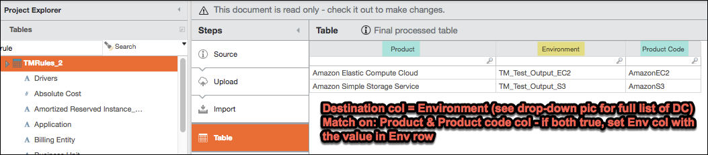
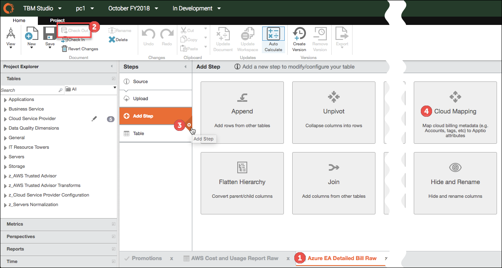
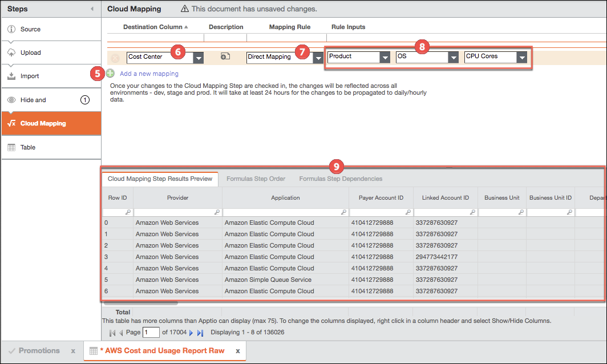
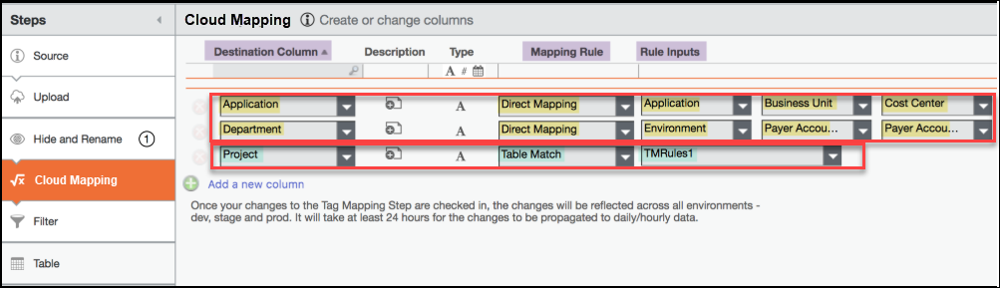

# Mapeamento de nuvem

O recurso de mapeamento da nuvem (também conhecido como *mapeamento de* tags) oferece a capacidade de mapear metadados da nuvem (como tags e contas) para atributos em Apptio, como unidade de negócios, aplicativo etc. O mapeamento dos dados da nuvem permitirá que você veja não apenas quais serviços de nuvem são consumidos, mas também que marque os dados de faturamento da nuvem com informações que o ajudem a entender os gastos e a propriedade da nuvem.

## Antes de começar

Como pré-requisito, você precisa decidir se quer usar regras de mapeamento direto, que permitem preencher a coluna de destino a partir de uma lista predefinida de colunas, ou as regras de correspondência de tabela, que exigem que você crie sua própria tabela de regras e defina a coluna que preenche a coluna de destino. Se você planeja usar regras de correspondência de tabela, é necessário criar uma tabela de regras (por exemplo, TMRules\_2 ) antes de executar as etapas a seguir.

Para criar uma tabela de regras, siga um destes procedimentos:

- Crie uma tabela de regras em um formato compatível com TBM Studio e, em seguida, carregue-a em TBM Studio.
- Crie uma tabela de regras em TBM Studio e salve-a.

Exemplo:

## Sobre esta tarefa

- Os mapeamentos se aplicam tanto ao arquivo mensal (usado no relatório Monthly TCO) quanto ao arquivo diário/hora (usado no relatório Daily Transparency).
- As alterações nos relatórios mensais são exibidas imediatamente após serem salvas em seu ambiente de desenvolvimento e, em seguida, verificadas no ambiente de teste.
- As alterações nos relatórios diários aparecem assim que a próxima fatura é ingerida por meio do pré-processador após clicar em Promotion to Production (Promoção para produção) em TBM Studio.

**OBSERVAÇÃO** O recurso de mapeamento de nuvem é ativado apenas para o Cloud Cost Management (CCM) e o Cloud Business Management (CBM). Ele não está disponível para nenhuma outra tabela no Studio. As tabelas com mapeamento na nuvem não podem usar uma etapa de fórmula em seu pipeline de transformação. Se você precisar adicionar lógica de fórmula ao pipeline de transformação, consulte [Adição de uma etapa de fórmula às tabelas de nuvem 12.6](addformulastep.html "Atualmente, o site Apptio não é compatível com a adição de etapas de fórmula às tabelas de nuvem AWS e Azure. No entanto, se houver necessidade (por exemplo, se você precisar modificar o Custo), use a seguinte solução alternativa.").

**OBSERVAÇÃO** O conector DataLink AWS pode processar contas do Relatório de Custo e Uso (CUR)

Tipos de regras de mapeamento

Há dois tipos de regras de mapeamento disponíveis:

Regras de mapeamento direto
:   - Cada regra consiste em 4 colunas: 1 coluna de destino | coluna 1 | coluna 2 | coluna 3
    - A regra tentará primeiro preencher a coluna de destino com o valor da coluna 1. Se essa coluna estiver vazia, será usado o valor da coluna 2. Se essa coluna estiver vazia, o valor da coluna 3 será usado. Se todas as colunas estiverem vazias, a coluna de destino estará vazia.
    - A lista de valores das colunas 1, 2 e 3 é extraída do cabeçalho da tabela AWS.

Regras de correspondência de tabela
:   - Cada regra consiste em 2 colunas: 1 coluna de destino | 1 tabela de entrada de regras
    - A tabela de regras deve ter uma coluna que corresponda à coluna de destino que foi selecionada. Por exemplo, se a coluna de destino for Projeto, a tabela de regras deverá conter uma coluna chamada Projeto.
    - A tabela de regras só pode ter colunas de entrada que façam parte da fatura original. Em outras palavras, as colunas que já foram emitidas e processadas não podem ser usadas como colunas de entrada.

Para mapear o faturamento da nuvem, faça o seguinte no ambiente de desenvolvimento em TBM Studio:

## Procedimento

1. No Project Explorer, abra uma das seguintes tabelas de nuvem:
   1. AWS Relatório de custo e uso Raw
   2. Azure Projeto de Lei EA Raw
2. Na guia **Home**, clique em **Check Out**.

   
3. Clique no sinal de **adição Adicionar etapa**.
4. Clique em **Cloud Mapping**.

   **NOTA** A etapa Mapeamento de nuvem é exibida (substituindo a etapa Fórmulas) somente depois que você seleciona uma tabela de nuvem.
5. Clique em **Adicionar um novo mapeamento**.

   
6. Na lista **Coluna de destino**, selecione uma ou mais colunas para usar como fonte.
7. Na lista **Mapping Rule (Regra de mapeamento** ), selecione **Direct Mapping (Mapeamento direto** ) ou **Table Match (Correspondência de tabela** ). Para obter uma descrição dessas regras, consulte a seção [Pré-requisitos](cloudmapping.html#base_file_name__prereq).

   
8. Nas listas **Rule Input (Entrada de regra** ), siga um destes procedimentos:
   1. Para mapeamento direto, em uma ou mais das listas suspensas, selecione o nome da coluna que deseja usar para preencher a coluna de destino.

      - A regra tentará primeiro preencher a coluna de destino com o valor da primeira lista de colunas (por exemplo, Aplicativo na imagem). Se essa coluna estiver vazia, será usado o valor da segunda lista de colunas (por exemplo, Unidade de negócios). Se essa coluna estiver vazia, será usado o valor da lista da terceira coluna (por exemplo, Centro de custo). Se todas as colunas estiverem vazias, a coluna de destino estará vazia.
      - A lista de valores das colunas 1, 2 e 3 é extraída do cabeçalho da tabela AWS.
   2. Para correspondência de tabela, selecione o nome da tabela de regras que você criou anteriormente (por exemplo, TMRules\_2 ).

      A tabela de regras deve ter uma coluna que corresponda à coluna de destino que foi selecionada. Por exemplo, se a coluna de destino for "Projeto", a tabela de regras deverá conter uma coluna chamada "Projeto"
9. Verifique suas alterações.

   A nova coluna agora aparece no relatório de TCO mensal do CCM e no relatório de transparência diária (Diário/Horário > Relatórios > Iaas Paas > Transparência diária), mas os dados no relatório de transparência diária não serão precisos até a próxima ingestão programada de dados de faturamento da nuvem (no máximo 24 horas).

   Em seguida, você precisa promover a produção para permitir que suas alterações sejam usadas no relatório de transparência diária/hora.
10. Mude para o ambiente **de preparação**.
11. Clique na guia **Projeto**.
12. Clique em **Lock**.
13. Clique em **Promotion Options (Opções de promoção** ).
14. Clique em **Promote Now (Promover agora** ).
15. Quando o processamento estiver concluído, clique em **Unlock (Desbloquear) para que** a próxima atualização diária seja bem-sucedida.

    Os dados de mapeamento serão exibidos no relatório de transparência diária/hora após a ingestão da próxima fatura de nuvem programada (no máximo 24 horas).

## Informações relacionadas

- [Enviar comentários sobre a Central de Ajuda](productfeedback@apptio.com "(Abre em uma nova guia ou janela)")
