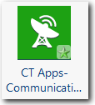

# CT Apps - componente de comunicações

O componente CT Apps - Communications faz parte do módulo Costing Standard Applications and Services. É usado para alocar os custos de infraestrutura de comunicação, incluindo circuitos e uso, para os consumidores do recurso de comunicação.

Aplica-se a: Costing Standard em TBM Studio 12.0 e posterior

Ícone do componente

## Tabelas de suporte

Quando você instala o componente CT Apps - Comunicações, um novo grupo de Comunicações é criado com duas tabelas: Comunicação (tabela de modelo), Dados mestre de comunicações.

## Dados principais

Para obter uma descrição dos campos na tabela de dados mestre, consulte as informações na página do componente CT Apps - Comunicações no produto. Para exibir a página:

1. Clique na guia **Project (Projeto** ) na faixa de opções.
2. Clique em **Components (Componentes** ).
3. Clique no componente **CT Apps - Comunicações**.

## Fazer upload dos dados

Faça o upload de seus dados de comunicação. Os campos obrigatórios e recomendados estão listados abaixo. Todos os campos podem ser mapeados para a tabela de dados mestre de comunicações.

- Conta (recomendado)
- Valor (obrigatório)
- ID do circuito (recomendado)
- Localização (recomendado)
- Tipo de local (obrigatório)
- Identificador de objeto (obrigatório)
- Oferta (recomendado)
- Produto (recomendado)
- Provedor de serviços (recomendado)
- Tipo (obrigatório)

## Mapear os dados

Depois de fazer o upload dos dados de comunicação, mapeie a tabela para a tabela de dados mestre de comunicação.

Depois que você mapear os dados, deverá haver um valor alocado de Torres de recursos de TI para Comunicações e de Comunicações para Servidores e Serviços empresariais no modelo de custos.

## Informações relacionadas

- [Enviar comentários sobre a Central de Ajuda](productfeedback@apptio.com "(Abre em uma nova guia ou janela)")
