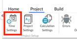
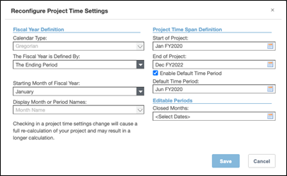

# Configurar horário

O tempo do projeto define as datas de início e término de um projeto e o tipo de períodos que serão utilizados.

Em um projeto com prazo definido, as datas de início e término são definidas para os dados e o ano fiscal é definido. Em um projeto com tempo definido, você pode inserir dados regularmente, alocá-los a um período específico e ver as tendências ao longo da duração do projeto. Você pode visualizar os dados do relatório do mês ou período atual, ou de períodos trimestrais, semestrais ou anuais. O aplicativo suporta calendários gregorianos, 445, 454, 544 e 13 períodos.

Para obter mais informações sobre como a IBM Apptio apoia projetos com prazo determinado, clique [aqui.](https://www.ibm.com/docs/en/apptio-commercial/tbm-studio/saas?topic=administration-enable-time-project "(Abre em uma nova guia ou janela)")

**Defina o prazo do projeto**

1. No estúdio da TBM.
2. Clique na guia Projeto na faixa de opções.
3. Clique em Configurações de tempo. A caixa de diálogo Configurar definições de tempo do projeto é exibida conforme mostrado abaixo.

   
4. Selecione um período de início do projeto e um período de término do projeto. Selecione as datas que incluem os dados históricos que você importará para o projeto.

   Observação: depois de definir a data de início do projeto, não será possível alterá-la. No entanto, você pode alterar a data de término do projeto.
5. Configure quaisquer outras definições de tempo adequadas ao seu projeto.
6. Clique em Configurar hora.

   

Para obter mais detalhes sobre as opções de calendário disponíveis e como configurá-las, clique [aqui.](https://www.ibm.com/docs/en/apptio-commercial/tbm-studio/saas?topic=administration-configure-project-time-settings "(Abre em uma nova guia ou janela)")
