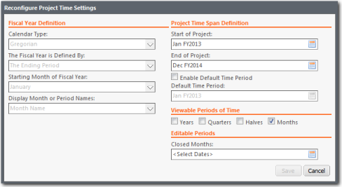

# Configurar o tempo para o projeto

O tempo do projeto define as datas de início e término de um projeto e o tipo de períodos que serão usados. Para configurar o tempo do **projeto**, clique em Time Settings (Configurações de tempo) na faixa de opções

## Sobre esta tarefa

Em um projeto ativado por tempo, as datas de início e término são definidas para os dados e o ano fiscal é definido. Em um projeto habilitado por tempo, é possível inserir dados regularmente, alocá-los a um período de tempo específico e ver as tendências ao longo da duração do projeto. Você pode visualizar os dados do relatório para o mês ou período atual, ou para períodos de um trimestre, semestre ou ano inteiro. O aplicativo é compatível com os calendários gregoriano, 445, 454, 544 e 13 períodos.

## Procedimento

1. Mude para o modo Studio clicando no ícone Modo Studio na extremidade direita da faixa de opções. O ícone ficará laranja e a faixa de opções do Studio será exibida.
2. Clique na guia Project (Projeto) na faixa de opções.
3. Clique em Configurações de tempo. A caixa de diálogo Configure Project Time Settings é exibida conforme mostrado abaixo.

   
4. Selecione um período de tempo de início do projeto e um período de tempo de fim do projeto. Selecione datas que incluam dados históricos que serão importados para o projeto. 

   OBSERVAÇÃO: Depois de definir a data de início do projeto, você não poderá alterá-la. No entanto, você pode alterar a data de término do projeto.
5. Defina quaisquer outras configurações de tempo de projeto apropriadas ao seu projeto. Para obter descrições dos campos, consulte a comunidade Apptio.
6. Clique em Configure Time (Configurar horário).

## Informações relacionadas

- [Enviar comentários sobre a Central de Ajuda](productfeedback@apptio.com "(Abre em uma nova guia ou janela)")
