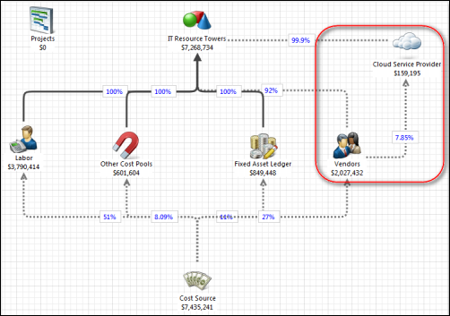

# Configuração da nuvem para cálculo de custos padrão 12.6

Apptio permite que os líderes de TI gerenciem e otimizem proativamente o consumo da nuvem pública e tomem decisões mais informadas sobre o uso e a compra da nuvem com análises em tempo real para monitorar os gastos e outros custos associados, como mão de obra e suporte.

Aplica-se a: Costing Standard em TBM Studio 12.6 e posterior, com o modelo v106 e posterior.

**OBSERVAÇÃO** : para obter instruções que se aplicam às versões de Costing Standard anteriores a 12.6, consulte [Configurando a nuvem para o cálculo de custos padrão 12.1 a 12.5x](cloudservices-12-5.html "Use o componente CTF - Cloud Service Provider para importar dados de uso de serviços da Web. O componente é opcional.").

## Antes de começar

Para que os custos da nuvem sejam calculados corretamente, os dados do fornecedor devem ser inseridos no aplicativo Costing Standard . Os dados do fornecedor identificam os custos provenientes dos serviços da Web e os alocam aos serviços em nuvem. O modelo apresentado abaixo mostra essa relação.

## Sobre esta tarefa

Se você estiver usando Amazon Web Services ( AWS ), Microsoft Azure, SoftLayer, ou CenturyLink,, poderá importar dados de uso dos relatórios mensais de uso e faturamento. Os dados são usados nos relatórios CTF e nos relatórios de aplicativos e serviços. Os dados podem ajudá-lo a comparar o custo dos serviços em nuvem com os serviços internos. Para usar os dados dos serviços da Web, você deve instalar o componente CTF - Cloud Service Provider.

Os seguintes componentes opcionais importam dados de uso de serviços da Web:

- CTF - Provedor de serviços em nuvem
- CTF - Amazon Web Services
- CTF - Azure
- CTF - Gerenciamento de negócios em nuvem

Apptio Costing Standard em TBM Studio 12.6 e posterior inclui o recurso de importar relatórios mensais de uso de dados na nuvem e de faturamento. Os dados são usados nos relatórios Costing Standard , permitindo que você compare o custo dos serviços em nuvem com os serviços internos.

## Etapa 1 - Instalar o componente do provedor de serviços em nuvem

### Procedimento

1. Abra o projeto Costing Standard .
2. Clique na guia **Projetos**.
3. Clique em **Components (Componentes** ) na faixa de opções.
4. Clique no componenteCTF **- Provedor de serviços em nuvem**.
5. Clique em **Install (Instalar** ).

### Resultados

Quando você instala o componente Cloud Service Provider:

- Um objeto do provedor de serviços de nuvem é adicionado ao modelo de custo.
- Os seguintes conjuntos de dados são criados na categoria Provedor de serviços de nuvem:
  - O Cloud Service Provider Lookup Master Data é usado para mapear os tipos de uso de sua organização para os tipos de uso do site Apptio.
  - Os dados mestre do provedor de serviços de nuvem são usados para mapear os dados de faturamento do serviço de nuvem para os relatórios de nuvem Apptio.
- Os conjuntos de dados a seguir são criados na categoria Configuração do provedor de serviços z\_Cloud:
  - Provedor de serviços de nuvem Apptio Lookup lista os tipos de uso do serviço de nuvem Apptio.
  - O Provider Lookup lista os tipos de uso do serviço de nuvem de sua organização.
- Os seguintes relatórios CBM são criados:
  - Resumo do provedor de serviços de nuvem
  - Finanças de TI - Resumo do projeto de lei do provedor de serviços de nuvem
  - Gerenciamento de TI - provedor de serviços em nuvem
  - Gerenciamento de TI - Provedor de serviços em nuvem - Detalhes
