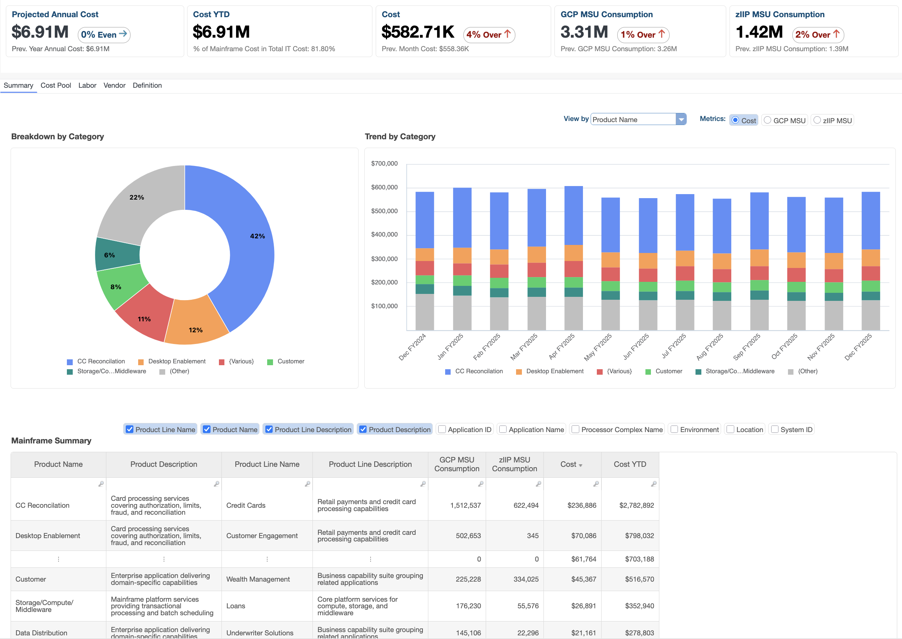
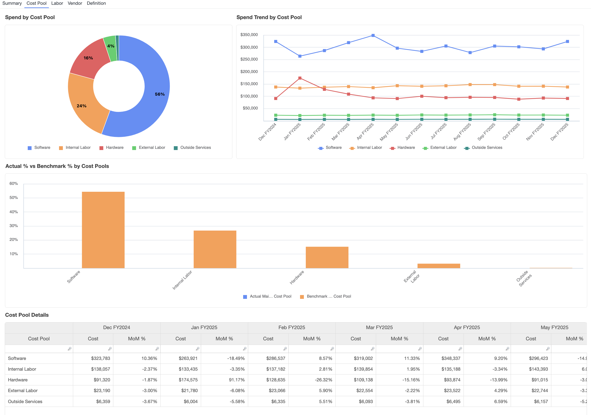
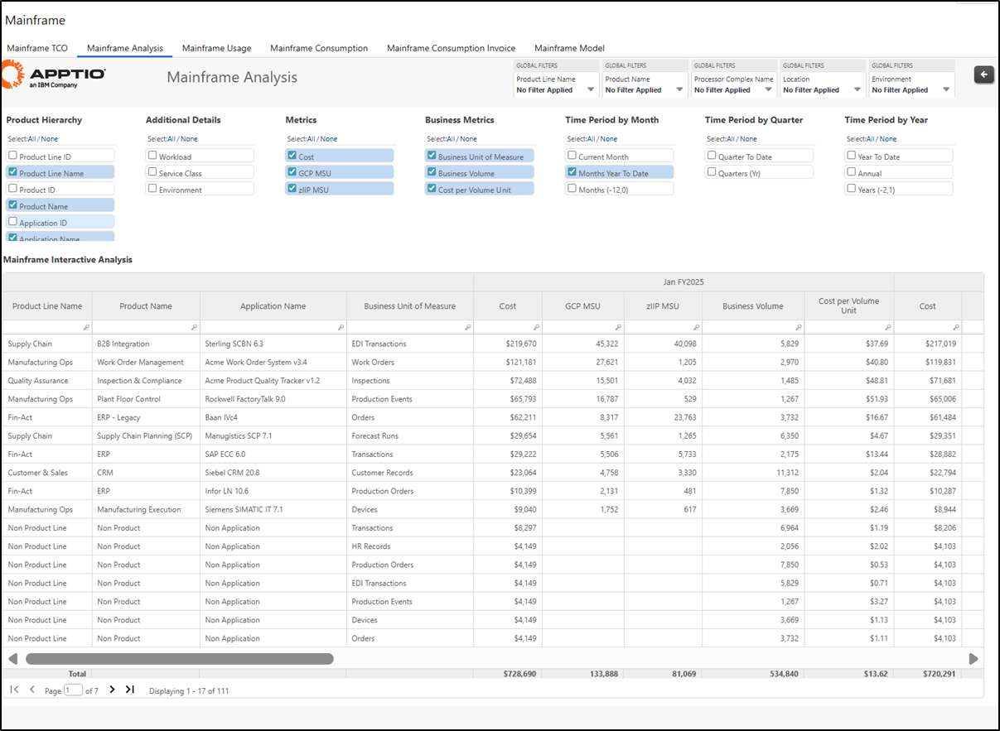
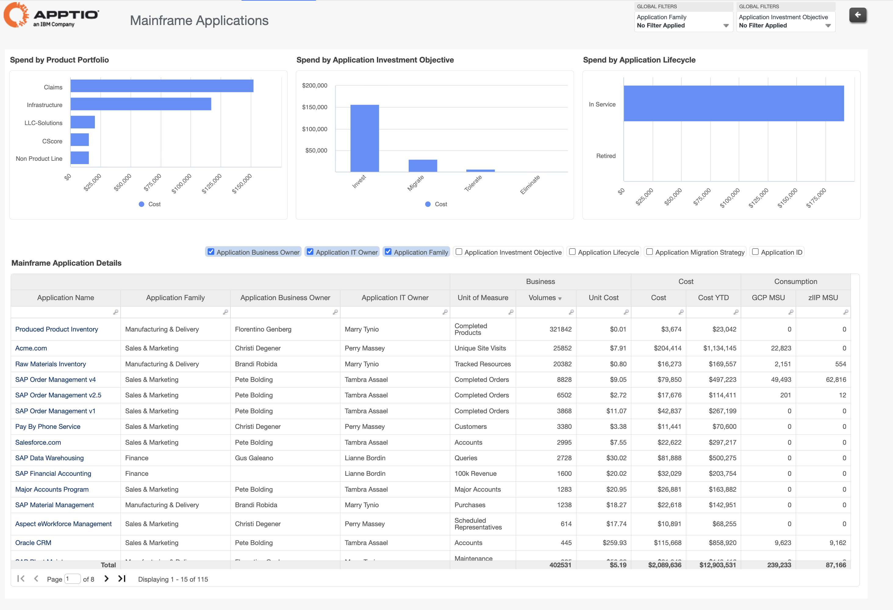
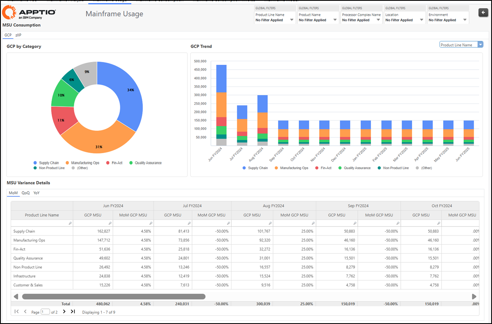
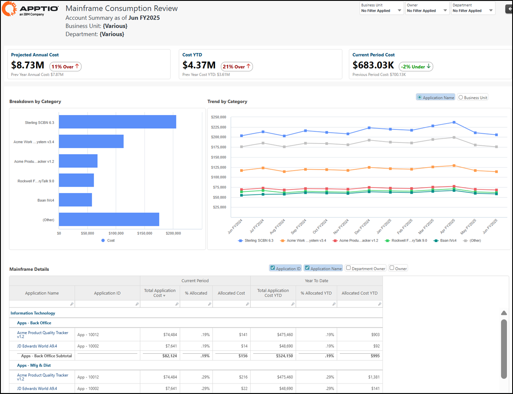
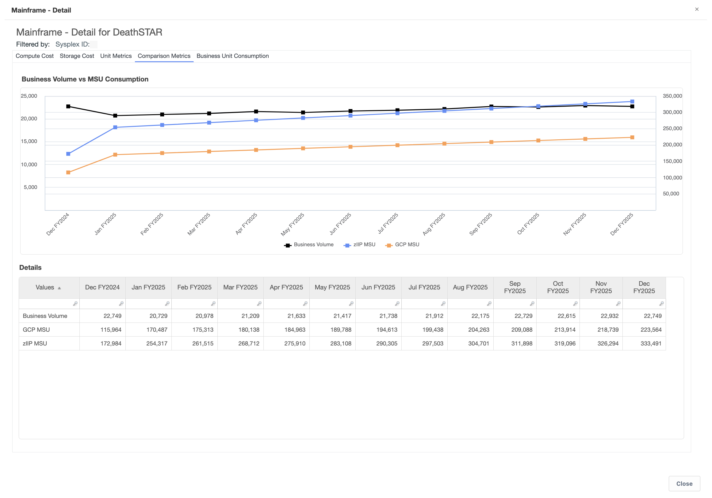
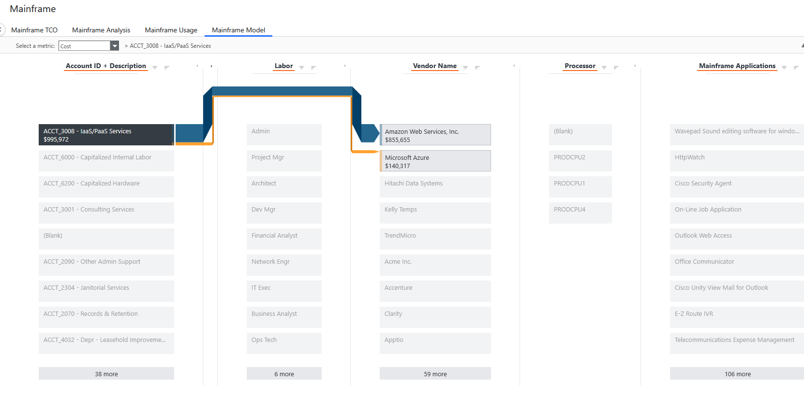

# Relatórios de mainframe

A coleção Mainframe oferece uma visão abrangente e defensável do custo total de propriedade, consumo, utilização e alocação do mainframe. Reúne informações financeiras, operacionais e sobre a carga de trabalho para ajudar as organizações a entender de onde vêm os custos do mainframe, como são consumidos e como podem ser alocados com precisão para aplicativos e unidades de negócios.

Essa coleção permite que os líderes de TI e finanças analisem os custos do mainframe juntamente com métricas de consumo, como MSUs ( GCP ) e MSUs ( zIIP ), acompanhem as tendências ao longo do tempo, comparem o uso com os volumes de negócios e identifiquem ineficiências ou anomalias. Ao combinar transparência de custos, análise de custos unitários e insights de utilização, a coleção apoia a tomada de decisões informadas sobre otimização, planejamento de capacidade e modelos de financiamento.

Os relatórios desta coleção apoiam a responsabilidade pelos custos por meio de visualizações transparentes de showback e chargeback, ajudam a validar as estruturas de custos em relação aos benchmarks e fornecem visibilidade sobre a eficiência da carga de trabalho e as tendências de consumo a longo prazo. Juntos, eles permitem que as organizações comuniquem com confiança o TCO do mainframe, defendam orçamentos e promovam melhorias contínuas de eficiência.

**Os relatórios disponíveis nesta coleção incluem:**

- TCO do mainframe – Transparência e alocação de custos
- TCO do mainframe – Composição do pool de custos e comparação com pares
- Análise de Mainframe
- Aplicação em mainframe
- Utilização do mainframe
- Showback e chargeback de mainframe
- TCO do mainframe - Informações sobre a utilização e eficiência do mainframe
- TCO do mainframe – Visão do modelo

**TCO do mainframe - Transparência e alocação de custos**

Este relatório fornece uma visão abrangente do custo total e do consumo do mainframe, combinando custos, MSUs ( GCP/zIIP ) e custos unitários calculados em uma visão integrada.

Use este relatório para compreender o panorama completo dos custos do mainframe, identificar os principais fatores de custo e comunicar o TCO às partes interessadas. O relatório detalha os gastos com mão de obra e fornecedores para identificar oportunidades de otimização.

Este relatório foi elaborado para ser utilizado pelas seguintes funções:

- Diretor de TI e liderança em TI
- Responsável pelo centro de custos do mainframe
- Finanças de TI

Informações fornecidas:

- Visão abrangente do custo total e do consumo, combinando custos, MSUs ( GCP/zIIP ) e custos unitários calculados.
- Compreensão das tendências de custo e uso ao longo do tempo.
- Análise dos principais fatores de custo relacionados à mão de obra e fornecedores para identificar oportunidades de otimização.

**TCO do mainframe - Composição do pool de custos e comparação com pares**

Este relatório fornece uma análise detalhada do TCO do mainframe em principais grupos de custos, incluindo hardware, software, mão de obra, instalações e serviços externos. As porcentagens de referência do setor são sobrepostas para destacar como sua estrutura de custos se compara às normas do setor.

Use este relatório para identificar áreas potenciais de otimização de custos, validar premissas orçamentárias e apoiar iniciativas de melhoria estratégica. A comparação entre pares permite discussões baseadas em evidências sobre a estrutura de custos do mainframe.

Este relatório foi elaborado para ser utilizado pelas seguintes funções:

- Diretor de TI e liderança em TI
- Finanças de TI
- Responsável pelo centro de custos do mainframe

Informações fornecidas:

- Discriminação detalhada do TCO do mainframe entre hardware, software, mão de obra, instalações e custos de serviços externos.
- Porcentagens de referência sobrepostas para mostrar como a estrutura de custos se compara às normas do setor e às organizações semelhantes.
- Identificação de centros de custos onde os gastos estão significativamente acima ou abaixo dos padrões de referência do setor.
- Apoio a iniciativas de melhoria estratégica por meio de análises da estrutura de custos baseadas em evidências.

**Análise de Mainframe**

Este relatório fornece uma análise flexível dos custos e do consumo do mainframe usando filtros, dimensões, métricas e períodos de tempo personalizáveis. O relatório permite visualizar o consumo de MSU do GCP e do zIIP para comparar diferentes tipos de processamento de carga de trabalho.

Utilize este relatório para uma análise detalhada dos padrões de custo e consumo em várias dimensões e períodos de tempo. O formato flexível permite a exportação para análise posterior em outras ferramentas ou painéis.

Este relatório foi elaborado para ser utilizado pelas seguintes funções:

- Responsável pelo centro de custos do mainframe
- Finanças de TI
- Planejamento de capacidade

Informações fornecidas:

- Visualize os custos e o consumo do mainframe em um formato de tabela flexível, utilizando filtros e dimensões, métricas e tempo opcionais.
- Análise de consumo para GCP e zIIP MSU para comparar diferentes tipos de processamento de carga de trabalho.
- Análise de tendências em vários períodos, incluindo mensal, trimestral ou intervalos personalizados para relatórios.
- Capacidade de exportação para análise posterior em outras ferramentas ou painéis.

**Aplicação em mainframe**

Este relatório fornece uma visão abrangente das aplicações suportadas por mainframe, combinando custos ao nível da aplicação, volumes de negócios, custos unitários e métricas de consumo do mainframe (MSUs de GCP e zIIP ) numa única visão integrada. Permite que as organizações compreendam como os recursos do mainframe são consumidos por aplicativos individuais e como esses custos se traduzem em valor comercial.

Este relatório foi elaborado para ser utilizado pelas seguintes funções:

- Diretor de TI e liderança em TI
- Responsável pelo centro de custos do mainframe
- Proprietários de aplicativos

Informações fornecidas:

- Visualize o custo total no nível do aplicativo, o custo acumulado no ano (YTD), o consumo de MSU ( GCP ) e o consumo de MSU ( zIIP ) em uma única visualização integrada.
- Compreenda o custo unitário por volume de negócios (por exemplo, custo por pedido, custo por conta, custo por transação).
- Analise os gastos por família de aplicativos, objetivo de investimento e estágio do ciclo de vida (Investir, Migrar, Tolerar, Eliminar).
- Identifique aplicativos de alto custo ou alto consumo para priorizar decisões de otimização, modernização ou desativação.

**Utilização do mainframe**

Este relatório acompanha as tendências de consumo de MSU por categoria de carga de trabalho, tipo de carga de trabalho, nome da linha de produtos, nome do produto e nome do aplicativo. O relatório destaca mudanças significativas mês a mês e fornece visões trimestre a trimestre e ano a ano para análise de tendências de longo prazo.

Use este relatório para monitorar padrões de consumo de carga de trabalho, identificar anomalias de utilização e acompanhar tendências de consumo a longo prazo. O destaque condicional chama a atenção para alterações significativas que podem exigir investigação.

Este relatório foi elaborado para ser utilizado pelas seguintes funções:

- Planejamento de capacidade
- Proprietário de aplicativo
- Responsável pelo centro de custos do mainframe

Informações fornecidas:

- Tendências de consumo de MSU por categoria de carga de trabalho, mostrando o uso em diferentes tipos de processamento.
- Rastreamento de uso por tipo de carga de trabalho, nome da linha de produtos, nome do produto e nome do aplicativo para análise detalhada.
- Monitoramento mensal do consumo de MSU com destaques condicionais identificando mudanças significativas.
- Visão trimestral e anual para compreender as tendências de consumo a longo prazo.

**Showback e chargeback de mainframe**

Este relatório relaciona o uso do mainframe aos custos por aplicação, carga de trabalho ou unidade de negócios, utilizando dados reais de consumo. O relatório garante que a alocação de custos reflita o consumo real por meio da integração com os dados do IBM IntelliMagic Vision.

Use este relatório para fornecer visões claras e defensáveis de showback e chargeback às unidades de negócios. A abordagem baseada em dados torna as discussões sobre custos produtivas, fundamentando-as em métricas de uso reais.

Este relatório foi elaborado para ser utilizado pelas seguintes funções:

- Gerente de Relacionamento Comercial
- Finanças de TI
- Proprietário de aplicativo

Informações fornecidas:

- Conexão do uso do mainframe aos custos por aplicação, carga de trabalho ou unidade de negócios com base no consumo real.
- Alocação de custos que reflete o consumo real usando dados precisos do IBM IntelliMagic Vision.
- Visualizações claras e justificáveis de showback e chargeback para unidades de negócios com metodologias transparentes.
- Discussões sobre custos baseadas em dados, fundamentadas em métricas de uso real e padrões de consumo.

**TCO do mainframe - Informações sobre a utilização e eficiência do mainframe**

Este relatório identifica as eficiências do mainframe por meio de insights sobre a utilização no nível da carga de trabalho que revelam padrões, picos e capacidade subutilizada. O relatório rastreia todas as cargas de trabalho e aplicativos atualmente ativos no mainframe, juntamente com seu consumo de MSU.

Use este relatório para tomar decisões mais inteligentes sobre planejamento e uso, identificando ineficiências, acompanhando tendências de consumo e detectando picos de carga de trabalho. A visibilidade detalhada contribui para melhorias na eficiência operacional.

Este relatório foi elaborado para ser utilizado pelas seguintes funções:

- Planejamento de capacidade
- Proprietário de aplicativo
- Responsável pelo centro de custos do mainframe

Informações fornecidas:

- Identificação das eficiências do mainframe por meio de insights sobre a utilização no nível da carga de trabalho, revelando padrões, picos e capacidade subutilizada.
- Rastreamento de todas as cargas de trabalho e aplicativos atualmente ativos no mainframe, juntamente com seu consumo de MSU.
- Acompanhamento da tendência de consumo por tipo de carga de trabalho, linha de produtos e aplicação para identificar ineficiências.
- Acompanhamento de picos de carga de trabalho e identificação de oportunidades para melhorar a eficiência operacional.

**TCO do mainframe - Visão do modelo**

Este relatório visualiza o fluxo completo de custos do início ao fim no modelo de custos do mainframe. O relatório traça os fatores de custo subjacentes que alimentam o processador do mainframe, incluindo custos diretos do Razão, como depreciação, bem como custos de mão de obra e fornecedores.

Use este relatório para entender como os custos fluem pelo modelo e como os dados de uso orientam a alocação do TCO do mainframe para aplicativos de negócios. A visualização permite a validação das metodologias de alocação e a precisão do modelo de custos.

Este relatório foi elaborado para ser utilizado pelas seguintes funções:

- Finanças de TI
- Responsável pelo centro de custos do mainframe
- Escritório da TBM

Informações fornecidas:

- Visualização do fluxo de custos do início ao fim no modelo de custos do mainframe.
- Rastreamento dos fatores de custo subjacentes que alimentam o processador do mainframe, incluindo custos diretos do Razão.
- Compreensão de como os custos com mão de obra e fornecedores contribuem para o TCO total do mainframe.
- Visualização de como os dados de uso orientam a alocação do TCO do mainframe para aplicativos de negócios.

