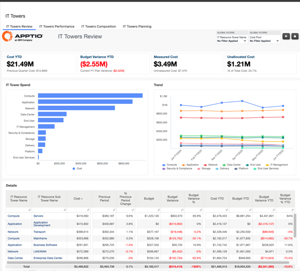
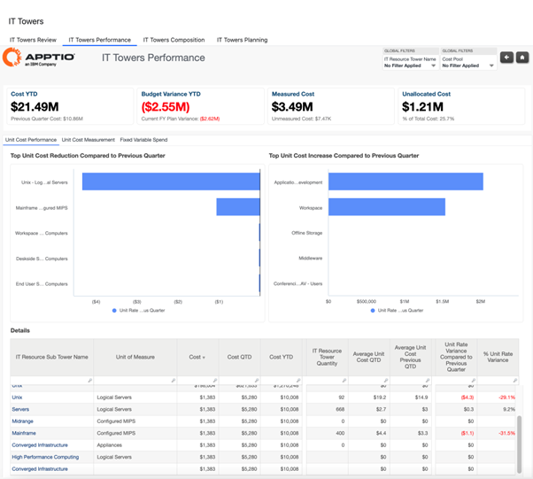
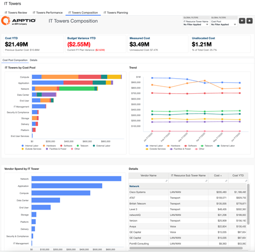
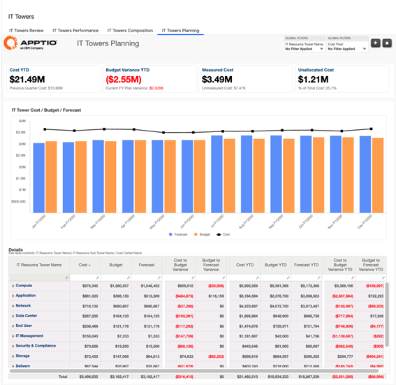

# Relatórios da Resource Towers

**A coleção de relatórios IT Towers** oferece visibilidade dos gastos com TI em torres e subtorres de recursos tecnológicos, permitindo que as organizações compreendam a distribuição de custos, as tendências de desempenho, a composição e o planejamento prospectivo em um nível funcional. Esses relatórios auxiliam nas revisões operacionais e estratégicas, ajudando os líderes de TI e finanças de TI a analisar como os custos evoluem ao longo do tempo, o que impulsiona os gastos com torres e como os gastos se alinham com o orçamento e a previsão.

Esta coleção inclui:

- Análise da IT Towers
- Desempenho das Torres de TI
- Composição das Torres de TI
- Planejamento das Torres de TI

## Análise da IT Towers

O relatório IT Towers Review fornece visibilidade dos gastos com TI em torres e subtorres de recursos, ajudando as organizações a entender onde os custos estão concentrados e como eles mudam ao longo do tempo. Ele também fornece uma comparação de alto nível entre os gastos e o orçamento para apoiar revisões periódicas e a identificação precoce de desvios.

Este relatório foi elaborado para:

- Finanças de TI
- Gerentes de TI / Gerentes de Recursos
- Proprietários do serviço

**Informações fornecidas**

- Compreenda a distribuição dos gastos com TI entre torres e subtorres de recursos.
- Identifique as torres e subtorres com os custos mais elevados e avalie se os padrões de gastos estão alinhados com as expectativas e o orçamento.
- Analise como os centros de custos e fornecedores contribuem para os custos da torre e da subtorre e identifique fatores inesperados.
- Detecte mudanças periódicas nos gastos com torres e subtorres para identificar tendências emergentes ou anomalias.
- Analise as tendências de quantidade e custo unitário para compreender os fatores que impulsionam as mudanças nos custos.
- Identifique os aplicativos com o maior consumo acumulado no ano por torre e subtorre.

Para obter mais detalhes sobre como usar o relatório IT Towers Review[, clique](https://www.ibm.com/docs/en/apptio-commercial/costing-standard/saas?topic=reports-it-towers-review "(Abre em uma nova guia ou janela)") aqui.

## Desempenho da Torre de TI

O relatório de desempenho das torres de TI fornece uma visão comparativa dos gastos com recursos de TI ao longo do tempo. Ele destaca as mudanças nos gastos entre as torres e indica se elas estão melhorando a eficiência ou enfrentando uma pressão crescente de custos, com uma breve referência ao alinhamento do orçamento.

Este relatório foi elaborado para:

- Finanças de TI
- Gerentes de TI / Gerentes de Recursos

**Informações fornecidas**

- Compare as mudanças nas despesas trimestre a trimestre entre as torres de recursos de TI.
- Identifique as torres com as maiores reduções ou aumentos de custo em relação aos períodos recentes.
- Destaque as tendências de desempenho que indicam melhoria ou declínio na eficiência de custos.
- Apoie as avaliações de desempenho identificando torres onde a movimentação de gastos possa justificar uma investigação mais aprofundada.

Para obter mais detalhes sobre como usar o relatório de desempenho da IT Towers[, clique](https://www.ibm.com/docs/en/apptio-commercial/costing-standard/saas?topic=reports-it-towers-performance "(Abre em uma nova guia ou janela)") aqui.

## Composição da Torre de TI

O relatório Composição das Torres de TI fornece uma visão estrutural dos custos da torre de recursos de TI, detalhando os gastos por grupos de custos e fornecedores. Ele também fornece uma visão geral de como os gastos com torres se comparam ao orçamento, auxiliando na compreensão tanto da composição dos custos quanto do alinhamento financeiro.

Este relatório foi elaborado para:

- Finanças de TI
- Gerentes de TI / Gerentes de Recursos

**Informações fornecidas**

- Entenda como os custos da torre de TI são distribuídos entre os centros de custos, como hardware, software e mão de obra.
- Identifique os principais centros de custos que impulsionam os gastos em cada torre de recursos de TI.
- Analise os gastos com fornecedores por torre de TI para entender onde os gastos externos estão concentrados.
- Analise os gastos relativos ao orçamento para identificar áreas que possam exigir uma análise mais aprofundada.

Para obter mais detalhes sobre como usar o relatório IT Towers Composition[, clique](https://www.ibm.com/docs/en/apptio-commercial/costing-standard/saas?topic=reports-it-towers-composition "(Abre em uma nova guia ou janela)") aqui.

## Planejamento das Torres de TI

O relatório de planejamento das torres de TI fornece uma visão prospectiva dos custos das torres de recursos de TI para apoiar o planejamento e a previsão financeira. Ajuda os usuários a comparar os custos reais com o orçamento e a previsão, compreender o orçamento restante e avaliar como as tendências de gastos estão se comportando ao longo do tempo no nível da torre.

Este relatório foi elaborado para:

- Finanças de TI
- Gerentes de TI / Gerentes de Recursos

**Informações fornecidas**

- Analise os custos da torre de TI em relação ao orçamento e às previsões para avaliar o alinhamento financeiro.
- Compreenda o orçamento restante e a previsão de esgotamento do orçamento com base nas tendências atuais de gastos.
- Compare tendências de custo, orçamento e previsão em todas as torres de recursos de TI ao longo do tempo.
- Analise os custos, o orçamento, as previsões e as variações acumulados no ano por torre de recursos de TI para apoiar as decisões de planejamento.

Para obter mais detalhes sobre como usar o relatório IT Towers Composition, clique [aqui](https://www.ibm.com/docs/en/apptio-commercial/costing-standard/saas?topic=reports-it-towers-planning "(Abre em uma nova guia ou janela)").

