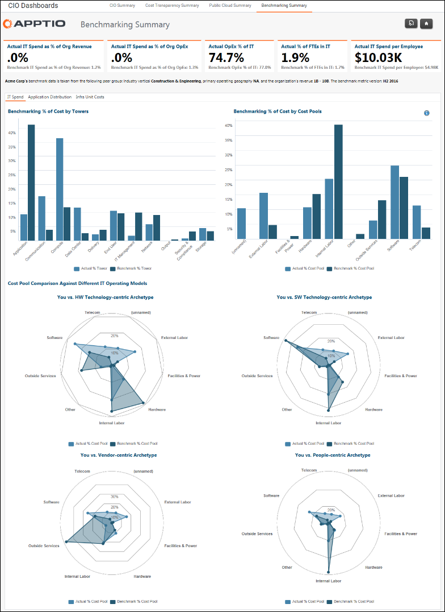
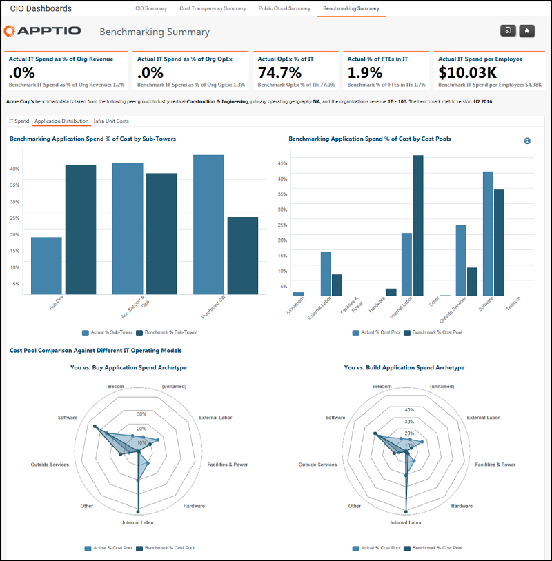
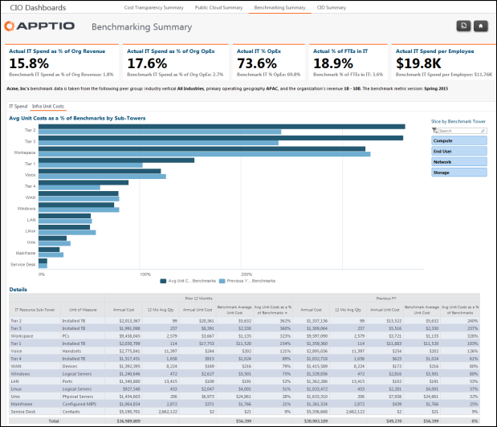

# Relatórios resumidos de benchmarking

Aplica-se a: Costing Standard 11.8.x em execução em TBM Studio v12 ou TBM Studio v11.

## Introdução

O benchmarking automatiza a comparação contínua de custos com uma seleção de organizações semelhantes. Os custos de TI são calculados da mesma forma para cada organização, de acordo com ATUM® - Apptio e são baseados nos sistemas financeiros de origem, incluindo o Razão (GL). Os custos são calculados no nível da torre e da subtorre de TI e apresentados em um conjunto padrão de pools de custos (por exemplo, g.: hardware, software, mão de obra interna, mão de obra externa etc.).

Ao comparar os gastos calculados de TI da sua organização de TI com um conjunto de organizações semelhantes, você pode obter os insights necessários para promover a melhoria contínua da TI:

Identificar metas de otimização de custos
:   Use métricas de custo unitário para suporte e infraestrutura de TI e faça comparações confiáveis com seus pares.

Promover melhorias no desempenho
:   Apoiar as atividades de governança, estimular a melhoria contínua e criar incentivos com base em metas confiáveis.

Justificar os gastos com TI
:   Planeje com fatos e métricas relevantes e justifique os gastos atuais e futuros com TI e os custos de pessoal.

Permitir conversas centradas nos negócios
:   Demonstrar o valor dos serviços de TI e melhorar o diálogo e o alinhamento com os usuários corporativos com base em dados.

## Aplicativo de benchmarking

Os relatórios de Resumo de Benchmarking fazem parte do aplicativo da Fundação Costing Standard . O aplicativo Benchmarking oferece um conjunto mais detalhado e extenso de relatórios de benchmarking.

## Os KPIs destacam os principais benchmarks

Os KPIs (Key Performance Indicators, indicadores-chave de desempenho) que aparecem na parte superior dos relatórios se concentram em:

- Gastos com TI como porcentagem da receita total da empresa
- Despesas operacionais de TI como um percentual das despesas operacionais totais da empresa
- Despesas operacionais de TI como porcentagem do gasto total de TI ( OpEx mais CapEx )
- O número de funcionários em tempo integral em TI como uma porcentagem do total de funcionários da empresa
- O valor dos gastos com TI por funcionário na empresa

Os valores de KPI de referência baseiam-se nos valores de origem de custo de sua organização em comparação com os valores de referência dos colegas.

## Guia Despesas de TI

A guia **Despesas de TI** exibe dados de benchmarking para as torres e pools de custos definidos em ATUM. O relatório faz parte do aplicativo da Fundação Costing Standard e estará disponível se a sua organização concordar em compartilhar suas informações de custo com a Apptio para que elas possam fazer parte dos dados de benchmarking.

## Guia Distribuição de aplicativos

O relatório **Distribuição de aplicativos** exibe dados de benchmarking para os aplicativos usados em sua organização. Os benchmarks são baseados nas características do setor, geografia e tamanho de sua organização. Esse relatório faz parte do aplicativo Benchmarking e estará disponível se sua organização tiver adquirido o aplicativo.

## Guia Custos unitários de infraestrutura (estrutura)

A guia **Custos unitários de infraestrutura** exibe dados de benchmarking para as torres definidas pelo Apptio Modelo Unificado TBM ( ATUM ). Os benchmarks são baseados nas características do setor, geografia e tamanho de sua organização. O relatório faz parte do aplicativo autônomo ApptioBenchmarking e estará disponível se a sua organização tiver adquirido o aplicativo.

