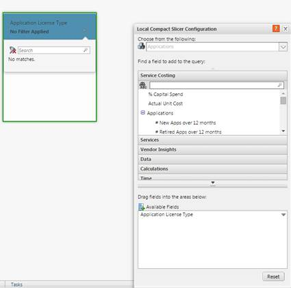
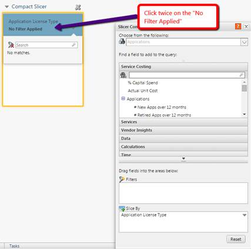

# Fatiadores compactos e filtragem no fatiador

Para filtrar os Compact Slicers, você pode adicionar um filtro para ocultar um pool de custos específico de ser filtrado em um relatório.

1. Clique no **Slicer**.
2. Clique em **No Filter Applied** (duas vezes) e a janela **Ad Hoc Query** será atualizada como mostrado nas imagens a seguir.

 
