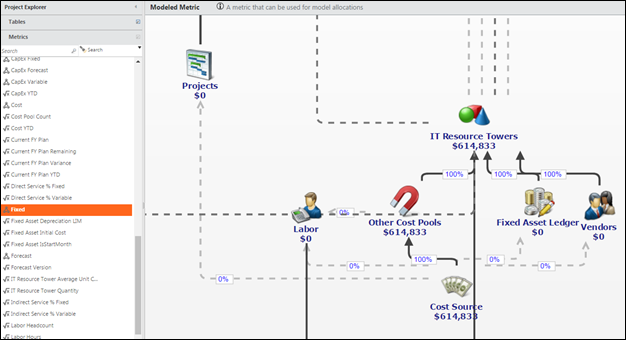
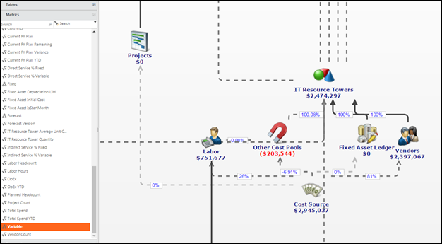
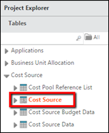
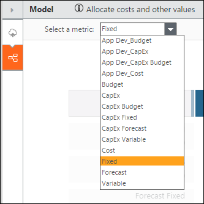
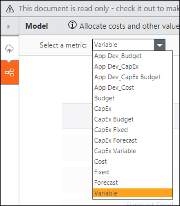
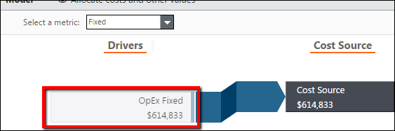
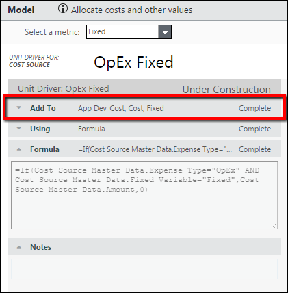
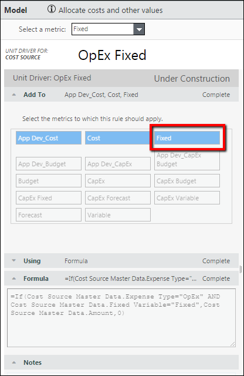
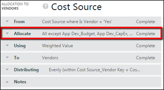
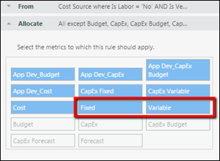

# Fixo /var relatórios e alocações variáveis

Aplica-se a : v12+

## Visão geral

Tentando descobrir por que seus custos fixos ou variáveis estão:

- não parece correto?
- muito baixo?

Você está fazendo alguma dessas perguntas?

- Como são calculados os custos fixos e variáveis?
- Como faço para obter dólares nos modelos fixo ou variável?
- Como faço para garantir que os custos fixos e variáveis estejam fluindo em seus modelos?
- Como posso afetar diretamente o valor exibido no relatório Fixo/Variável?

Este tópico o orientará sobre como os custos fixos e variáveis são configurados em Costing Standard e onde você pode editar esses custos.

## Como são criados os custos fixos e variáveis?

Os custos fixos e variáveis são criados a partir dos modelos fixo e variável, que são executados em paralelo ao modelo de custo pronto para uso.

Modelo fixo
:   

Modelo de variável
:   

## Como faço para obter dólares nos modelos fixo e variável?

Para garantir que haja valores preenchidos nos modelos Fixo e Variável, siga estas etapas.

1. Clique na tabela **Origem do custo**.

   
2. Selecione a métrica **Fixa** ou **Variável** no menu suspenso.

   Menu suspenso fixo
   :   

   Menu suspenso de variáveis
   :   
3. Clique no driver **OpEx Fixed**.

   
4. Clique no menu suspenso **Add To**.

   
5. Certifique-se de que o botão **Fixo** esteja selecionado.

   

Siga as etapas anteriores para verificar os modelos Fixo e Variável se estiver executando o Custo por meio de Apptio. Além disso, você deve verificar os modelos Fixo e Variável para cada métrica de relatório adicional: CapEx, Budget e Forecast.

## Como faço para garantir que os custos fixos e variáveis estejam fluindo pelo modelo?

Para garantir que os custos fixos e variáveis estejam funcionando corretamente e fluindo em dólares, você terá de ativar a alocação fixa e variável. Para fazer isso, selecione o botão Fixo e Variável na janela suspensa Alocar linha de alocação. Faça essa seleção para todas as linhas de alocação que levam às Torres de Recursos de TI.

## Como posso afetar diretamente o valor exibido no relatório do App Dev?

Para afetar o valor em dólares vinculado ao relatório Fixo/Variável, você terá de selecionar os botões Fixo e Variável para as linhas de alocação. Por exemplo: se estiver tentando informar a divisão Fixo/Variável no nível de Trabalho, os botões Fixo e Variável deverão ser selecionados em todas as linhas de alocação que fluem para o objeto Trabalho. Se estiver tentando informar o detalhamento Fixo/Variável no nível da Torre de Recursos de TI, os botões Fixo e Variável terão de ser selecionados em todas as linhas de alocação que fluem para o objeto Torre de Recursos de TI.

## Principais conclusões

- Todas as linhas de alocação abaixo de Torres de recursos de TI devem ter os botões Fixo e Variável selecionados.
- Somente as linhas de alocação que estão fluindo diretamente para o objeto que está sendo relatado e que também têm os botões Fixo e Variável selecionados serão exibidas como custos Fixos/Variáveis no relatório.
- Para afetar diretamente os valores exibidos nos relatórios Fixo/Variável, as linhas de alocação que rolam para o objeto que está sendo reportado terão de ser ajustadas.

## Informações relacionadas

- [Enviar comentários sobre a Central de Ajuda](productfeedback@apptio.com "(Abre em uma nova guia ou janela)")
