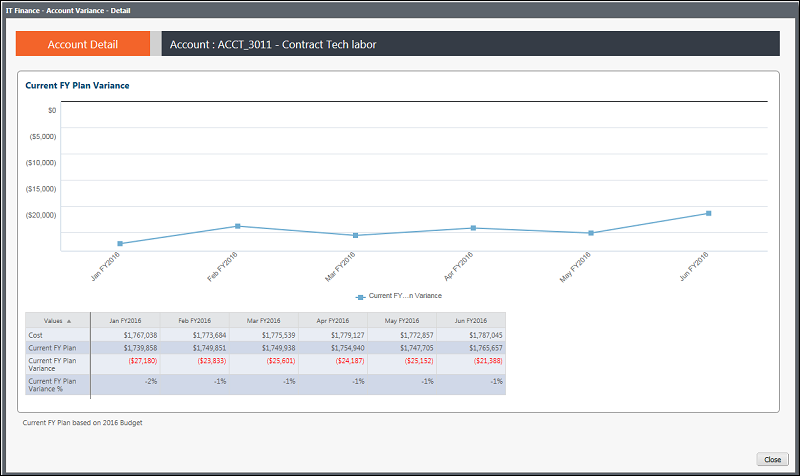

# IT Finance - Variação de conta - Relatório de tendências ( v103 )

Aplica-se a: Costing Standard 11.8.x em execução em TBM Studio v12 ou TBM Studio v11.

## Introdução

Use este relatório para visualizar as despesas e o orçamento por mês do ano fiscal atual.

## Navegação

Finanças de TI > Variação de conta > Visualização da tendência de variação

## Funções

Este relatório foi elaborado para a equipe de finanças de TI.

## Objetivos

Use este relatório para:

- Visualizar as despesas e o orçamento por mês para o ano fiscal atual.
- Analise os dados de suporte para ver a variação orçamentária e a variação percentual por mês.

## Perguntas respondidas

Você pode usar as informações apresentadas neste relatório para responder às seguintes perguntas:

- Como a variação do meu orçamento para esse centro de custo está flutuando ao longo do tempo?
- A tendência das despesas é aumentar, diminuir ou permanecer constante?
- Minhas despesas estão acompanhando o orçamento planejado ou estou observando picos de variação acima ou abaixo do orçamento?
- São necessárias medidas para reduzir o risco orçamentário?

## Próximas ações

Visualize as transações da conta do mês atual ou dos meses anteriores clicando em uma conta no relatório IT Finance - Account Variance.

## Informações relacionadas

- [Enviar comentários sobre a Central de Ajuda](productfeedback@apptio.com "(Abre em uma nova guia ou janela)")
