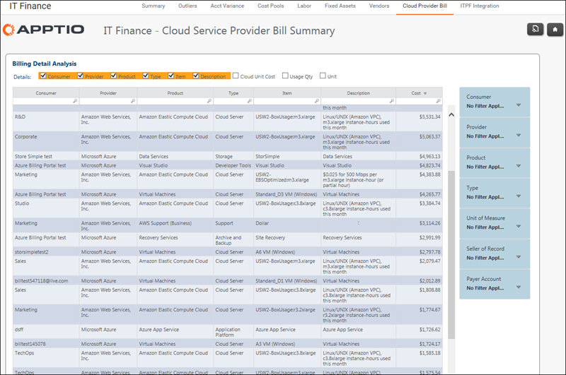

# Finanças de TI - Relatório da fatura do provedor de nuvem

◆ Aplica-se a: Costing Standard 11.8.x em execução em [TBM Studio v12](https://community.apptio.com/community/apptio/product-central/tbm-studio/studio-v12 "(Abre em uma nova guia ou janela)") ou [TBM Studio v11](https://community.apptio.com/community/apptio/product-central/tbm-studio/studio-v11 "(Abre em uma nova guia ou janela)").

Use o relatório para revisar os detalhes dos gastos com a nuvem. Selecione as colunas que deseja exibir e filtre o relatório por nome do cliente, produto, tipo de produto e unidade.

## Navegação

Finanças de TI - fatura do provedor de nuvem

## Funções

Este relatório foi elaborado para:

## Objetivos

Use este relatório para:

## Perguntas respondidas

As informações apresentadas neste relatório podem ser usadas para responder às seguintes perguntas:

## Próximas ações
