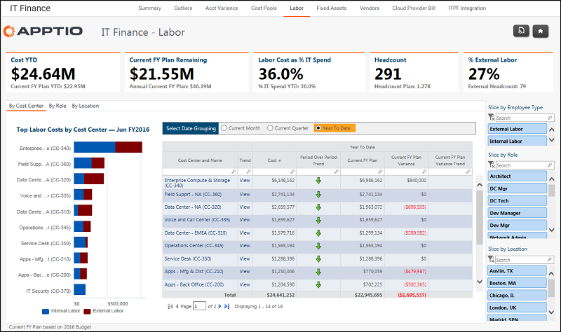

# Finanças de TI - Relatório trabalhista ( v103 )

Aplica-se a: Costing Standard 11.8.x em execução em TBM Studio v12 ou TBM Studio v11.

## Introdução

Use esse relatório para visualizar os custos de mão de obra por pessoal interno e externo por centro de custo.

## Navegação

Finanças de TI > Trabalho

## Funções

Este relatório foi elaborado para a equipe de finanças de TI.

## Objetivos

Use este relatório para:

- Visualizar os custos de mão de obra por pessoal interno e externo por centro de custo.
- Entenda as despesas de mão de obra em relação ao orçamento por centro de custos para o mês atual, trimestre e acumulado no ano.

## Perguntas respondidas

Você pode usar as informações apresentadas neste relatório para responder às seguintes perguntas:

- Quanto gastei com mão de obra este ano?
- Como estou me saindo em relação ao número total de funcionários e aos planos orçamentários?
- Qual departamento ou centro de custos é responsável pelo meu maior gasto com mão de obra?
- Onde está minha maior variação, por valor?
- São necessárias medidas para reduzir o risco orçamentário?

## Próximas ações

Para ver as despesas, o número de funcionários e as taxas por função, clique no centro de custos específico para abrir o relatório IT Finance Labor Detail.

## Informações relacionadas

- [Enviar comentários sobre a Central de Ajuda](productfeedback@apptio.com "(Abre em uma nova guia ou janela)")
