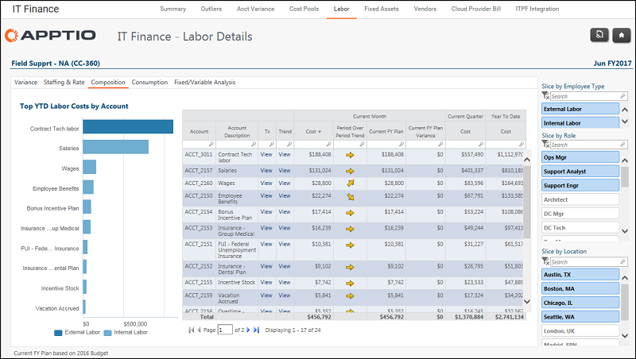

# IT Finance - Detalhes trabalhistas - Relatório de composição ( v103 )

Aplica-se a: Costing Standard 11.8.x em execução em TBM Studio v12 ou TBM Studio v11.

## Introdução

Use esse relatório para entender quais contas compõem as despesas com mão de obra.

## Navegação

Finanças de TI > Trabalho > Centro de custos > Composição da conta

## Funções

Este relatório foi elaborado para:

- Equipe de finanças de TI
- Proprietário do centro de custo

## Objetivos

Use este relatório para:

- Entenda quais contas compõem o gasto com mão de obra.
- Revise as despesas por conta para o período atual, o trimestre atual e o acumulado no ano usando o componente Select Date Grouping.

## Perguntas respondidas

Você pode usar as informações apresentadas neste relatório para responder às seguintes perguntas:

- Quais são todas as contas que compõem as despesas com mão de obra?
- O valor vinculado a uma conta específica faz sentido para o meu centro de custos?
- É necessária uma ação para investigar melhor as despesas de uma determinada conta?

## Próximas ações

- Veja as transações da conta clicando em View (Exibir) na coluna Tx.
- Visualize as despesas e o orçamento de 13 meses para identificar tendências anormais clicando em Visualizar na coluna Tendência.
- Investigue o consumo para entender onde os recursos do Labor estão trabalhando, clicando na guia Consumo.
