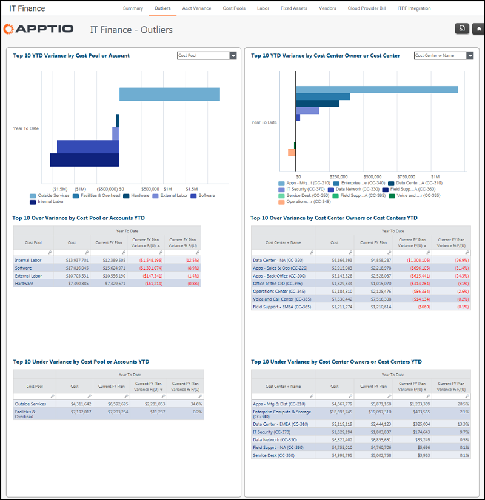

# Finanças de TI - Relatório de outliers ( v103 )

Aplica-se a: Costing Standard 11.8.x em execução em TBM Studio v12 ou TBM Studio v11.

## Introdução

Use esse relatório para revisar o desvio orçamentário por pool de custos e proprietário do centro de custos. Este relatório foi atualizado em R11.8.1.

## Navegação

Finanças de TI > Excedentes

## Funções

Este relatório foi elaborado para a equipe de finanças de TI.

## Objetivos

Use os gráficos do relatório para:

- Variação orçamentária por pool de custos
- Variação orçamentária por proprietário de centro de custo

Use as tabelas do relatório para:

- Identificar os principais orçamentos superiores e inferiores por conta
- Identificar os principais orçamentos superiores e inferiores por centro de custo

## Perguntas respondidas

Use as informações apresentadas neste relatório para responder às seguintes perguntas:

- Quais pools de custos têm a maior variação?
- Quais são os principais proprietários de centros de custo com orçamento excedente?
- Onde devo priorizar a investigação para entender e ajudar a explicar qualquer variação inesperada?

Use as tabelas do relatório para responder às seguintes perguntas:

- Quais contas específicas eu preciso investigar para explicar os desvios?
- Quais centros de custo específicos eu preciso investigar para explicar os desvios?
- As variações orçamentárias são significativas o suficiente para justificar uma investigação mais aprofundada?

## Próximas ações

- Se a variação for irrelevante, nenhuma preocupação ou ação será necessária.
- Clique em uma conta específica para ver os detalhes da transação.
- Clique em um centro de custo específico para ver os detalhes no nível da transação.
