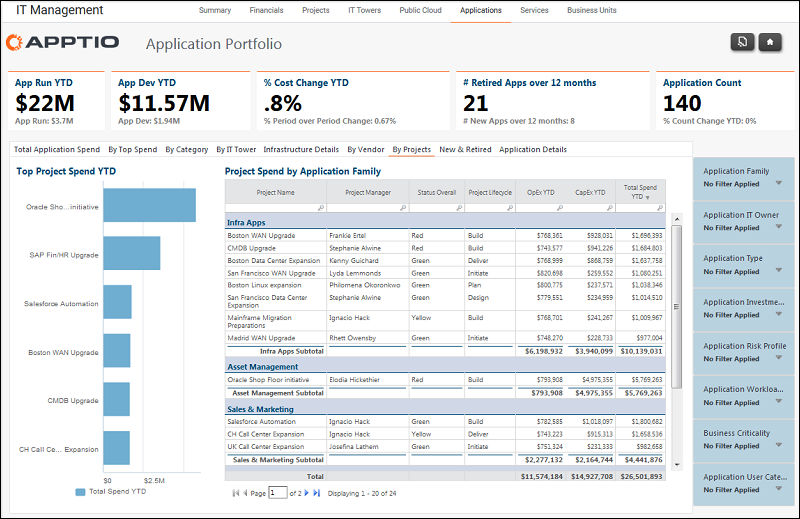

# Gerenciamento de TI - Aplicativos - Relatório por projetos ( v103 )

Use este relatório para identificar as despesas com aplicativos por projeto e família de aplicativos.

Aplica-se a: Costing Standard 11.8.x em execução em TBM Studio v12 ou TBM Studio v11.

## Navegação

Gerenciamento de TI > Aplicativos > Por projetos

## Funções

Este relatório foi elaborado para:

- Proprietários de aplicativos
- Proprietários do portfólio de aplicativos / VP de desenvolvimento e suporte de aplicativos
- Arquitetos corporativos

## Objetivos

Use este relatório para identificar as despesas com aplicativos por projeto e família de aplicativos.

## Perguntas respondidas

As informações apresentadas neste relatório podem ser usadas para responder às seguintes perguntas:

- Quanto gastamos em projetos relacionados a aplicativos?
- O gasto corresponde aos objetivos de investimento das aplicações?

## Próximas ações

Use o relatório IT Finance - Projects para acompanhar os gerentes de projeto.
