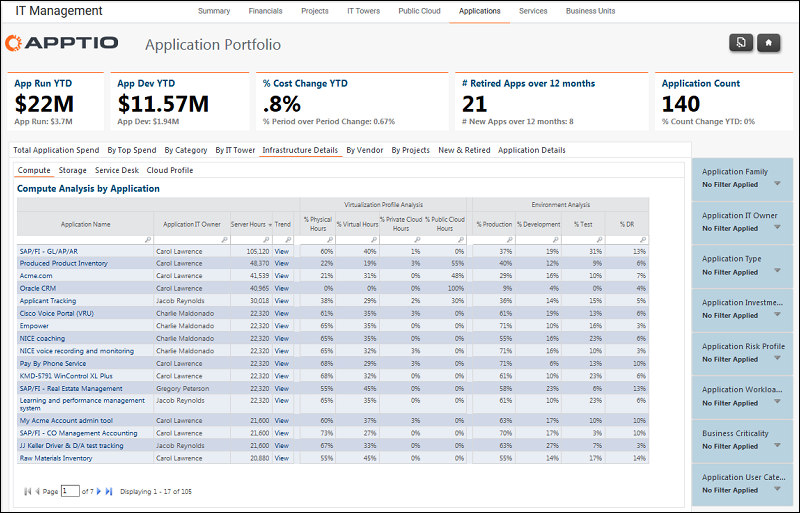

# Relatório detalhado sobre Gerenciamento de TI - Aplicativos - Infraestrutura ( v103 )

Use este relatório para analisar o consumo de torres de TI de computação pelos aplicativos.

Aplica-se a: Costing Standard 11.8.x em execução em TBM Studio v12 ou TBM Studio v11.

## Navegação

Gerenciamento de TI > Aplicativos > Detalhes da infraestrutura

## Funções

Este relatório foi elaborado para:

Analise o consumo da torre de TI de computação pelos aplicativos.

## Objetivos

Use este relatório para analisar o consumo da torre de TI de computação pelos aplicativos.

## Perguntas respondidas

As informações apresentadas neste relatório podem ser usadas para responder às seguintes perguntas:

- Para um determinado aplicativo, o consumo de recursos de computação (servidor) é adequado?
- É preciso fazer alguma coisa para reduzir o risco?

## Próximas ações

- Clique nas guias Storage e Service Desk para obter relatórios semelhantes.
- Clique no nome de um aplicativo para obter o relatório Portfólio de aplicativos - Detalhes do aplicativo.
