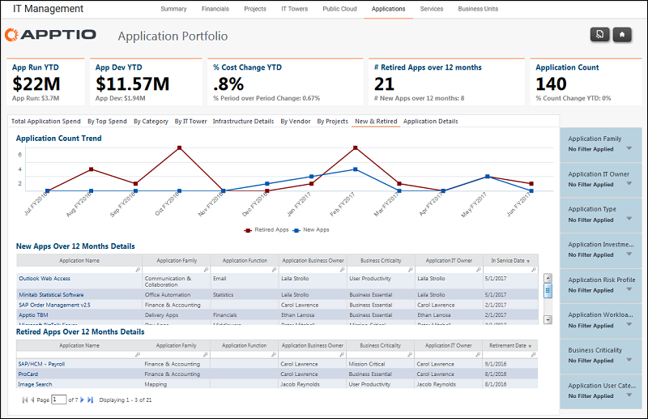

# Gerenciamento de TI - Aplicativos - Relatório de novos e aposentados ( v103 )

Use esse relatório para revisar as contagens de aplicativos novos e desativados.

Aplica-se a: Costing Standard 11.8.x em execução em TBM Studio v12 ou TBM Studio v11.

## Navegação

Gerenciamento de TI > Aplicativos > Novos e aposentados

## Funções

Este relatório foi elaborado para:

- Proprietários de aplicativos
- Proprietários do portfólio de aplicativos / VP de desenvolvimento e suporte de aplicativos
- Arquitetos corporativos

## Objetivos

Use este relatório para:

- Analise as tendências de contagem de aplicativos em períodos de três meses.
- Aplicativos introduzidos nos 12 meses mais recentes.
- Aplicativos retirados nos 12 meses mais recentes.

## Perguntas respondidas

As informações apresentadas neste relatório podem ser usadas para responder às seguintes perguntas:

- O número de aplicações está de acordo com a tendência de nossas aposentadorias planejadas?
- Outros aplicativos devem ser retirados?
- Os aplicativos estão sendo introduzidos muito rapidamente?
- São necessárias ações para mitigar o risco?

## Próximas ações

Clique em um aplicativo para ver um relatório detalhado.
