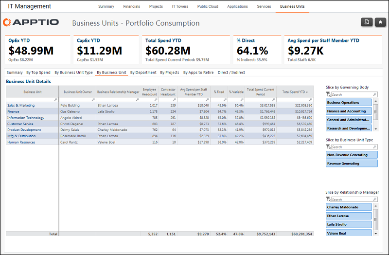

# Gerenciamento de TI - Unidades de negócios - Relatório por unidade de negócios ( v103 )

Use este relatório para revisar as despesas por unidade de negócios.

Aplica-se a: Costing Standard 11.8.x em execução em TBM Studio v12 ou TBM Studio v11.

## Navegação

Gerenciamento de TI > Unidades de negócios > Por unidade de negócios

## Funções

Este relatório foi elaborado para:

- Proprietários de unidades de negócios
- CIOs
- Diretores financeiros

## Objetivos

Use este relatório para:

- Identificar o gerente de relacionamento comercial de uma unidade de negócios.
- Veja o gasto médio por membro da equipe por unidade de negócios.
- Consulte total de despesas e porcentagem fixa e porcentagem variável.

## Perguntas respondidas

As informações apresentadas neste relatório podem ser usadas para responder às seguintes perguntas:

- Estamos gastando muito pouco ou muito por membro da equipe para uma determinada unidade de negócios?
- Temos a combinação certa de gastos fixos e variáveis em todas as unidades de negócios?
- São necessárias ações para mitigar o risco?

## Próximas ações

Clique no nome de uma unidade de negócios para acessar o relatório Unidade de negócios - Detalhes de consumo individual para essa unidade de negócios.
