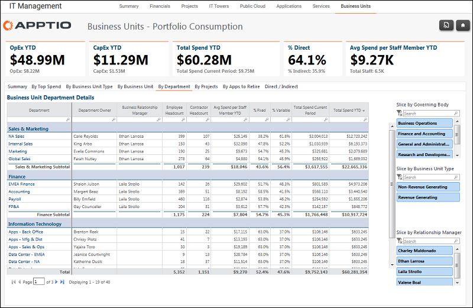

# Gerenciamento de TI - Unidades de negócios - Relatório por departamento ( v103 )

Use esse relatório para ver os detalhes dos departamentos em uma unidade de negócios.

Aplica-se a: Costing Standard 11.8.x em execução em TBM Studio v12 ou TBM Studio v11.

## Navegação

Gerenciamento de TI > Unidades de negócios > Por departamento

## Funções

Este relatório foi elaborado para:

- Proprietários de unidades de negócios
- CIOs
- Diretores financeiros

## Objetivos

Use esse relatório para ver os detalhes dos departamentos em uma unidade de negócios.

## Perguntas respondidas

As informações apresentadas neste relatório podem ser usadas para responder às seguintes perguntas:

São necessárias ações para mitigar o risco?

## Próximas ações

Use as segmentações para filtrar o relatório por órgão dirigente, tipo de unidade de negócios ou gerente de relacionamento (comercial).
