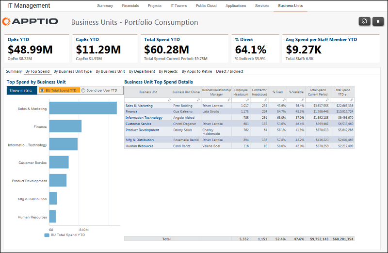

# Gerenciamento de TI - Unidades de negócios - Por relatório de despesas principais ( v103 )

Use este relatório para ver as principais despesas por unidade de negócios.

Aplica-se a: Costing Standard 11.8.x em execução em TBM Studio v12 ou TBM Studio v11.

## Navegação

Gerenciamento de TI > Unidades de negócios > Por despesas principais

## Funções

Este relatório foi elaborado para:

- Proprietários de unidades de negócios
- CIOs
- Diretores financeiros

## Objetivos

Use este relatório para:

- Veja as principais despesas por unidade de negócios.
- Para cada unidade, veja seu proprietário, gerente de relacionamento comercial e outros dados.

## Perguntas respondidas

As informações apresentadas neste relatório podem ser usadas para responder às seguintes perguntas:

- Quais unidades de negócios consomem mais custos de TI?
- São necessárias ações para mitigar o risco?

## Próximas ações

- Clique no nome de uma unidade de negócios para acessar um relatório Business Units - Individual Consumption Details (Unidades de negócios - Detalhes de consumo individual) para essa unidade de negócios.
- Entre em contato com o gerente de relacionamento comercial designado se for necessário um acompanhamento.
