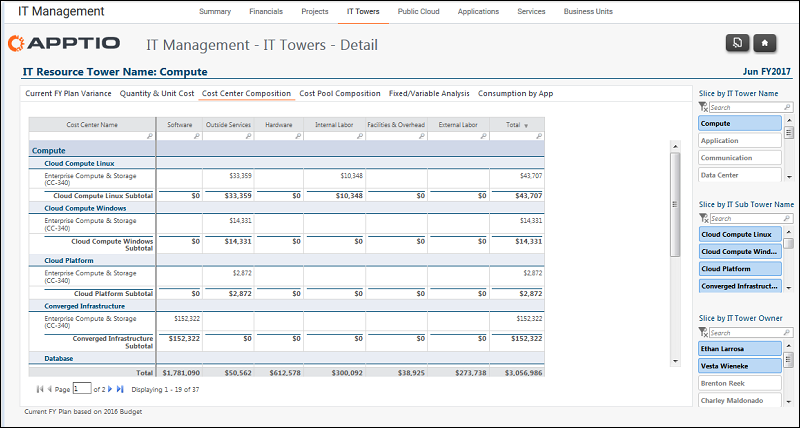

# Gerenciamento de TI - Detalhes das torres de TI - Relatório de composição do centro de custos ( v103 )

◆ Aplica-se a: Costing Standard 11.8.x em execução em TBM Studio v12 ou TBM Studio v11.

## Introdução

Utilize este relatório para identificar as despesas por pool de custos e centro de custos de cada subárvore.

## Navegação

Gerenciamento de TI > Torres de TI > Nome da torre de TI > Composição do centro de custo

## Funções

Este relatório foi elaborado para:

- Administração da TI
- Proprietário da torre de TI

## Objetivos

Use este relatório para:

- Identificar as despesas por pool de custos e centro de custos para cada subtorre.
- Concentre-se em uma subtorre ou em um proprietário de torre específico usando os filtros.

## Perguntas respondidas

As informações apresentadas neste relatório podem ser usadas para responder às seguintes perguntas:

- Em quais centros de custo os gastos estão ocorrendo?
- Há custos provenientes de centros de custo inesperados?
- É necessária uma ação para investigar melhor as despesas em um determinado pool de custos?

## Próximas ações

- Observe as despesas do centro de custos e do pool de custos em períodos anteriores para identificar tendências (aumento, diminuição ou manutenção da consistência).
- Examine as transações de conta do período usando a guia Variação orçamentária.
- Entre em contato com um analista financeiro de TI para obter mais informações.
