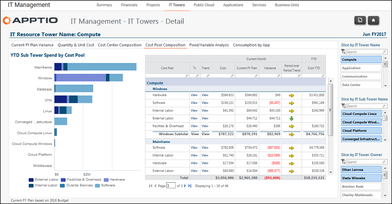

# Gerenciamento de TI - Detalhes das torres de TI - Relatório de composição do pool de custos ( v103 )

◆ Aplica-se a: Costing Standard 11.8.x em execução em TBM Studio v12 ou TBM Studio v11.

## Introdução

Utilize este relatório para identificar as despesas por pool de custos para cada subtorre.

## Navegação

Gerenciamento de TI > Torres de TI > Nome da torre de TI > Composição do pool de custos

## Funções

Este relatório foi elaborado para:

- Administração da TI
- Proprietário da torre de TI

## Objetivos

Use este relatório para:

Identificar as despesas de cada subtorre por pool de custos.

## Perguntas respondidas

As informações apresentadas neste relatório podem ser usadas para responder às seguintes perguntas:

- Onde está meu maior gasto por pool de custos?
- O gasto para essa categoria parece razoável em comparação com outras subtorres?
- É necessária uma ação para investigar melhor as despesas em um determinado pool de custos?

## Próximas ações

- Examine as despesas do pool de custos de períodos anteriores para identificar tendências (aumento, diminuição ou manutenção da consistência).
- Investigue a composição do centro de custo para entender quem é responsável pelo gerenciamento dos custos clicando na guia Composição do centro de custo.
- Veja as transações da conta para o período clicando na guia Variação orçamentária.
- Entre em contato com o analista financeiro de TI para obter mais informações.
