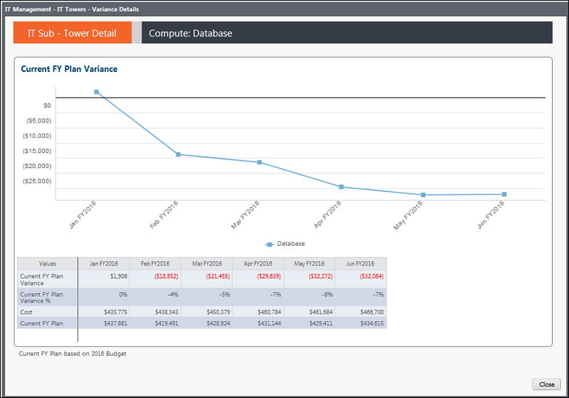

# Gerenciamento de TI - Detalhes das torres de TI - Desvio do plano atual do ano fiscal - Relatório de tendências ( v103 )

◆ Aplica-se a: Costing Standard 11.8.x em execução em TBM Studio v12 ou TBM Studio v11.

## Introdução

Use esse relatório para ver os volumes e os custos unitários por mês nos últimos 13 meses e para revisar o volume, os custos totais, os custos unitários e a variação percentual por mês.

## Navegação

Gerenciamento de TI > Torres de TI > Nome da torre de TI >Trend View

## Funções

Este relatório foi elaborado para:

- Administração da TI
- Proprietário da torre de TI

## Objetivos

Use este relatório para:

- Veja rapidamente as despesas e o orçamento por mês nos últimos 13 meses.
- Analise os dados de suporte para ver a variação orçamentária e a variação percentual por mês.

## Perguntas respondidas

As informações apresentadas neste relatório podem ser usadas para responder às seguintes perguntas:

- Como meus gastos com minha subtorre de TI estão flutuando ao longo do tempo?
- A tendência das despesas é aumentar, diminuir ou permanecer constante?
- Minhas despesas estão acompanhando o orçamento planejado ou estou observando picos de variação acima ou abaixo do orçamento?
- São necessárias medidas para reduzir o risco orçamentário?

## Próximas ações

- Visualize as transações da conta para os meses atuais ou anteriores usando o relatório de transações.
- Investigue o volume e os custos unitários usando o relatório de transações.
