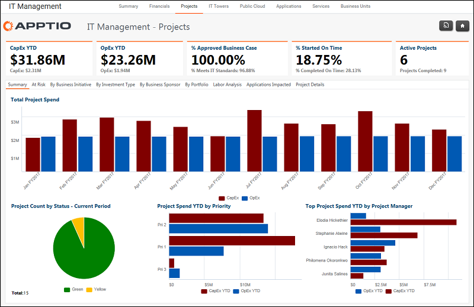
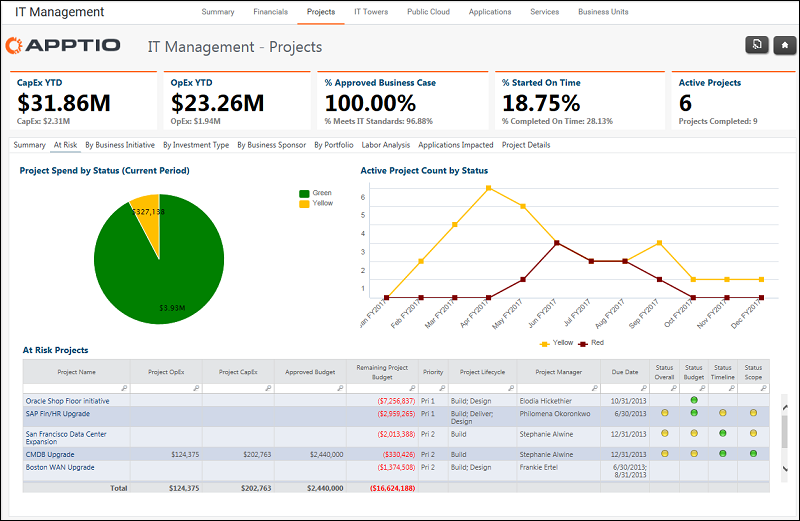
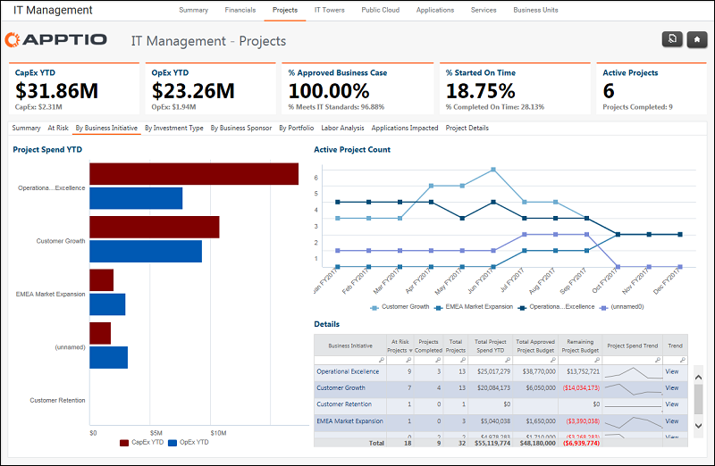
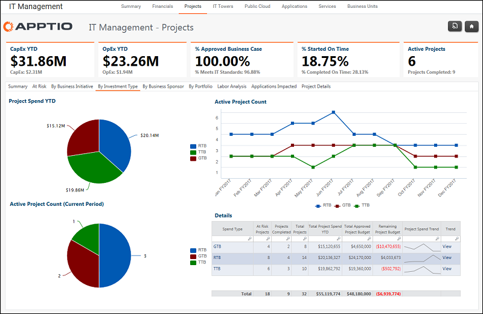
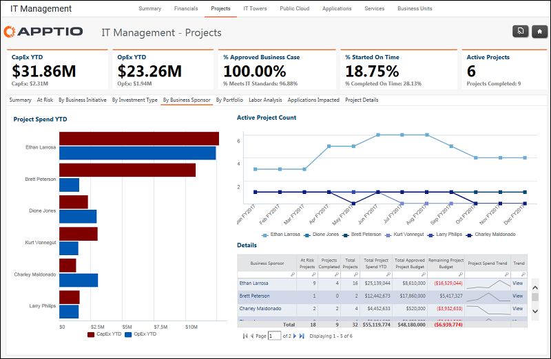
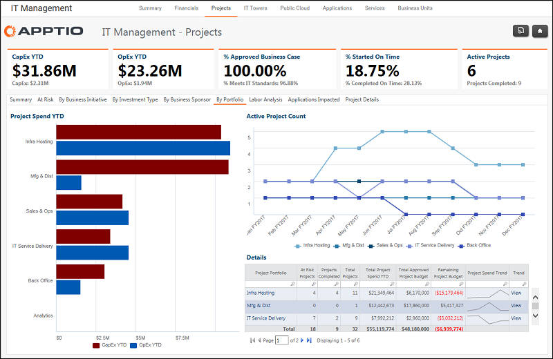
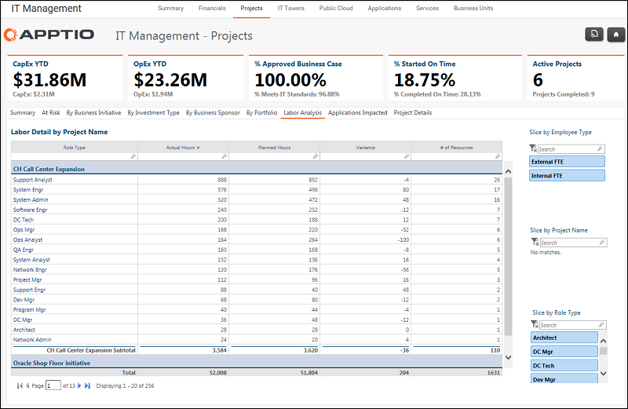
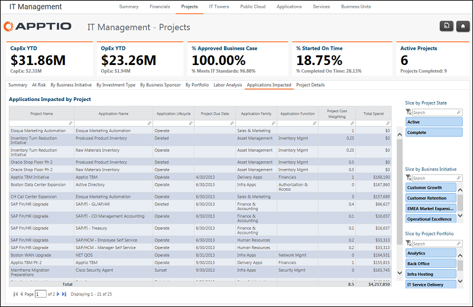
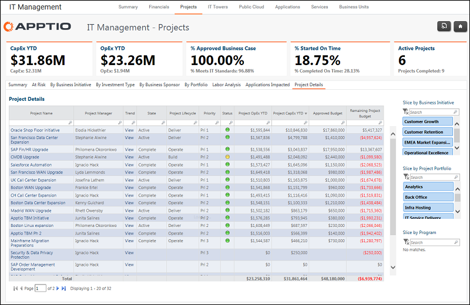

# Gerenciamento de TI - Relatório de projetos ( v103 )

◆ Aplica-se a: Costing Standard 11.8.x em execução em TBM Studio v12 ou TBM Studio v11.

## Introdução

Use este relatório para analisar as despesas e o status do projeto CapEx e OpEx a partir de várias perspectivas. Para alterar a perspectiva, selecione uma guia: Em risco, Por portfólio, Por tipo de investimento, Por gerente de projeto, Por proprietário de TI, Por patrocinador de negócios e Detalhes do projeto.

## Navegação

Gerenciamento de TI > Projetos

## Funções

Este relatório foi elaborado para:

- CIO
- Administração da TI

## Perguntas respondidas

Use as informações apresentadas nos relatórios do projeto para responder às seguintes perguntas:

- Que porcentagem dos meus gastos com TI está sendo destinada ao crescimento ou à inovação?
- Como os gastos do meu projeto estão progredindo em relação ao orçamento geral?
- As despesas do projeto estão tendendo conforme o planejado para o ano atual?
- Como meus principais projetos estão se saindo em relação ao orçamento e a outros status do projeto?
- Quem é o gerente de projeto se eu precisar de mais informações?
- Quem é o proprietário do projeto se eu precisar me comunicar ou gerenciar expectativas?
- Quais projetos estão acima do orçamento e requerem uma análise mais aprofundada para determinar por que e se há necessidade de financiamento adicional?

## Objetivos

Os objetivos dos relatórios sobre as guias estão descritos abaixo.

## guia Resumo

Use para:

- Analise as despesas e o status do projeto em CapEx e OpEx.
- Revisar as despesas do projeto por status, prioridade e gerente de projeto.

Consulte a figura acima para ver uma captura de tela da guia de relatório.

Consulte a figura acima para ver uma captura de tela da guia de relatório.

## Guia Em risco

Use para:

- Revisar o status do projeto com base
- Pesquise em um projeto para ver um resumo do projeto, drivers por pool de custos e despesas por fornecedor.

## Por guia Iniciativa de negócios

Use para:

- Analisar as despesas por iniciativa de negócios.
- Pesquise em uma iniciativa de negócios para ver os detalhes.

## Guia Por tipo de investimento

Use para:

- Revisar as despesas por RTB (Run-the-Business), GTB (Grow-the-Business) e TTB (Transform-the-Business).
- Pesquise em um tipo de investimento para ver os detalhes.

## Pela guia Patrocinador comercial

Use para:

- Analisar as despesas por patrocinador de negócios e unidade de negócios patrocinadora.
- Pesquise em um patrocinador de negócios para ver os detalhes.

## Por guia Portfólio

Use para:

- Analisar as despesas por portfólio de projetos e iniciativa de negócios.
- Pesquise em um portfólio para ver os detalhes.

## Guia Análise de mão de obra

Use para:

- Revise a equipe por funções.
- Filtrar por tipo de funcionário, nome do projeto e tipo de função.

## Guia Aplicativos afetados

Use para:

- Analise os aplicativos afetados por cada projeto.
- Filtre por status do projeto, iniciativa de negócios e portfólio de projetos.

## Guia Detalhes do projeto

Use para:

- Revise os detalhes de todos os projetos por meses, trimestres e anos.
- Filtrar por unidade de negócios e patrocinador de negócios.
- Classifique por orçamento, variação orçamentária, status e prioridade.
- Analise um projeto para ver detalhes sobre os drivers, fornecedores, mão de obra e aplicativos afetados.

