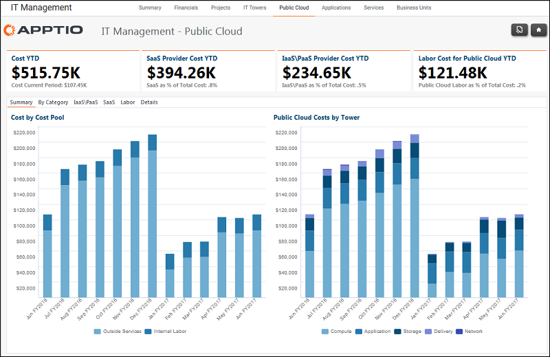

# Gerenciamento de TI - Relatório de nuvem pública

◆ Aplica-se a: Costing Standard 11.8.x em execução em TBM Studio v12 ou TBM Studio v11.

## Introdução

Use esse relatório para analisar os custos da nuvem por categoria, IaaS/PaaS, SaaS, e mão de obra.

## Navegação

Gerenciamento de TI > Provedor de nuvem

## Funções

Este relatório foi elaborado para:

- CIO
- Liderança em operações de TI

## Objetivos

Use este relatório para:

- Analise os KPIs de gastos com a nuvem pública.
- Veja as despesas e os produtos da nuvem pública por categoria, IaaS\PaaS, SaaS, Labor.
- Visualize os gastos com nuvem pública por centro de custos, pool de custos, torre e subtorre de recursos de TI para o período atual, trimestre e acumulado no ano.

## Perguntas respondidas

As informações apresentadas neste relatório podem ser usadas para responder às seguintes perguntas:

- Qual porcentagem de nossos gastos com tecnologia (como porcentagem de nossos gastos totais com torre modelada) está em serviços de nuvem pública?
- Qual é a tendência dessa despesa nos últimos 6 meses?
- Quais produtos estão fornecendo nosso serviço Compute Linux? Computar o Windows?

## Próximas ações

- Clique em uma guia para visualizar os dados por categoria, IaaS\PaaS, SaaS, e Trabalho.
- Revise os detalhes de cada fornecedor clicando na guia Details (Detalhes).
- Revise os detalhes da transação de um fornecedor clicando em View (Exibir) na coluna Tx.
