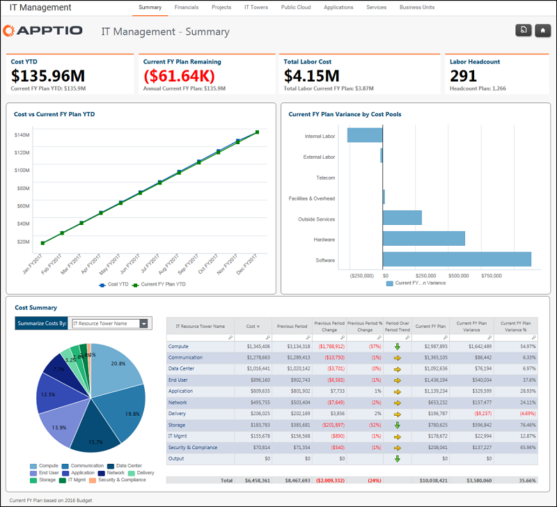

# Gerenciamento de TI - Relatório resumido ( v103 )

◆ Aplica-se a: Costing Standard 11.8.x em execução em TBM Studio v12 ou TBM Studio v11.

## Introdução

O relatório IT Management - Summary compara o orçamento com as despesas.

## Navegação

Gerenciamento de TI > Resumo

## Funções

Este relatório foi elaborado para:

- CIO
- Administração da TI

## Objetivos

Use este relatório para:

- Veja os KPIs de despesas e orçamento (barra de KPIs).
- Entenda os gastos acumulados no acumulado do ano e os gastos anuais projetados (gráfico Custo com projeção versus orçamento do ano inteiro).
- Identificar o desvio orçamentário por grupo de custos (gráfico Desvio orçamentário por grupos de custos).
- Identificar as principais despesas e variações por torre de TI (gráfico e tabela de resumo de custos).

## Perguntas respondidas

Você pode usar as informações apresentadas neste relatório para responder às seguintes perguntas:

- Como minhas despesas estão sendo monitoradas em relação ao orçamento até agora neste ano?
- A previsão é de que o orçamento do ano fique acima ou abaixo do previsto?
- Quais pools de custos estão acima ou abaixo do orçamento?
- Quanto eu gastei com a IT Tower até agora neste ano?
- Onde está meu maior gasto? - Onde está minha maior variação - por valor e por porcentagem?
- Que quantidade de variação ou porcentagem de variação é material em comparação com meus gastos gerais com TI?
- São necessárias medidas para reduzir o risco orçamentário?

## Próximas ações

- Se a variação for irrelevante, nenhuma preocupação ou ação será necessária.
- Para saber mais, clique em uma torre de TI específica na tabela Resumo de custos para abrir o relatório Gerenciamento de TI > Torre de TI.
