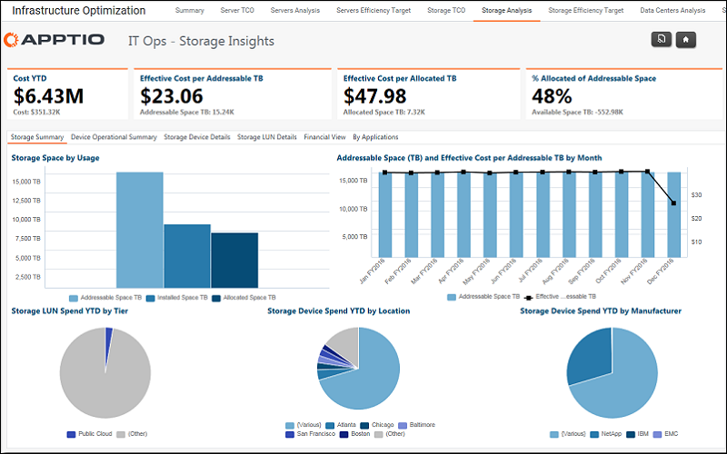

# Operações de TI - Relatório de análise de armazenamento

◆ Aplica-se a: Costing Standard 11.8.x em execução em TBM Studio v12 ou TBM Studio v11.

## Introdução

Use esse relatório para revisar o custo, a contagem de volumes, o espaço disponível e as taxas de utilização do armazenamento.

## Navegação

Infraestrutura e operações de TI > Relatório de análise de armazenamento

## Funções

Este relatório foi elaborado para:

- Líderes/gerentes de armazenamento

## Objetivos

Use este relatório para:

- Analise o custo, o volume, a disponibilidade e a utilização do armazenamento.
- Analise os dados por local, nível, ambiente e dispositivo específico.

## Perguntas respondidas

As informações apresentadas neste relatório podem ser usadas para responder às seguintes perguntas:

- Quais data centers têm os custos de armazenamento mais altos e mais baixos? Quais são suas características?
- Como meu volume de armazenamento é distribuído entre os data centers?
- Quais data centers têm as taxas de utilização de armazenamento mais altas e mais baixas?

## Próximas ações

Clique em uma guia para obter informações detalhadas sobre o LUN de armazenamento, os dispositivos de armazenamento, a operação do dispositivo, as finanças e os aplicativos.
