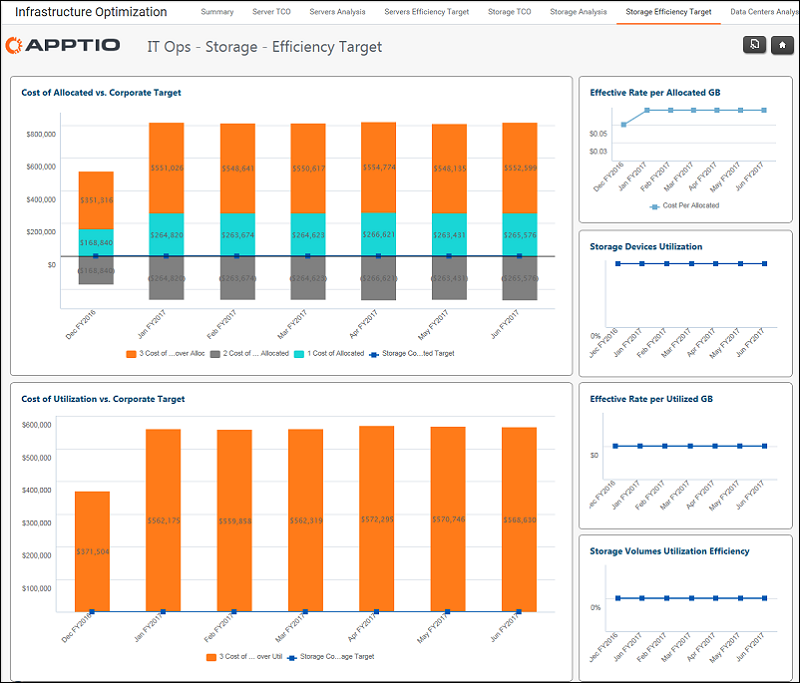

# Operações de TI - Relatório de metas de eficiência de armazenamento

◆ Aplica-se a: Costing Standard 11.8.x em execução em TBM Studio v12 ou TBM Studio v11.

Use esse relatório para comparar as estatísticas de alocação e utilização de armazenamento com as metas corporativas.

## Navegação

Infraestrutura e operações de TI > Relatório de metas de eficiência de armazenamento

## Funções

Este relatório foi elaborado para:

- Líderes/gerentes de armazenamento

## Objetivos

Use este relatório para:

- Compare o armazenamento alocado com as metas corporativas.
- Comparar o custo de utilização com as metas corporativas.

## Perguntas respondidas

As informações apresentadas neste relatório podem ser usadas para responder às seguintes perguntas:

- O custo da memória alocada está alinhado com as metas corporativas?
- Qual é a taxa efetiva por GB de memória alocado?
- O custo por CPU alocado está alinhado com as metas corporativas?
- Qual é a taxa efetiva por núcleo da CPU?

## Próximas ações

Pesquise outras métricas de operações selecionando uma das outras guias de Operações de TI.
