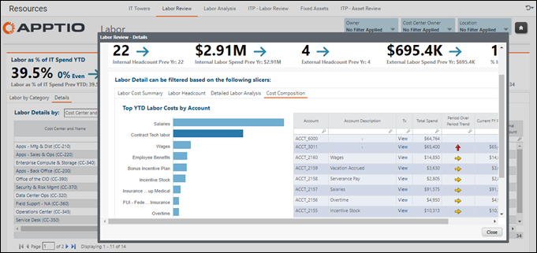

# Revisão da mão de obra - Detalhes da mão de obra - Relatório de composição de custos

Aplica-se a: Costing Standard R12

Use este relatório para entender quais contas contribuem para uma despesa de mão de obra.

## Caminho

Trabalho - guia Revisão de trabalho - Detalhes de trabalho por centro de custo e nome (visualização de detalhes) - detalhamento para um centro de custo - guia Composição de custo

## Funções

Este relatório foi elaborado para:

- Equipe de finanças de TI
- Proprietários de centros de custo

## Objetivos

Use este relatório para:

- Entenda quais contas contribuem para as despesas com mão de obra de um centro de custos.
- Analisar e gerenciar os gastos com mão de obra.
- Tomar decisões informadas sobre a equipe.

## Perguntas respondidas

Você pode usar os dados deste relatório para responder às seguintes perguntas:

- Quais contas GL contribuem para as despesas com mão de obra de um centro de custos?
- Quais contas estão causando a variação em relação ao plano atual do ano fiscal?
- O valor vinculado a uma conta específica faz sentido para o meu centro de custos?
- É necessária alguma ação para investigar melhor as despesas de alguma conta?

## Próximas ações

Visualize as transações de cada conta clicando em **View (Exibir** ) na coluna **Tx**.
