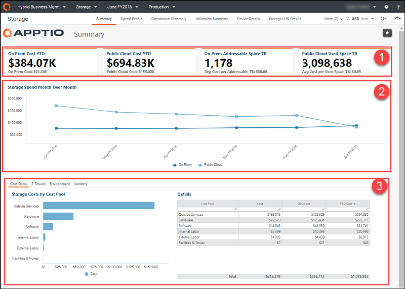
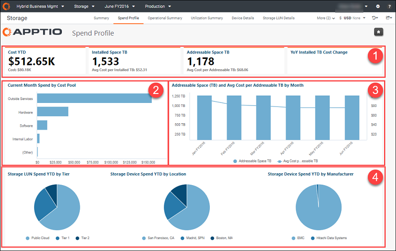
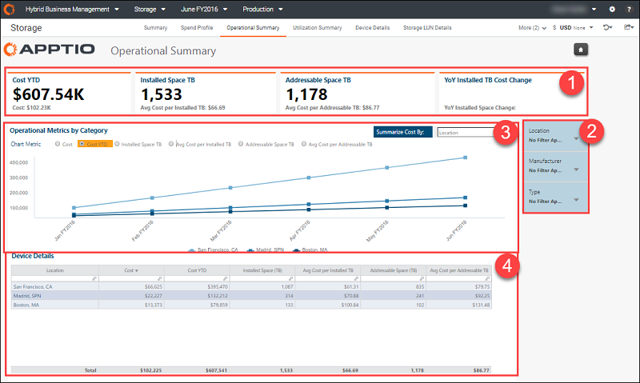
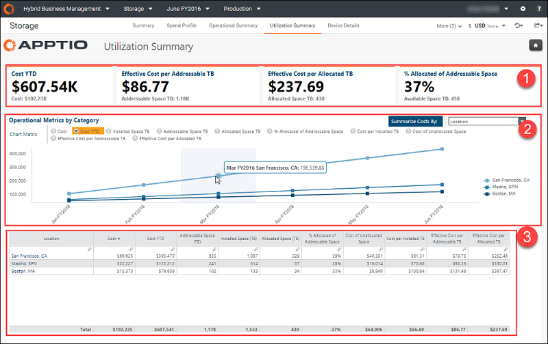
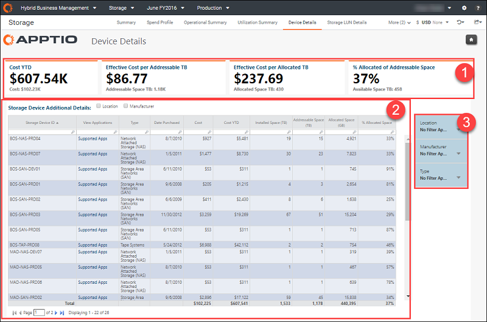
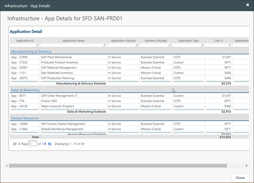
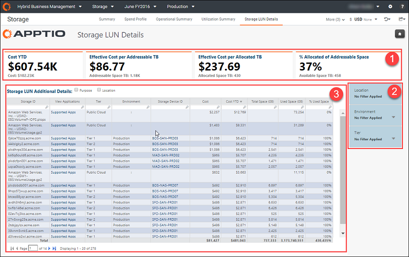
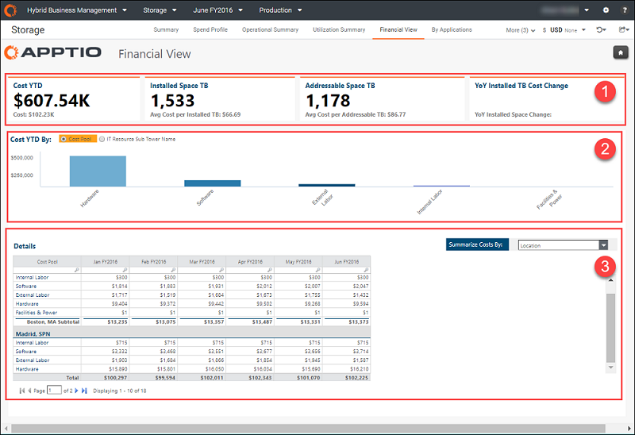
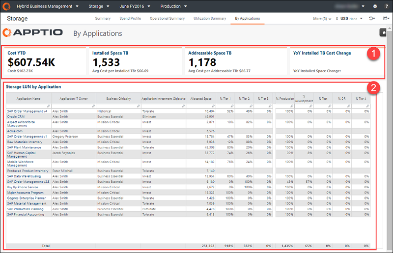

# Storage Insights & Coleção de otimização

aplica-se a: Hybrid Business Management em TBM Studio TBM Studio e posterior

Use os relatórios de armazenamento para entender o custo, a capacidade e a utilização de seus recursos de armazenamento. Os relatórios desta coleção permitem que você analise seu perfil de despesas, entenda as métricas de armazenamento, analise os detalhes do armazenamento (dispositivos e unidades lógicas) e tenha uma visão de aplicativos do seu armazenamento. A coleção fornece relatórios granulares para que você possa otimizar os custos e a utilização do armazenamento.

Essa coleção de relatórios foi criada para as seguintes funções:

- Diretor de TI
- Equipe de computação em TI
- Chefe de Operações
- Proprietários de serviços

Essa coleção de relatórios está alinhada às seguintes metas de negócios:

- Visualizar os custos de armazenamento em relação ao planejado para servidores no local e na nuvem
- Acompanhe a estratégia de infraestrutura de armazenamento e o uso de recursos de armazenamento para determinar se os gastos com armazenamento estão tendendo conforme o esperado
- Visualizar a capacidade de armazenamento (instalada e endereçável) e as alterações ano a ano

Esses relatórios permitem que você determine o seguinte:

- Se as camadas de armazenamento estão devidamente alinhadas com a importância comercial de seu portfólio de aplicativos
- Unidades de armazenamento que estão se aproximando do fim de seu ciclo de vida útil
- O custo da capacidade de armazenamento não alocada
- O custo unitário médio do armazenamento total disponível
- O custo unitário efetivo do armazenamento alocado
- A taxa de utilização média por camada de armazenamento
- Há oportunidades para recuperar o armazenamento subutilizado

## Exibir a coleção de relatórios

1. Faça login em Apptio.
2. Na página **inicial**, clique em **Hybrid Business Management**.
3. No menu Coleção de relatórios, selecione **Armazenamento**. O relatório **Resumo de armazenamento** é aberto por padrão.

## Relatório de resumo de armazenamento

Use este relatório para visualizar seus gastos gerais com armazenamento em toda a empresa e uma visão dos custos de armazenamento por torre e subtorre de TI.

Esse relatório tem os seguintes elementos:

**(1) KPIs** - os KPIs fornecem uma visão de alto nível de seus gastos com infraestrutura:

- **On Prem Cost YTD** - Esse KPI mostra o gasto geral com servidores de armazenamento no local no acumulado do ano. Os gastos do período atual são mostrados como **Custo On Prem**.
- **Public Cloud Custo acumulado no** ano - Esse KPI mostra o gasto geral com servidores de armazenamento em nuvem pública no acumulado no ano. Os gastos do período atual são mostrados em **Public Cloud Cost**.
- **TB de espaço endereçável** no local - este KPI mostra os terabytes de memória no local que estão atualmente disponíveis para programas e processos. O KPI secundário mostra o custo médio por terabyte como **Avg Cost per Addressable TB (custo médio por TB endereçável** ).
- **Public Cloud TB de espaço usado** - este KPI mostra os terabytes de memória da nuvem pública atualmente em uso. O KPI secundário mostra o custo médio por terabyte de espaço usado como **Avg Cost per Used Space TB**.

**(2) Gastos com armazenamento mês a mês** - use este gráfico para visualizar a tendência de gastos de um ano com recursos de armazenamento em seus servidores locais e na nuvem pública.

**(3) Storage Costs by (Custos de armazenamento por** ) - clique nas guias **Cost Pools (Grupos de custos** ), **IT Towers (Torres de TI** ), **Environment (Ambiente** ) ou **Vendors (Fornecedores** ) para visualizar gráficos dos gastos atuais com computação no mês. A tabela **Details (Detalhes** ) lista os gastos do mês atual, QTD e YTD.

Perguntas respondidas:

- Há anomalias em nossos gastos?
- Os gastos estão de acordo com nossa estratégia de armazenamento?
- Como a estratégia de infraestrutura está evoluindo?
- Onde estamos incorrendo em custos de armazenamento?

## Relatório de perfil de despesas

Clique em **Perfil de despesas** na guia Coleção de relatórios para abrir o relatório. Use este relatório para visualizar o gasto planejado e a utilização dos recursos de armazenamento.

Esse relatório tem os seguintes elementos:

**(1) KPIs** - os KPIs fornecem uma visão de alto nível de seus gastos com infraestrutura:

- **Cost YTD (Custo acumulado no** ano) - Este KPI mostra o gasto geral com servidores no acumulado no ano. As despesas do período atual são mostradas como **Custo**.
- **Espaço instalado TB** - Esse KPI mostra a quantidade de capacidade de armazenamento usada em terabytes. O KPI secundário mostra o custo médio por terabyte instalado como **Avg Cost per Installed TB (Custo médio por TB instalado** ).
- **TB de espaço endereçável** - este KPI mostra os terabytes de memória no local que estão atualmente disponíveis para programas e processos. O KPI secundário mostra o custo médio por terabyte como **Avg Cost per Addressable TB (custo médio por TB endereçável** ).
- **YoY Mudança no custo da TB instalada** - Este KPI mostra a mudança ano a ano no custo da memória instalada no local.

**(2) Gastos do mês atual por pool de** custos - Use este gráfico para visualizar os gastos de armazenamento por pool de custos no mês atual.

**(3) Espaço endereçável (TB) e custo médio por** - Use este gráfico para ver a quantidade de memória disponível em terabytes por mês e o custo médio desse espaço.

**(4) Gráficos de pizza YTD de armazenamento** - Os gráficos de pizza mostram a relação de um tipo específico de armazenamento por nível, por local ou por fabricante. Use essas informações como uma visão geral rápida de seu perfil de gastos com armazenamento.

Perguntas respondidas:

- Há anomalias em nossos gastos?
- Os gastos estão de acordo com nossa estratégia de armazenamento?
- Como a estratégia de infraestrutura está evoluindo?
- Onde estamos incorrendo em custos de armazenamento?

## Resumo operacional

Clique em **Operational Summary (Resumo operacional** ) na guia Report collection (Coleção de relatórios) para abrir o relatório. Use este relatório para entender as métricas operacionais (como custo, custo médio, espaço endereçável em terabytes) de seu armazenamento local.

Esse relatório tem os seguintes elementos:

**(1) KPIs** - Os KPIs deste relatório são os mesmos do Storage Spend Profile. Consulte o elemento 1 no [relatório Storage Spend Profile](hbmstoragecollection.html).

**(2) Filtros** - Os seguintes filtros estão disponíveis neste relatório. Esses filtros são cumulativos e afetam todos os dados da página, inclusive os KPIs:

- **Localização** - Selecione uma localização específica para ver o impacto dos gastos com armazenamento nessa localização.
- **Fabricante** - Selecione um provedor de serviços em nuvem específico para limitar os dados do relatório aos serviços desse provedor.
- **Tipo** - Selecione um tipo de finalidade de servidor para ver o impacto dos gastos com armazenamento em servidores por tipo.

**(3) Métricas operacionais por categoria** - Use as opções na parte superior desse gráfico para exibir seletivamente várias métricas. Métricas adicionais estão disponíveis na lista **Resumir custo por**. Use o gráfico para visualizar os gastos atuais do Storage com base na métrica que você selecionar.

**(4) Detalhes do dispositivo** - Essa tabela fornece o custo mensal atual por local para as métricas selecionadas na lista **Resumir por**. Clique em qualquer link na primeira coluna para ver a tendência de gastos do Storage TCO e detalhes sobre o item selecionado.

Perguntas respondidas:

- Como nossa estratégia de armazenamento está evoluindo?
- Onde estamos incorrendo em custos de armazenamento?
- Existem anomalias em nossos gastos com armazenamento?

## Resumo de utilização

Clique em **Utilization Summary (Resumo da utilização** ) na guia Report collection (Coleção de relatórios) para abrir o relatório. Use esse relatório para entender o impacto de seus recursos de armazenamento no local sobre o custo e para visualizar as métricas de utilização (como custo de armazenamento, espaço endereçável, porcentagem de espaço alocado, porcentagem de espaço usado e custo por terabyte) para seus recursos de armazenamento no local.

Esse relatório tem os seguintes elementos:

**(1) KPIs** - os KPIs fornecem uma visão de alto nível dos gastos com seu servidor host:

- **Cost YTD (Custo acumulado no** ano) - Esse KPI mostra o gasto geral com dispositivos de armazenamento no acumulado do ano. As despesas do período atual são mostradas como **Custo**.
- **Custo efetivo por TB endereçável** - Este KPI mostra o custo efetivo (custo real) por terabyte de memória local atualmente disponível para programas e processos. O KPI secundário mostra os terabytes de armazenamento disponível como **TB de espaço endereçável**.
- **Custo efetivo por TB alocado** - Esse KPI mostra o custo efetivo (custo real) por terabyte de armazenamento usado. O KPI secundário mostra os terabytes de armazenamento usado como **TB de espaço alocado**.
- **% alocado de espaço endereçável** - Este KPI mostra a porcentagem atual de espaço endereçável que está alocado. O KPI secundário mostra o total de terabytes disponíveis como **TB de espaço disponível**.

**(2) Operational Metrics by Category (Métricas operacionais por categoria** ) - Esse relatório é semelhante ao relatório Operational Summary (Resumo operacional), mas com métricas adicionais sobre o uso médio e de pico da CPU e o uso médio e de pico da memória. Utilize as opções na parte superior deste gráfico para exibir as tendências de despesas para uma métrica selecionada com base na métrica selecionada na seção **Resumir custos por**.

**(3) Tabela** - A tabela fornece o custo mensal atual para a métrica selecionada na lista **Summarize Costs By (Resumir custos por** ) e as contagens, os custos unitários, o uso médio e o pico de uso de CPUs, servidores, memória e horas de instância relacionados. A primeira coluna muda com base em sua seleção na coluna **Summarize Costs By (Resumir custos por** ). Clique em qualquer link na primeira coluna para ver a tendência de gastos do Storage TCO e detalhes sobre o item selecionado.

Perguntas respondidas:

- Como nossa estratégia de utilização de armazenamento está evoluindo?
- Onde estamos incorrendo em custos de armazenamento?
- Há anomalias na utilização de nosso armazenamento?

## Detalhes do dispositivo

Clique em **Device Details (Detalhes do dispositivo** ) na guia Report collection (Coleção de relatórios) para abrir o relatório. Use esse relatório para visualizar seus gastos com servidores locais e dispositivos de armazenamento físico (armazenamento conectado à rede [NAS] e redes de área de armazenamento [SAN]). O relatório fornece o custo, o custo YTD e as métricas relacionadas à alocação e ao uso do espaço.

Esse relatório tem os seguintes elementos:

**(1) KPIs** - Os KPIs deste relatório são os mesmos do Resumo de utilização de armazenamento. Consulte o elemento 1 no [relatório Resumo de utilização](hbmstoragecollection.html).

**(2) Filtros** - Os filtros deste relatório são os mesmos do Resumo operacional de armazenamento. Consulte o elemento 2 no [relatório Storage - Spend Profile (Armazenamento - Perfil de despesas](hbmstoragecollection.html) ).

**(3) Detalhes adicionais do dispositivo de armazenamento**

- Use as opções na parte superior desse gráfico para adicionar colunas de **Location** e **Manufacturer** ao gráfico.
- Use a tabela para exibir detalhes sobre dispositivos de armazenamento específicos e entender rapidamente o espaço instalado versus o espaço endereçável versus o espaço alocado.
- Clique em qualquer link na coluna **Supported Apps (Aplicativos compatíveis** ) para exibir informações sobre os aplicativos que usam o dispositivo de armazenamento.

  

Perguntas respondidas:

- Como está evoluindo nossa estratégia de armazenamento para dispositivos?
- Onde estamos incorrendo em custos com dispositivos de armazenamento?

## Detalhes do LUN de armazenamento

Clique em **Storage LUN Details (Detalhes do LUN** de armazenamento) na guia Report collection (Coleção de relatórios) para abrir o relatório. Use esse relatório para visualizar seus gastos com armazenamento por número de unidade lógica (LUN). O relatório fornece o custo do período atual, o custo acumulado no ano, o espaço total e o espaço usado.

Esse relatório tem os seguintes elementos:

**(1) KPIs** - Os KPIs deste relatório são os mesmos do Resumo de utilização de armazenamento. Consulte o elemento 1 no [relatório Resumo de utilização](hbmstoragecollection.html).

**(2) Filtros** - Os filtros deste relatório são os mesmos do Resumo operacional de armazenamento. Consulte o elemento 2 no [relatório Resumo operacional](hbmstoragecollection.html).

**(3) Detalhes adicionais do LUN de armazenamento** - Use as opções na parte superior da tabela para adicionar colunas que listem a **finalidade** e o **local**. Use a tabela para visualizar o custo mensal atual, o custo acumulado no ano, o espaço total e o espaço usado para seu armazenamento lógico. Clique em qualquer link na coluna **Supported Apps (Aplicativos compatíveis** ) para exibir informações sobre os aplicativos que usam o dispositivo de armazenamento.

Perguntas respondidas:

- Como nossa estratégia de servidor lógico está evoluindo?
- Onde estamos incorrendo em custos?

## Visão financeira

Clique em **Financial View** na guia Report collection (Coleção de relatórios) para abrir o relatório. Use esse relatório como uma visão financeira de seus gastos com armazenamento por local, tipo, fabricante, produto, modelo ou origem.

Esse relatório tem os seguintes elementos:

**(1) KPIs** - Os KPIs deste relatório são os mesmos do Storage Spend Profile. Consulte o elemento 1 no [relatório Perfil de despesas](hbmstoragecollection.html).

**(2) Cost YTD By (Custo acumulado até** o momento) - Use as opções na parte superior desse gráfico para visualizar os gastos acumulados até o momento com recursos de armazenamento por pool de custos (serviços externos, hardware, etc.) versus subtorre de TI (servidores, transporte, voz, etc.). Essas informações fornecem uma visão geral de seus gastos gerais com armazenamento por ATUM torre e subtorre.

**(3) Tabela** - A tabela mostra os mesmos dados mês a mês, com base em sua seleção na lista **Resumir custos por**. Clique em qualquer link na primeira coluna para visualizar os detalhes do pool de custos de infraestrutura sobre o item que você clicar.

- Como nossa estratégia de armazenamento está evoluindo?
- Onde estamos incorrendo em custos de armazenamento?
- Existem anomalias em nossos gastos com armazenamento?

## Por aplicativos

Clique em **By Applications (Por aplicativos** ) na guia Report collection (Coleção de relatórios) para abrir o relatório. Use esse relatório para visualizar seus gastos com armazenamento por aplicativo em todo o seu perfil de virtualização.

Esse relatório tem os seguintes elementos:

**(1) KPIs** - Os KPIs deste relatório são os mesmos do Storage Spend Profile. Consulte o elemento 1 no [relatório Perfil de despesas](hbmstoragecollection.html).

**(2) Storage LUN by Application (LUN de armazenamento por** aplicativo) - Use essa tabela para visualizar os gastos YTD para recursos de LUN de armazenamento por aplicativo (por exemplo, Active Directory, SAP Data Warehouse e Office 365). A tabela mostra o proprietário do aplicativo, o espaço alocado e as porcentagens por camada e ambiente para cada aplicativo. Clique em qualquer link na coluna **Application Name (Nome do aplicativo)** para visualizar os detalhes do pool de custos de infraestrutura sobre o aplicativo em que você clicou.

Perguntas respondidas:

- Como nossa estratégia de armazenamento está evoluindo?
- Onde estamos incorrendo em custos de armazenamento?
- Existem anomalias em nossos gastos com armazenamento?
