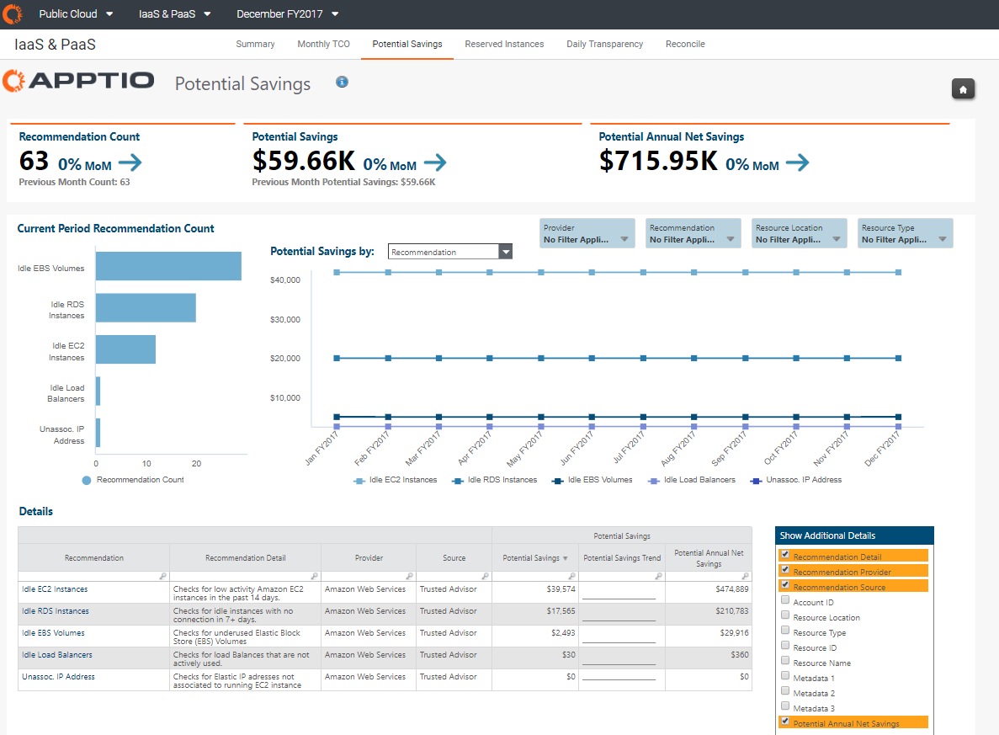

# Visão geral do relatório - Economia potencial

Observação: Aplica-se a: [Apptio Costing Standard](https://community.apptio.com/docs/DOC-8364.html "(Abre em uma nova guia ou janela)") ou [Apptio Cloud Cost Management](https://community.apptio.com/docs/DOC-8365.html "(Abre em uma nova guia ou janela)") em execução em TBM Studio v12.3.3 ou posterior.

## Visão geral

Os relatórios de Recomendações de economia oferecem uma visão das oportunidades em que os custos podem ser reduzidos alterando como ou quais serviços de nuvem estão sendo consumidos. No momento, os dados que alimentam o Savings Recommendations são provenientes do AWS Trusted Advisor, um recurso on-line para ajudar os clientes do AWS a reduzir custos, aumentar o desempenho e melhorar a segurança, otimizando seus ambientes AWS. Apptio apresenta o subconjunto de informações de otimização de custos do Trusted Advisor, permitindo que os clientes do site Apptio identifiquem oportunidades de redução de custos e entendam como eles se saíram em termos de ações contra essas oportunidades ao longo do tempo.

Esses relatórios oferecem uma visão de alto nível das possíveis economias associadas a recursos usados de forma ineficiente, bem como a capacidade de se aprofundar para obter mais informações sobre esses recursos individuais.

Observação: os dados associados à verificação de otimização de instância reservada disponível no Trusted Advisor são apresentados nos relatórios de instâncias reservadas, não nos relatórios de economia potencial.

## Métricas e KPIs

- **Contagem de recomendações** - o número total de recomendações de recursos
- **Potencial** de economia - o valor total da economia mensal que poderia ser obtida se as recomendações fossem seguidas
- **Potencial de economia líquida anual** - o valor total da economia anual que poderia ser obtida se as recomendações fossem seguidas

