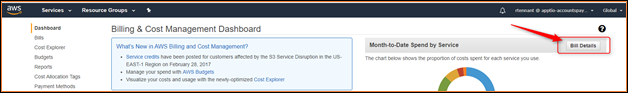
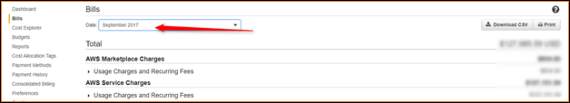
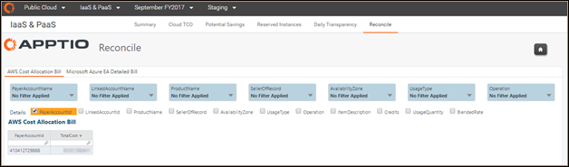
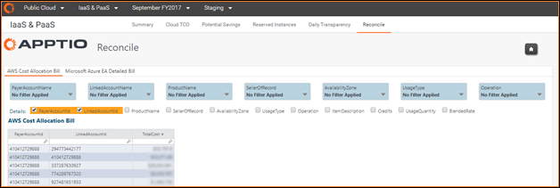
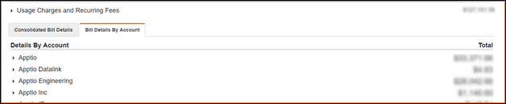

# Visão geral do relatório - Reconciliar

Observação: Aplica-se a: [Apptio Costing Standard](https://community.apptio.com/docs/DOC-8364.html "(Abre em uma nova guia ou janela)") ou [Apptio Cloud Cost Management](https://community.apptio.com/docs/DOC-8365.html "(Abre em uma nova guia ou janela)") em execução em TBM Studio v12.3.3 ou posterior.

## Visão geral

Com o Cloud Cost Management, o Apptio oferece a capacidade de reconciliar os custos e o consumo no Apptio com os informados pelos provedores de nuvem em seus consoles de gerenciamento de faturamento. O relatório Reconciliar no Cloud Cost Management inclui relatórios flexíveis que permitem reconciliar em vários níveis dentro do faturamento e isolar subconjuntos específicos de custos (por exemplo, para um único ou subconjunto de contas) para reconciliar em um nível mais profundo.

## Reconciliação de seus custos AWS

Com o Amazon Web Services ( AWS ), você pode reconciliar suas despesas mensais com os dados que o AWS fornece em seu Billing Dashboard. (Basta selecionar Bill Details (Detalhes da fatura) e, em seguida, selecionar o mês em relação ao qual você deseja fazer a reconciliação)

No site Apptio, o relatório Reconcile permite visualizar a quantidade de custo e uso agrupada e filtrada por vários atributos de faturamento, como, entre outros, ID da conta (pagador e/ou vinculado), nome do produto, vendedor do registro e outros. Para começar, você pode agrupar apenas por ID da conta do pagador para obter uma visão do total de despesas mensais de uma conta de pagador principal.

Esse número total deve ser conciliado com o número total em sua fatura AWS para o mesmo mês.

**AVISO**

Se você não tiver ingerido suas contas do AWS Marketplace e tiver cobranças do AWS Marketplace, será necessário fazer a reconciliação com o total de cobranças de serviço do AWS em vez do total do AWS. Para obter mais informações sobre como ingerir suas faturas do AWS Marketplace, consulte [Ingerir o faturamento do AWS Marketplace](../user-guide/ingestingawsmarketplacebilling-6655.html "Se estiver consumindo serviços do AWS Marketplace, você desejará ingerir e modelar essas contas do AWS Marketplace da mesma forma que ingere e modela as contas de serviços normais do AWS. AWS cria um arquivo de faturamento separado do AWS Marketplace para os relatórios de faturamento que você configurou para serem criados em suas preferências de faturamento. Assim como nas contas normais de serviços do AWS, o Apptio recomenda usar o relatório de alocação de custos do AWS Marketplace que agrega em nível mensal.").

Você pode começar a adicionar mais detalhes ou filtrar por atributos específicos para reconciliar em um nível mais profundo em sua conta. Por exemplo, você pode reconciliar contas vinculadas específicas marcando a caixa de seleção LinkedAccount ou filtrando uma conta específica no divisor LinkedAccount. Em seguida, na fatura AWS, você pode selecionar Bill Details by Account (Detalhes da fatura por conta) e comparar os dois sistemas.

## Reconciliação de seus custos Azure

Para reconciliar seus custos em Azure, você pode visualizar seus custos no portal Azure e reconciliá-los com os custos em Apptio por meio do relatório EA Detailed Bill (Conta detalhada do EA) em Microsoft Azure. No relatório Apptio, você pode variar o nível e o subconjunto de itens que deseja reconciliar usando seletores de atributos e divisores.
