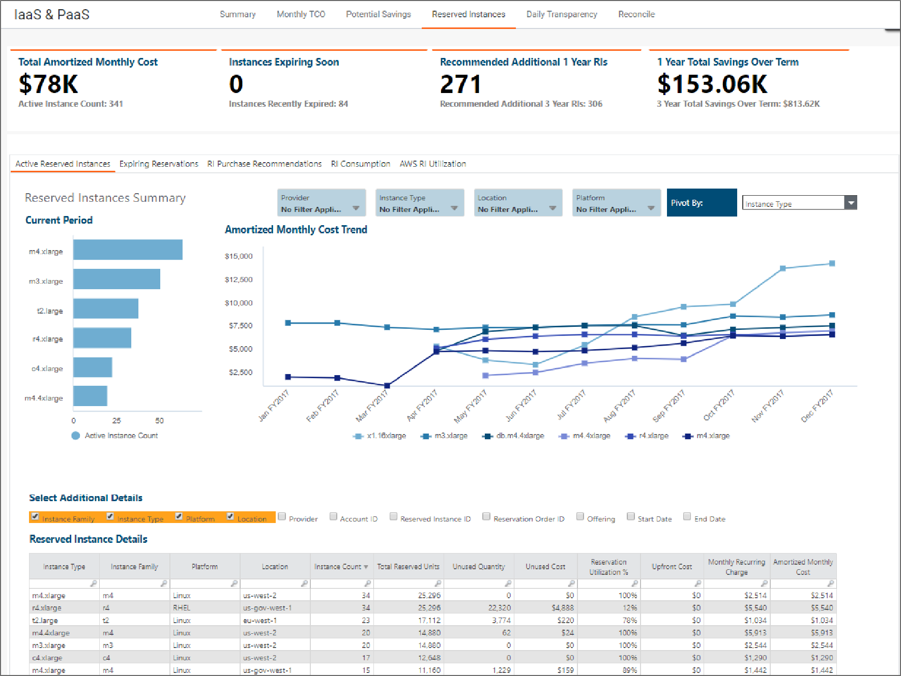

# Visão geral do relatório - Instâncias reservadas

Observação: Aplica-se a: Apptio Costing Standard em TBM Studio 12.3.3 e posterior; Cloud Business Management em TBM Studio 12.6 e posterior

O relatório Instâncias reservadas fornece uma explicação do seu inventário atual de instâncias reservadas (RIs) AWS e Azure e pode ajudá-lo a tomar decisões sobre compras contínuas de instâncias reservadas. Azure as instâncias reservadas estão disponíveis a partir de TBM Studio 12.6.

Este relatório oferece uma visão dos seguintes aspectos:

- O conjunto atual de instâncias reservadas adquiridas por sua organização
- As instâncias reservadas que expiraram recentemente ou que devem expirar em breve

  Observação: essas análises só serão preenchidas se você trouxer suas compras de instâncias reservadas pelo site DataLink.
- Recomendações para comprar instâncias reservadas adicionais

  Observação: essas análises só serão preenchidas se você inserir seus dados do Trusted Advisor do AWS. Para obter mais informações, consulte [Configurar recomendações para Public Cloud possíveis economias](../user%20guide/configrecsforpubliccloud-7051.html "(Abre em uma nova guia ou janela)").

## KPIs

- **Custo faturado** - Este é o custo real, faturado mensalmente e no acumulado do ano, associado às compras de instâncias reservadas de sua organização. Esses dados são provenientes dos itens de linha de compra da instância reservada em sua fatura AWS.
- **Custo amortizado** - Este é o custo amortizado mensal e acumulado no ano associado às compras de RI de sua organização. Esse custo é calculado em Apptio e distribui os custos iniciais do RI uniformemente ao longo da vida do RI e acrescenta os custos mensais recorrentes. Esses dados são provenientes das compras do RI que são separadas de sua fatura do AWS.
- **Instâncias que expiram em breve** - O número de instâncias que expirarão nos próximos 30 dias ou que expiraram nos últimos 30 dias. Esses dados são provenientes dos mesmos dados de compra do RI usados para calcular o custo amortizado.
- **RIs adicionais recomendados de 1 ano** - Os RIs adicionais recomendados para compra com base nos sites AWS Trusted Advisor e Azure Advisor.
- **economia total de 1 ano** - A economia potencial associada às compras adicionais recomendadas do RI. Esses dados são provenientes do site AWS Trusted Advisor.

## Relatórios

- **Instâncias de reserva ativas** - Um inventário e uma análise de custo das instâncias reservadas que sua organização adquiriu.
  - **Cash Based (Baseado em dinheiro** ) - Essa guia fornece uma visão dos custos reais de compra de RI faturados e tem como fonte a fatura AWS.
    - **Contagem** de instâncias - O número de instâncias associadas a cada compra de instância reservada.
    - **Custo da fatura na nuvem** - O custo faturado para o mês atual.
    - **Cloud Invoice Cost YTD** - O custo faturado no ano até a data.
  - **Amortized Based (Baseado em amortização** ) - Esta guia fornece uma visão dos custos amortizados associados aos RIs que sua organização adquiriu. Os dados nessa guia são gerados pelas compras do RI, que são obtidas por meio de APIs do AWS separadas do seu faturamento.
    - **Contagem** de instâncias - O número de instâncias associadas a cada compra do RI.
    - **Custo inicial** - O custo inicial da compra do RI.
    - **Custo mensal recorrente** - O custo mensal recorrente para a compra do RI. Isso só será associado a compras de RI sem adiantamento ou com adiantamento parcial, em que sua organização é cobrada todos os meses durante o período do RI.
    - **Custo mensal amortizado** - Esse é um valor calculado pelo site Apptio com base na adição do custo inicial amortizado ao custo mensal recorrente.
- **Reservas expiradas** - Essa guia fornece uma visão dos RIs que expiraram recentemente ou que devem expirar em breve.
- **Recomendações de compra do RI** - Essa guia é orientada pela verificação de otimização do RI do AWS Trusted Advisor e pelo Azure Advisor. Ele apresenta compras adicionais de RI que sua organização pode fazer com base no uso real do EC2 sob demanda. Para obter mais informações sobre AWS, consulte a documentação do Trusted Advisor AWS : [https://aws.amazon.com/premiumsupport/ta-faqs/](https://community.apptio.com/external-link.jspa?url=https%3A%2F%2Faws.amazon.com%2Fpremiumsupport%2Fta-faqs%2F "(Abre em uma nova guia ou janela)")
  - **RIs adicionais recomendados** - O número de RIs adicionais que você deve comprar para obter a economia de custos.
  - **Custo** inicial - O custo inicial exigido para as compras adicionais recomendadas do RI.
  - **Economia mensal estimada** - O valor aproximado da economia a ser obtida com as compras adicionais do RI.
  - **Economia total durante o** prazo - A economia total a ser obtida durante o prazo (1 ou 3 anos) das compras adicionais de RI.
- **Consumo de RI** - Essa guia fornece uma visão do consumo das instâncias reservadas com base na quantidade de uso e compara o consumo entre as instâncias reservadas e os custos sob demanda (disponível em v12.5+ ).
  - **Qtd. de uso** - o total de horas de instância usadas durante o mês selecionado
  - **Custos fixos de RI** - o total de custos amortizados de RI (recorrentes + amortizados antecipadamente) associados ao item de linha para o mês selecionado
  - **Custo de uso** - o total de custos sob demanda associados ao item de linha para o mês selecionado
  - **Custos de não provedores** - os custos totais incorridos como resultado do uso da nuvem, mas que não estão associados a um provedor de nuvem (por exemplo, custos de software de terceiros, custos de mão de obra etc.)
  - **Infraestrutura de nuvem compartilhada** - os custos associados aos serviços do provedor de nuvem que são compartilhados. Esses serviços compartilhados podem incluir Enterprise Support, VPCs ou qualquer outra ferramenta ou serviço básico usado para fornecer aplicativos ou serviços em AWS.
- **AWS Utilização do RI** - Esta guia fornece informações sobre o uso do RI mês a mês, tendências de uso e o valor em dólares economizado em relação às horas de RI. Quando o uso sob demanda é superior a 100%, o custo do gasto excessivo é mostrado.(Disponível em 12.6 e posterior, com o modelo v106 )
  - **Total de unidades reservadas** - O número de horas reservadas para o mês selecionado como parte da compra do RI
  - **Quantidade usada** - O número de horas reservadas usadas pelos recursos durante o mês selecionado
  - **Utilização da reserva %** - A porcentagem de horas de RI adquiridas que foram usadas durante o mês selecionado. Isso é calculado dividindo-se a quantidade usada pelo total de unidades reservadas.
  - **Custo Mensal Efetivo** - Os custos do RI (amortizado antecipadamente + mensal recorrente) para o mês selecionado
  - **Hypothetical On-Demand Cost (Custo hipotético sob demanda** ) - o custo que sua organização teria incorrido no mês selecionado se nenhum RI fosse comprado. Isso é calculado multiplicando-se a quantidade usada pela taxa On-Demand para os tipos de instâncias associadas ao item de linha na tabela.
  - **Economia de custos/gastos excessivos** - é o valor que você economizou com a compra de RIs ou o quanto sua organização gastou a mais com a compra de RIs e com a não utilização total dessas compras. Isso é calculado subtraindo-se o custo hipotético sob demanda pelo custo mensal efetivo.

