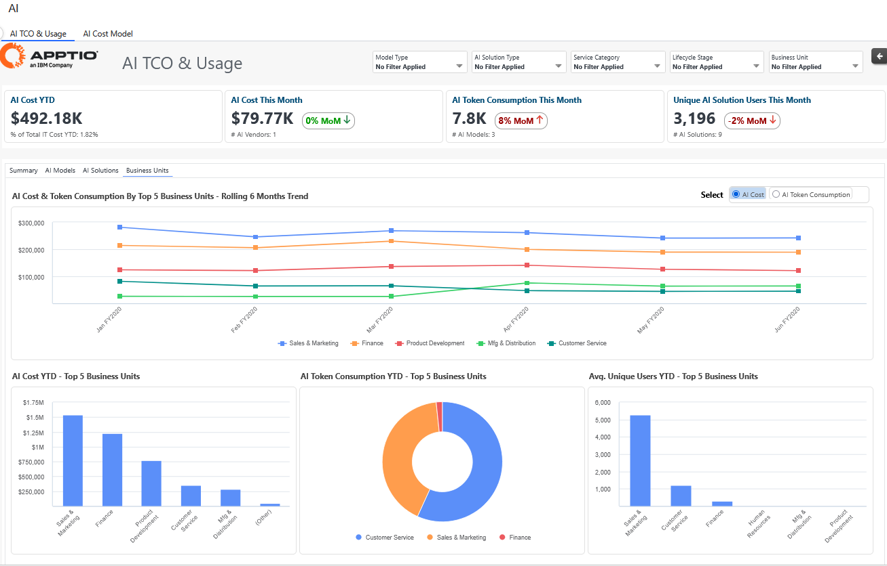
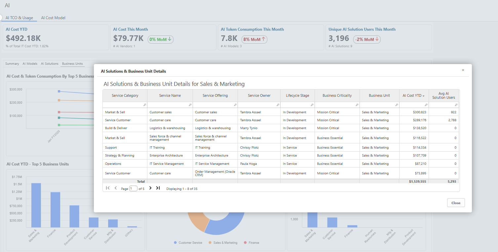
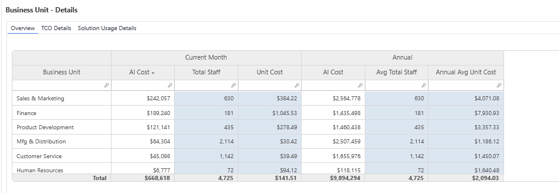

# AI TCO - Unidades de negócios

| Principais benefícios | Detalhes |
| --- | --- |
| - Acompanhe a adoção de soluções de IA em suas unidades de negócios - Identificar oportunidades para minimizar os custos unitários consolidando ou retirando modelos ou soluções de IA - Aumentar a transparência dos custos e do consumo de IA no nível da unidade de negócios - Incentivar o consumo responsável de IA | **Para** : Líderes de unidades de negócios  **Caso de uso** : insights para otimizar os gastos e o uso de IA |
