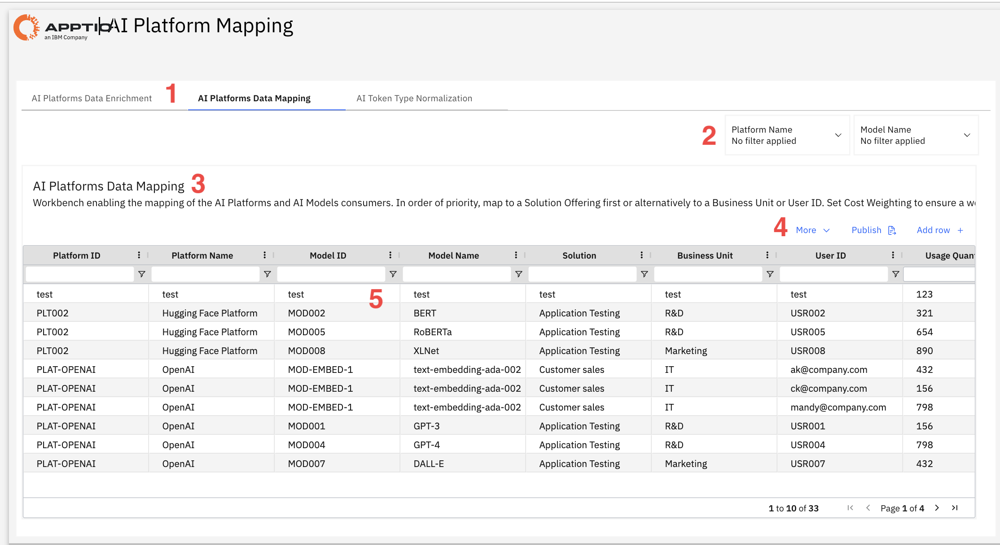

# Mapeamento da plataforma de IA

Este relatório mapeia o consumo da plataforma de IA para os centros de custo da organização, permitindo um repasse de custos preciso e uma alocação orçamentária adequada, ao atribuir o uso dos serviços de IA a soluções específicas, unidades de negócios e usuários em toda a empresa.

Este relatório foi elaborado para ser utilizado pelos seguintes perfis:

- Administradores de IA/ML
- Equipes de Finanças
- Operações de TI
- Equipes de Ciência de Dados
- Analistas de alocação de custos

## Elementos-chave

| Elemento | Descrição |
| --- | --- |
| Navegação por abas (1) | Navegue entre três visualizações de gerenciamento de dados: enriquecimento para adicionar detalhes da plataforma, mapeamento para alocação de custos e normalização para padronizar métricas de tokens. |
| Opções de filtro (2) | Duas listas permitem filtrar o relatório por nome da plataforma e nome do modelo. |
| Painel de instruções (3) | Revise as diretrizes de hierarquia de mapeamento para garantir uma alocação de custos consistente: priorize o mapeamento no nível da solução, depois no nível da unidade de negócios e, por fim, a atribuição no nível do usuário. |
| Botões de ação (4) | Esses botões abrem opções adicionais, publicam alterações no mapeamento ou adicionam uma linha. |
| Tabela de dados de mapeamento (5) | Visualize e edite os mapeamentos de consumo de IA em todas as plataformas, modelos e entidades organizacionais. Cada linha associa um serviço de IA específico ao seu centro de custo, com os volumes de uso que servem de base para os cálculos de alocação. |

## Perguntas respondidas

- Quais plataformas e modelos de IA estão gerando custos que precisam ser alocados?
- Como o consumo de IA deve ser distribuído entre as soluções e as unidades de negócios para garantir um chargeback preciso?
- Quais usuários estão utilizando quais modelos de IA?
- Qual é o volume de uso para cada combinação de plataforma, modelo e consumidor?
- Quais plataformas de IA não possuem atribuições de centro de custo e exigem mapeamento?
- Quais soluções utilizam vários modelos ou plataformas de IA?
- Como se distribui o uso da IA pelas diferentes unidades de negócios?
- Existem plataformas ou modelos ainda não mapeados que precisem de atenção?

## Ações recomendadas

- Verifique se a tabela contém dados provisórios ou de teste e substitua-os pelas atribuições reais de plataforma a centro de custo.
- Clique em “Adicionar linha” para criar mapeamentos para plataformas de IA que não tenham atribuições de solução, unidade de negócios ou usuário.
- Atribua os custos primeiro à Oferta de Solução (opção preferencial), depois à Unidade de Negócios e, por fim, ao ID do usuário como opções alternativas.
- Verifique se os valores de consumo estão corretos, pois essas métricas determinam a distribuição dos custos.
- Use filtros para analisar plataformas específicas ( OpenAI, Hugging Face ) e garantir uma cobertura completa dos modelos.
- Clique em "Publicar" para ativar seus mapeamentos no sistema de alocação de custos.
- Agende revisões mensais para acompanhar novas plataformas, modelos e usuários de IA à medida que a adoção cresce.
