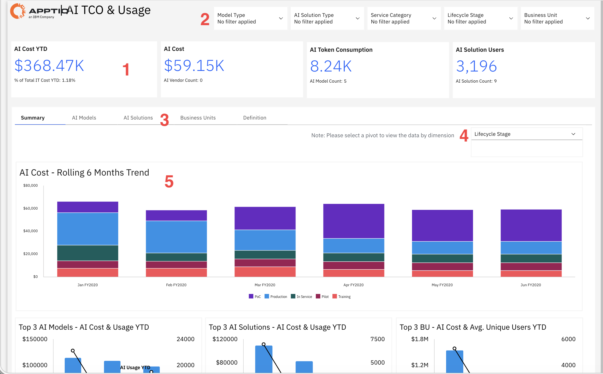
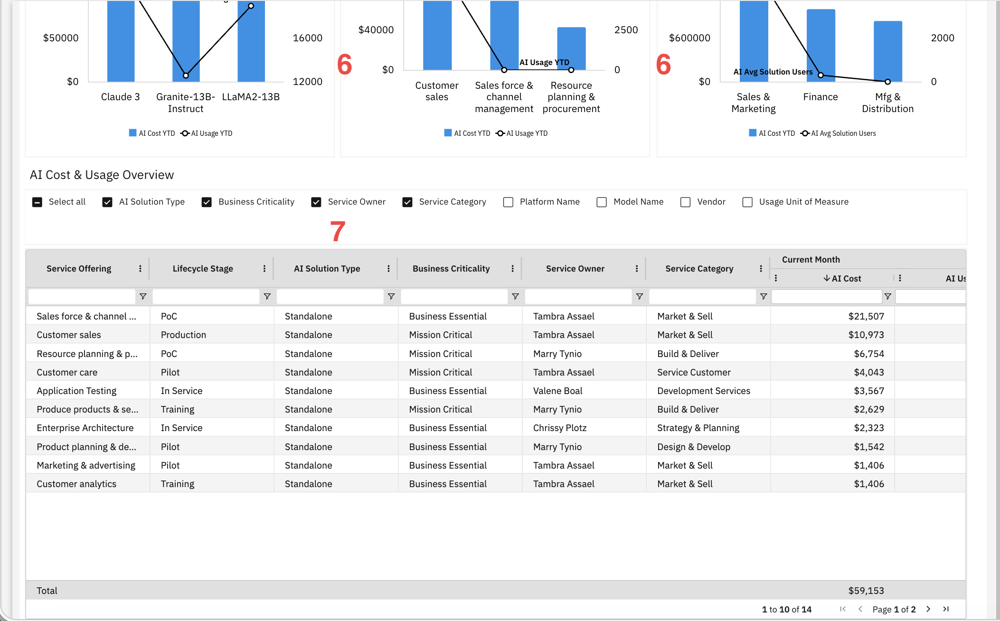

# Custo total de propriedade (TCO) e uso da IA

Utilize este relatório para analisar os gastos e o uso de serviços de IA em diferentes modelos, soluções e unidades de negócios, identificando oportunidades de otimização de custos por fase do ciclo de vida.

Este relatório destina-se aos seguintes usuários:

- Gerentes de programas de IA
- Analistas financeiros de TI ou de TBM
- Proprietários de plataformas de IA ou de serviços
- Líderes das unidades de negócios

## Elementos-chave

| Elemento | Descrição |
| --- | --- |
| Fichas de resumo (1) | Os quatro gráficos na parte superior do relatório mostram o custo da IA no acumulado do ano, o custo da IA no período atual, o consumo de tokens de IA e o número de usuários da solução de IA. Use esses cartões para ter uma visão geral dos gastos e do uso da IA. |
| Opções de filtro (2) | Cinco filtros permitem filtrar o relatório por tipo de modelo, tipo de solução de IA, categoria de serviço, fase do ciclo de vida e unidade de negócios. |
| Navegação por abas (3) | As guias alternam entre as visualizações Resumo, Modelos de IA, Soluções de IA, Unidades de Negócio e Definição. |
| Seletor giratório (4) | Use esta lista para alterar a dimensão que organiza os gráficos e a tabela, como, por exemplo, o estágio do ciclo de vida. |
| Tendência móvel de 6 meses do custo da IA (5) | Um gráfico de barras empilhadas mostra os custos de IA para um período de seis meses, agrupados por fase do ciclo de vida, como prova de conceito, produção, em operação, projeto-piloto e treinamento. |
| Lista dos 3 principais modelos de IA (6) | Um gráfico combinado de barras e linhas compara os custos com IA acumulados no ano e o uso de IA acumulado no ano para os três principais modelos de IA. |
| Lista das 3 principais soluções de IA (6) | Um gráfico combinado de barras e linhas compara os custos com IA acumulados no ano e o uso de IA acumulado no ano para as três principais soluções de IA. |
| Gráfico das 3 principais unidades de negócios (6) | Um gráfico combinado de barras e linhas compara o custo da IA no acumulado do ano e a média de usuários da solução de IA nas três principais unidades de negócios. |
| Tabela de visão geral dos custos e do uso da IA (7) | Esta tabela inclui colunas configuráveis, tais como oferta de serviço, fase do ciclo de vida, tipo de solução de IA, importância estratégica para o negócio, responsável pelo serviço, categoria do serviço, nome da plataforma, nome do modelo, fornecedor, unidade de medida de uso, custo de IA no mês atual e uso de IA. Você pode mostrar ou ocultar colunas e ordenar a tabela por coluna. |

## Perguntas respondidas

- Quanto custam as soluções de IA e que porcentagem do orçamento total de TI elas representam?
- Quais modelos de IA apresentam os custos mais elevados e o maior volume de uso?
- Quais soluções de IA apresentam os custos e o nível de uso mais elevados?
- Quantos usuários estão utilizando soluções de IA em toda a organização?
- Os gastos com IA estão aumentando ou diminuindo ao longo do tempo?
- Quais unidades de negócios apresentam os maiores gastos com IA?
- Como os gastos com IA são distribuídos pelas diferentes fases do ciclo de vida, tais como prova de conceito, produção, projeto-piloto e treinamento?
- Quais soluções de IA são críticas para a missão e quais são essenciais para os negócios?
- Quem é o proprietário de cada solução de IA e a qual categoria de serviço ela está atribuída?
- Como se compara o uso da IA com o custo da IA?

## Ações recomendadas

- Analise o quadro de custos de IA acumulados no ano para compreender os gastos atuais com IA.
- Use o gráfico dos três principais modelos de IA para comparar o custo e o uso da IA nos modelos mais utilizados.
- Analise o gráfico de tendências dos custos de IA nos últimos seis meses para identificar variações nos gastos ao longo do tempo.
- Filtre o relatório por fase do ciclo de vida para comparar os gastos nas fases de produção, prova de conceito, piloto e outras.
- Analise o gráfico das três principais unidades de negócios para comparar os gastos com IA e o número de usuários por unidade de negócios.
- Classifique a tabela de visão geral de custos e uso de IA por custo de IA do mês atual para identificar os serviços de IA mais caros.
- Exiba as colunas “Nome do modelo” e “Fornecedor” para comparar custos e uso entre modelos e fornecedores.
