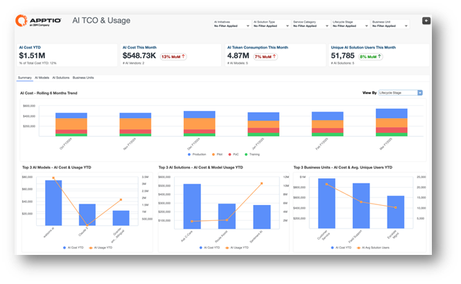
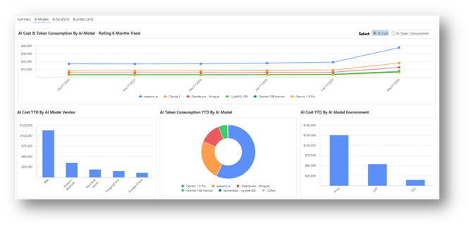
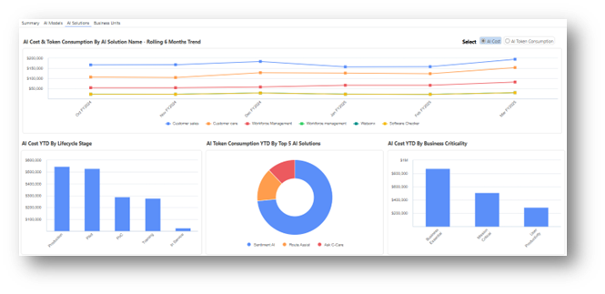
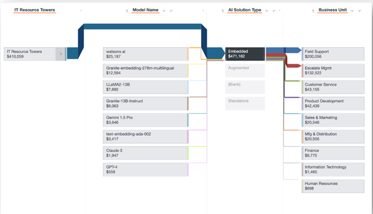

# Relatórios de TCO de IA

## Custo total de propriedade e uso da IA

O relatório **de TCO e uso de** IA fornece uma visão centralizada e justificável dos custos e do consumo de IA em toda a organização. Ao consolidar dados financeiros e de uso para modelos e soluções de IA, este relatório permite que as organizações compreendam o custo total de propriedade, monitorem padrões de adoção e apoiem o dimensionamento responsável dos investimentos em IA.

**Este relatório foi elaborado para ser utilizado pelas seguintes funções:**

• Executivos de alto escalão

• Líderes em TI e IA

• Proprietários de soluções (proprietários de aplicativos e serviços)

• Líderes de Unidades de Negócios

## TCO da IA – Resumo

• Compreenda e acompanhe o custo total de propriedade (TCO) da IA, a utilização do modelo de IA e a adoção da solução de IA em toda a empresa.

• Compare os gastos com IA como porcentagem dos gastos totais com TI para avaliar a escala e o impacto.

• Identifique anomalias de custo versus uso nos principais modelos de IA, soluções de IA e unidades de negócios para detectar ineficiências precoces.

Para obter mais detalhes sobre como usar o relatório de TCO e uso de IA, clique [aqui.](https://www.ibm.com/docs/en/apptio-commercial/costing-standard/saas?topic=reports-ai-tco-summary "(Abre em uma nova guia ou janela)")

## TCO da IA – Modelos de IA

• Obtenha visibilidade do TCO do modelo de IA e dos custos unitários em plataformas como Granite, Llama e Claude.

• Analise o custo da IA e o consumo de tokens no acumulado do ano por fornecedor de modelo, tipo de token e ambiente do modelo.

• Identifique oportunidades para consolidar ou retirar modelos de IA com baixa utilização ou relações custo-benefício desfavoráveis.

Para obter mais detalhes sobre como usar o relatório de TCO e uso de IA, clique [aqui.](https://www.ibm.com/docs/en/apptio-commercial/costing-standard/saas?topic=reports-ai-tco-ai-models "(Abre em uma nova guia ou janela)")

## TCO da IA – Soluções de IA

• Compreenda o TCO (custo total de propriedade) da solução de IA e os principais fatores de custo em nuvem, mão de obra, fornecedores e outras despesas de IA.

• Analise o custo e o consumo de IA no acumulado do ano por estágio do ciclo de vida, criticidade do negócio e principais soluções de IA.

• Analise como os modelos de IA são consumidos por cada solução de IA para otimizar o design, o dimensionamento e as decisões de investimento.

Para obter mais detalhes sobre como usar o relatório de TCO e uso de IA, clique [aqui.](https://www.ibm.com/docs/en/apptio-commercial/costing-standard/saas?topic=reports-ai-tco-ai-solutions "(Abre em uma nova guia ou janela)")

## TCO de IA – Unidades de Negócios

• Acompanhe a adoção da solução de IA e os padrões de consumo em todas as unidades de negócios.

• Identifique oportunidades para reduzir os custos unitários consolidando ou retirando modelos ou soluções de IA.

• Aumentar a transparência dos custos e do uso da IA no nível da unidade de negócios para incentivar o consumo responsável da IA.

Para obter mais detalhes sobre como usar o relatório de TCO e uso de IA, clique [aqui.](https://www.ibm.com/docs/en/apptio-commercial/costing-standard/saas?topic=reports-ai-tco-business-units "(Abre em uma nova guia ou janela)")

## Modelo de Custos de IA

Os relatórios de modelo no Apptio fornecem rastreabilidade completa de como os dados de custo se movem pelo modelo Apptio, abrangendo modelos de alocação, estruturas de torre/subtorre, pools de custos etc. Eles são usados para validar, solucionar problemas e analisar as transformações de dados aplicadas em cada etapa do modelo.

Para obter mais detalhes sobre como usar o relatório do Modelo de Custos de IA, clique [aqui.](https://www.ibm.com/docs/en/apptio-commercial/costing-standard/saas?topic=reports-ai-tco-model-views "(Abre em uma nova guia ou janela)")

