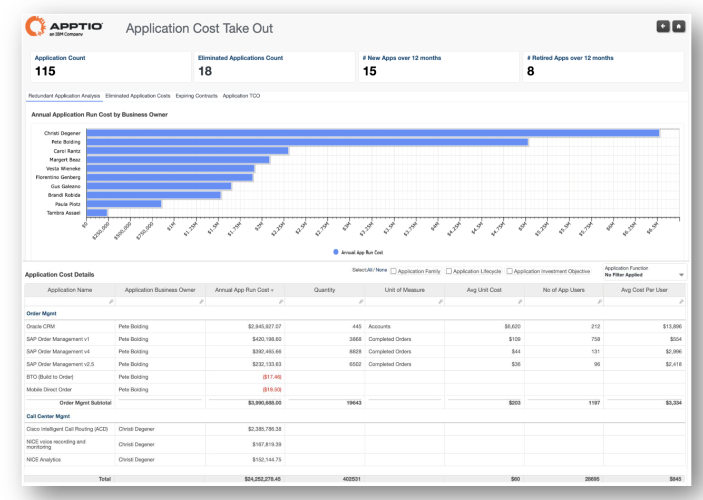
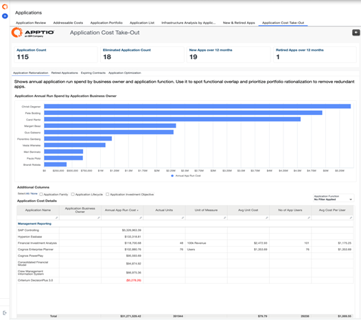
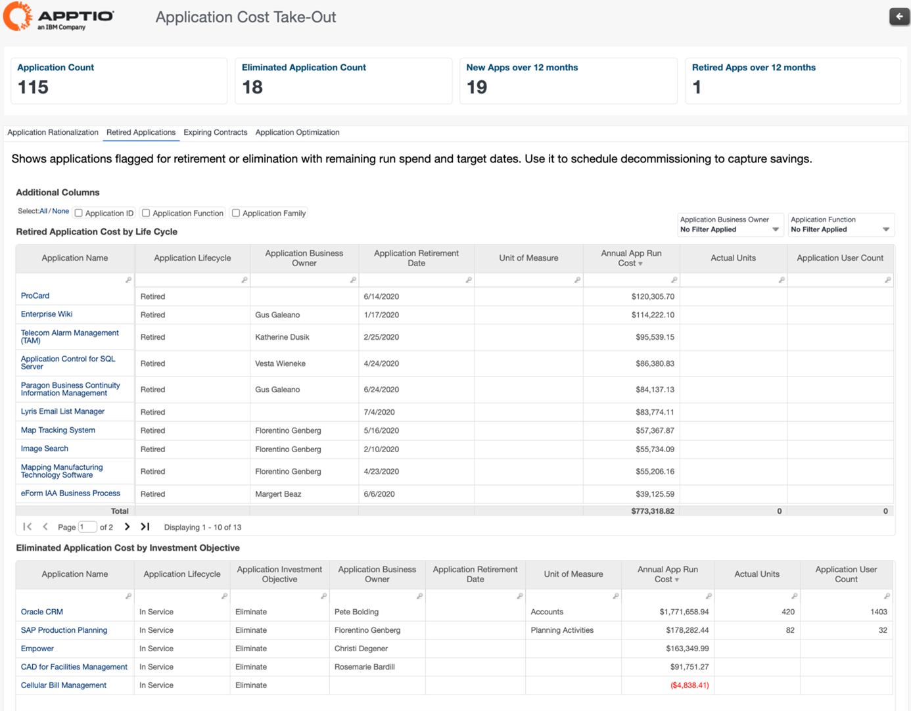
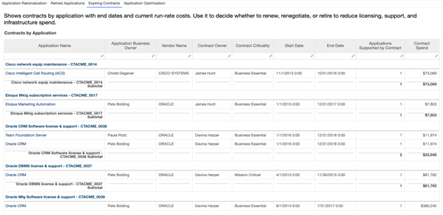
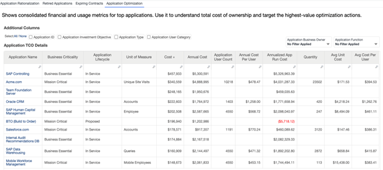
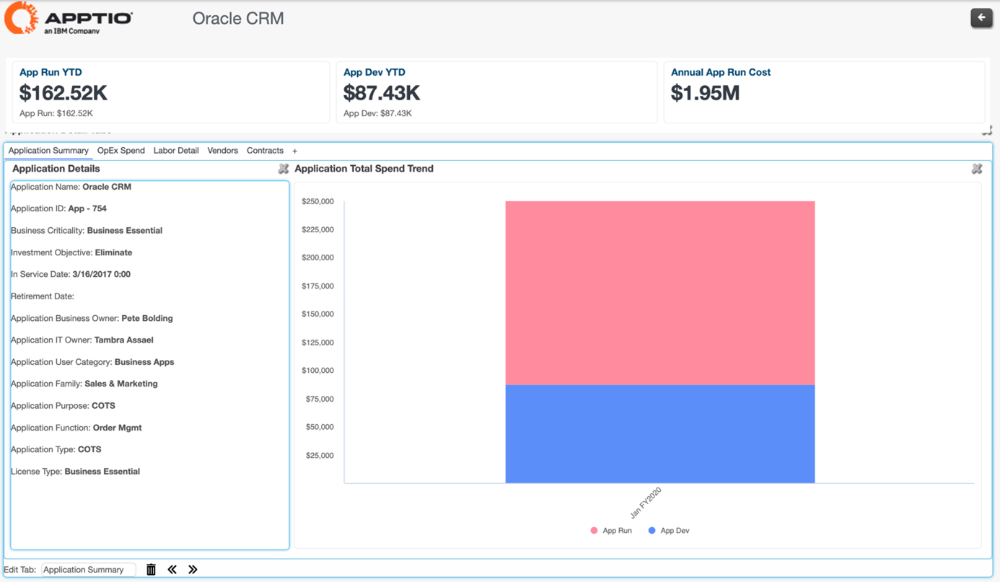

# Retirada de custos do aplicativo

| Principais benefícios | Detalhes |
| --- | --- |
| - Visualizar custos de aplicativos, custos unitários e custos por usuário - Detalhar as despesas mensais de cada aplicativo - Veja a economia de custos obtida com a desativação de aplicativos - Identificar áreas que podem racionalizar seu portfólio de aplicativos   **Perguntas respondidas**   - Qual é o custo médio por usuário de cada aplicativo? - Estamos pagando por aplicativos redundantes ou duplicados que têm a mesma finalidade? - O contrato desse aplicativo está expirando em breve - devemos renová-lo? | **Para** :  Líderes de soluções, proprietários de aplicativos, proprietários de serviços  **Como navegar** : Vá para **Relatórios** > **Aplicativo (Cobrança)** > **Retirada de custos do aplicativo** |

**Perspectivas:**

O Application Cost Take-Out Report foi desenvolvido para responder às seguintes perguntas:

**Racionalização de aplicativos** :  
Mostra as despesas anuais de execução de aplicativos juntamente com os proprietários de negócios. A visualização a seguir pode ser usada para identificar a sobreposição em uma determinada função de aplicativo, permitindo a eliminação de aplicativos redundantes como parte da atividade de racionalização do portfólio de aplicativos.

**Aplicativos desativados** :  
Mostra os aplicativos sinalizados para desativação ou eliminação, com os gastos de execução restantes e as datas de destino. Essas informações são usadas para programar o descomissionamento e obter economias.

**Expiring Contracts** :  
Mostra os contratos por aplicativos e, com base em sua data de término, permite-nos decidir se renovamos o contrato ou o retiramos para reduzir as despesas.

**Otimização de aplicativos** :  
Mostra as métricas financeiras e de uso consolidadas dos 10 principais aplicativos. Isso é usado para entender o custo total de propriedade e direcionar as ações de otimização de maior valor.

Ao analisar cada aplicativo, podemos entender os vários drivers de despesas do OpEx, bem como os detalhes de mão de obra, fornecedores e contratos desse aplicativo. Essas informações detalhadas podem ser visualizadas no Relatório detalhado de retirada de custos de aplicativos.

