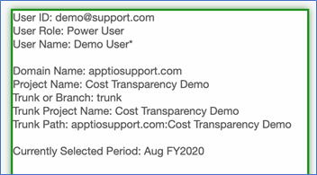
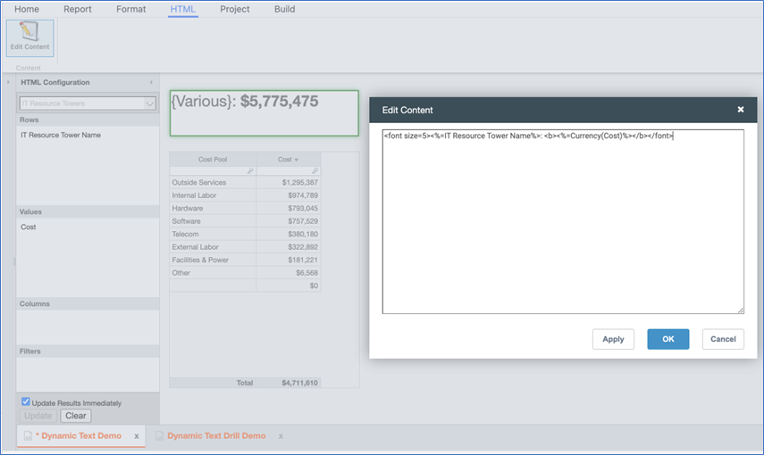
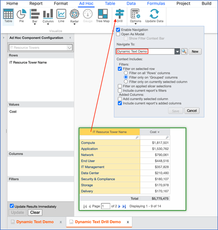
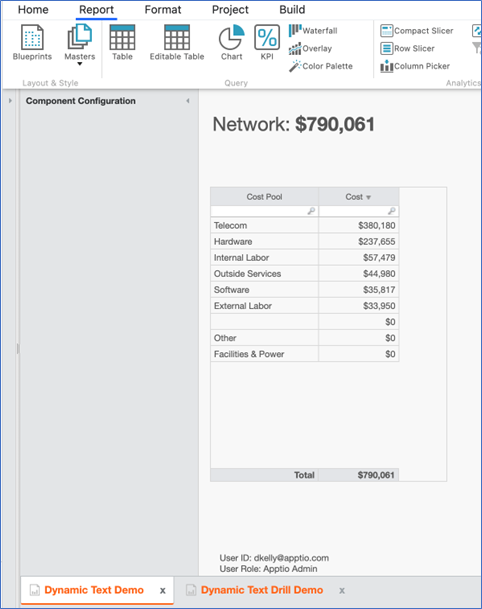

# Texto dinâmico e WikiText

Saiba mais sobre texto dinâmico, wikitexto e as diferenças entre os dois.

## O que é texto dinâmico?

O texto dinâmico permite que você execute uma fórmula Apptio para obter dados para uso em contextos específicos. O texto dinâmico começa com "<%=" e termina com "%>".

Onde posso usar o Dynamic Text?
:   Alguns dos locais em que você pode usar o texto dinâmico incluem:

    - Em [elementos de relatório HTML](https://www.ibm.com/docs/en/apptio-commercial/tbm-studio/saas?topic=reports-html-text-box "(Abre em uma nova guia ou janela)")
    - Na [função EvalWiki](https://www.ibm.com/docs/en/apptio-commercial/tbm-studio/saas?topic=ff-evalwiki-function "(Abre em uma nova guia ou janela)")
    - Ao criar [menus suspensos em tabelas editáveis](https://www.ibm.com/docs/en/apptio-commercial/tbm-studio/saas?topic=reports-add-list-editable-table "(Abre em uma nova guia ou janela)")
    - Em [ApptioScript](https://www.ibm.com/docs/en/apptio-commercial/tbm-studio/saas?topic=apptioscript-structure "(Abre em uma nova guia ou janela)")
    - Nos argumentos da [função CopyTable](https://www.ibm.com/docs/en/apptio-commercial/tbm-studio/saas?topic=apptioscript-copytable-function "(Abre em uma nova guia ou janela)")
    - Para controlar [a visibilidade do componente do relatório](https://www.ibm.com/docs/en/apptio-commercial/tbm-studio/saas?topic=reports-arrange-report-components "(Abre em uma nova guia ou janela)")

## O que é WikiText?

WikiText às vezes é usado de forma intercambiável com texto dinâmico. A principal diferença é que, em determinados contextos WikiText

Como usar o Dynamic Text
:   Exemplo 1: Exibição de usuário, projeto ou período em HTML
    :   Para começar, crie um relatório sandbox. Não é necessário fazer o check-in. Em seguida, crie um elemento de relatório HTML no relatório e cole o seguinte no elemento:

        ID do usuário: <%=$CurrentUser:Users.Id%> 

        Função do usuário: <%=$CurrentUser:Users.Role%> 

        Nome de usuário: <%=$CurrentUser:Users.Nome completo%> 

         

        Nome do domínio: <%=DomainName( )%> 

        Nome do projeto: <%=ProjectName( )%> 

        Tronco ou ramificação: <%=if(Left( ProjectName( ),1)="-", "branch", "trunk")%> 

        Nome do projeto do tronco: <%=if(Left( ProjectName( ),1)="-",Mid( ProjectName( ), 2,find( "\_( ",ProjectName())-2),ProjectName( ))%> 

        Caminho do tronco: <%=if(Left( ProjectName(),1)="-",DomainName( )&":"&Mid( ProjectName( ), 2,find( "\_( ",ProjectName())-2),DomainName( )&":"&ProjectName( ))%> 

         

        Período atualmente selecionado: <%=CurrentDate("MMM ffff")%>

        Ao fechar a caixa de diálogo de configuração de HTML, você deverá ver algo parecido com isto:

        

        Este é um exemplo do que pode ser feito com o texto dinâmico para obter informações sobre o usuário, o projeto ou o período.

    Exemplo 2: Exibição de dados de tabela em HTML
    :   Se quiser exibir dados de uma tabela em um elemento HTML, você pode fazer isso associando colunas de uma tabela.

        Neste exemplo, criaremos um relatório que exibe o custo de uma torre de recursos de TI em negrito na parte superior e os pools de custos associados em uma tabela abaixo.

        1. Crie um relatório com um elemento HTML configurado da seguinte forma. Neste exemplo, chamamos o relatório de "Demonstração de texto dinâmico".

           

           O HTML na captura de tela é:

           <%=IT Nome da Torre de Recursos%>: <b><%=Currency(Cost)%></b>

           Observe que o HTML exibe " {Various} ", porque há mais de um valor de Pool de custos na coluna Pool de custos. No entanto, trataremos disso em breve.

           No mesmo relatório, incluímos uma tabela que exibe o custo por pool de custos com base no objeto de origem de custos, conforme mostrado na captura de tela acima.
        2. Em seguida, criamos um relatório separado que chamamos de "Dynamic Text Drill Demo" com uma tabela que exibe o custo por nome da torre de recursos de TI e configuramos o drill Ad-Hoc para fazer o drill no primeiro relatório:

           
        3. Agora, quando clicamos em um nome de torre de recursos de TI na tabela, chegamos ao relatório "Dynamic Text Demo" filtrado pelo nome da torre de recursos de TI selecionada. Neste exemplo, clicamos em "Network" (Rede):

           

    Exemplo 3: Visibilidade do componente
    :   É melhor que isso seja colocado na [visibilidade do componente do relatório](https://www.ibm.com/docs/en/apptio-commercial/tbm-studio/saas?topic=reports-arrange-report-components#Arrangereportcomponents__Setcomponentvisibility__title__1 "(Abre em uma nova guia ou janela)").

    Exemplo 4: Controle de menus suspensos em tabelas editáveis
    :   É melhor que isso seja colocado nos [menus suspensos das tabelas editáveis](https://www.ibm.com/docs/en/apptio-commercial/tbm-studio/saas?topic=reports-add-list-editable-table#Addalisttoaneditabletable__Generatealistwithdynamictext__title__1 "(Abre em uma nova guia ou janela)").

    Exemplo 5: Em ApptioScript
    :   Isso pode ser melhor colocado na seção [ApptioScript](https://www.ibm.com/docs/en/apptio-commercial/tbm-studio/saas?topic=apptioscript-structure#ApptioScript_structure__DynamicText__title__1 "(Abre em uma nova guia ou janela)").
