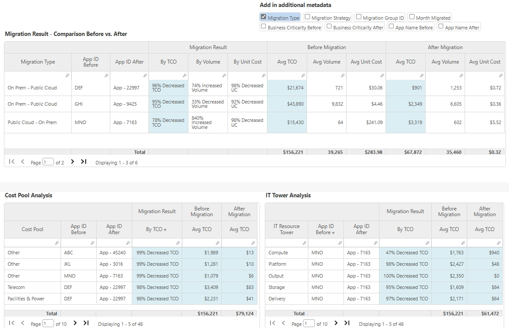

# Impacto do TCO da TI híbrida - Análise

| Principais benefícios | Detalhes |
| --- | --- |
| - Veja uma comparação dos fatores financeiros na raiz das mudanças de TCO - Entenda como o TCO, os custos unitários e os volumes dos aplicativos migrados mudaram - Compreender os principais fatores de mudança: - Grupos de custos (mão de obra, ativos fixos, fornecedores etc.) como impulsionadores financeiros - Torres e subtorres de TI como geradores de recursos | **Para** : Proprietários de aplicativos, equipes de finanças  **Caso de uso** :  Análise detalhada pré/pós-migração  Mergulhe nos resultados da migração em um nível de aplicativo individual para identificar conjuntos de custos específicos e torres de TI que estão gerando benefícios/vantagens financeiras. |
