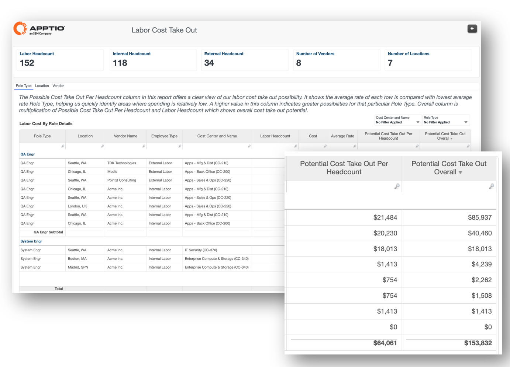
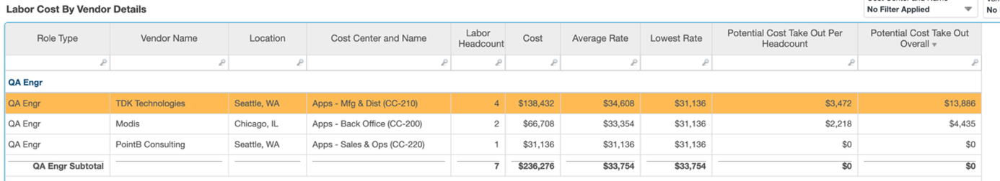

# Custo de mão de obra Take-Out



| Principais benefícios | Detalhes |
| --- | --- |
| - Compare as taxas de mão de obra por função, local e fornecedor - Identificar locais e fornecedores de alto e baixo custo para cada função - Analisar tendências com outros fatores, como centro de custo e tipo de funcionário (interno ou externo) - Visualize a possível economia de custos da obtenção de recursos de mão de obra por meio de locais e fornecedores de menor custo   **Perguntas respondidas**   - Quanto podemos economizar contratando um engenheiro em Seattle ou em Chicago? - Devemos contratar um profissional interno ou terceirizar? - Qual fornecedor nos oferece as taxas mais baixas? | **Para** :  Líderes de unidades de negócios  **Como navegar até os relatórios** : Vá para **Relatórios** > **Cobranças trabalhistas** > **Tomada de custos trabalhistas** |

**Insights**



A tabela acima fornece informações sobre a possível otimização de custos para diferentes fornecedores.

/opt A linha destacada representa o custo da função de QA no local de Seattle com o fornecedor TDK que pode ser reduzido em até US$ 13.866,00 ao transferir a função de QA para a consultoria PointB em Seattle

A taxa média representa o custo total por número de funcionários 138432/4=34608.

A taxa mais baixa (essa coluna está oculta) é a taxa média mais baixa desse tipo de função específica, ou seja, Software Engr =31136

O custo potencial por número de funcionários representa o custo que pode ser otimizado em comparação com o valor mais baixo de Software Engr.`Potential cost take-out per headcount = Average Rate –
Lowest Rate  
 = 34608-1136   
(This is the cost which can be optimized ) = 3472`

```
Potential Cost Take-Out Overall gives us multiplication of no of labor headcount and Potential Cost Take-Out per headcount = 3472 * 4 = 13866
```
