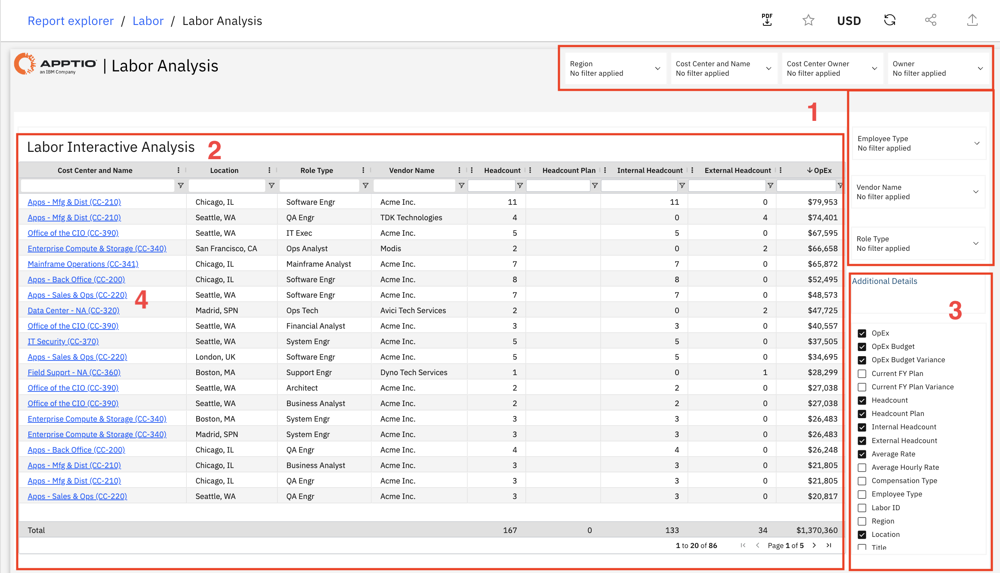

# Análise do Trabalho

Utilize este relatório para analisar os custos de mão de obra e o quadro de funcionários por centro de custo, localização, tipo de função e fornecedor, comparando os funcionários internos com os prestadores de serviços externos e o quadro de funcionários planejado com o real.

Este relatório foi elaborado para ser utilizado pelos seguintes perfis:

- Analistas financeiros
- Responsáveis pelos centros de custo
- Gerentes de Recursos
- Equipes de RH
- Equipes de compras

## Elementos-chave

| Elemento | Descrição |
| --- | --- |
| Cortadores globais (1) | Sete filtros permitem filtrar o relatório por região, centro de custo e nome, responsável pelo centro de custo, responsável, tipo de funcionário, nome do fornecedor e tipo de função. |
| Tabela de Análise Interativa da Mão de Obra (2) | Esta tabela inclui colunas como centro de custo e nome, localização, tipo de função, nome do fornecedor, quadro de pessoal, plano de quadro de pessoal, quadro de pessoal interno, quadro de pessoal externo e despesas operacionais. |
| Painel de detalhes adicionais (3) | Este painel permite mostrar ou ocultar as colunas disponíveis, incluindo métricas financeiras, métricas de pessoal, métricas de taxas e atributos dimensionais. |
| Links de detalhamento (4) | Os nomes dos centros de custo levam a informações mais detalhadas sobre o centro de custo selecionado. |

## Perguntas respondidas

- Qual é a proporção entre funcionários internos e prestadores de serviços externos nos diversos centros de custo?
- Quais fornecedores estão fornecendo a maior parte da mão de obra e quanto estamos gastando com eles?
- Como está distribuída nossa força de trabalho pelas diferentes localidades?
- Quais funções ou centros de custo apresentam os maiores custos com mão de obra?
- Como se compara o número real de funcionários com o número planejado?
- Existem diferenças de custos ou tarifas entre fornecedores, funções ou locais?
- Em que áreas estamos acima ou abaixo do quadro de pessoal previsto e onde podemos otimizar custos ou recursos?

## Ações recomendadas

Após analisar o relatório de análise de mão de obra, tome as seguintes medidas recomendadas:

- Identifique as áreas de alto custo analisando os centros de custo ou fornecedores com os maiores gastos com mão de obra.
- Analise a proporção entre funcionários internos e externos para compreender o grau de dependência de prestadores de serviços e identificar áreas passíveis de conversão.
- Comparar o número de funcionários com o planejado para identificar excesso ou falta de pessoal e atualizar os planos de pessoal de acordo com isso.
- Compare os custos de mão de obra entre as diferentes unidades para identificar oportunidades de otimização de custos.
- Analise o uso dos fornecedores para identificar possíveis oportunidades de consolidação ou redução de custos.
- Analise os dados detalhados para investigar variações específicas de custos ou de quadro de funcionários.
- Analise o relatório regularmente para acompanhar as tendências e garantir que as medidas sejam implementadas.
